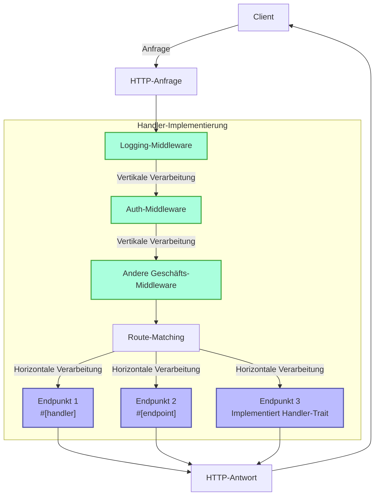
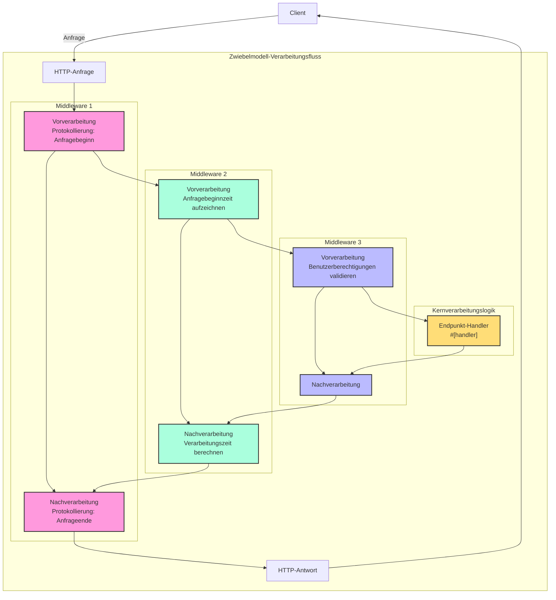

# Handler

## Schnellübersicht

Handler ist ein Kernkonzept im Salvo-Framework und kann vereinfacht als eine Anforderungsverarbeitungseinheit verstanden werden. Es hat zwei Hauptzwecke:

1. **Als Endpunkt**: Ein Objekt, das `Handler` implementiert, kann als finaler Endpunkt im Routing-System platziert werden, um Anfragen zu verarbeiten. Bei Verwendung des `#[handler]`-Makros kann eine Funktion direkt als Endpunkt verwendet werden; während die Verwendung des `#[endpoint]`-Makros nicht nur ermöglicht, als Endpunkt zu dienen, sondern auch automatisch OpenAPI-Dokumentation generiert (dies wird in der nachfolgenden Dokumentation detailliert beschrieben).

2. **Als Middleware**: Derselbe `Handler` kann auch als Middleware verwendet werden, um Anfragen zu verarbeiten, bevor sie den finalen Endpunkt erreichen oder danach.

Der Anforderungsverarbeitungsfluss von Salvo kann als "Pipeline" betrachtet werden: Eine Anfrage durchläuft zunächst eine Reihe von Middlewares (vertikale Verarbeitung) und erreicht dann den passenden Endpunkt (horizontale Verarbeitung). Sowohl Middleware als auch Endpunkte sind Implementierungen von `Handler`, was Konsistenz und Flexibilität im gesamten System gewährleistet.

### Handler-Flussdiagramm in Salvo



### Middleware und das Zwiebelmodell

Das Wesen des Zwiebelmodells besteht darin, dass durch die Platzierung von `ctrl.call_next()` vor und nach spezifischer Logik ein bidirektionaler Verarbeitungsfluss für Anfragen und Antworten implementiert wird, der es jeder Middleware ermöglicht, am vollständigen Anfrage-Antwort-Zyklus teilzunehmen.

### Beispielstruktur einer vollständigen Middleware

```rust
async fn example_middleware(req: &mut Request, depot: &mut Depot, resp: &mut Response, ctrl: &mut FlowCtrl) {
    // Vorverarbeitung (Anfragephase)
    // Logik platzieren, die ausgeführt werden soll, wenn die Anfrage hier eintrifft.

    // Nächsten Handler in der Kette aufrufen.
    ctrl.call_next(req, depot, resp).await;

    // Nachverarbeitung (Antwortphase)
    // Logik platzieren, die ausgeführt werden soll, nachdem die Anfrage verarbeitet wurde.
}
```



## Was ist ein Handler

Ein Handler ist das konkrete Objekt, das für die Verarbeitung von Request-Objekten verantwortlich ist. Handler selbst ist ein Trait, das eine asynchrone `handle`-Methode enthält:

```rust
#[async_trait]
pub trait Handler: Send + Sync + 'static {
    async fn handle(&self, req: &mut Request, depot: &mut Depot, res: &mut Response);
}
```

Die Standardsignatur der `handle`-Funktion umfasst vier Parameter in der Reihenfolge: `&mut Request, &mut Depot, &mut Response, &mut FlowCtrl`. Depot ist ein temporärer Speicher, der Daten zur aktuellen Anfrage halten kann.

Je nach Verwendungsweise kann es als Middleware (Hoop) dienen, die Verarbeitung vor oder nach Erreichen des formalen Anfrage-verarbeitenden `Handler` durchführen kann, wie z.B.: Login-Verifizierung, Datenkomprimierung usw.

Middleware wird über die `hoop`-Funktion eines `Router` hinzugefügt. Die hinzugefügte Middleware betrifft den aktuellen `Router` und alle seine untergeordneten `Router`.

Ein `Handler` kann auch als `Handler` verwendet werden, der am Route-Matching teilnimmt und letztendlich ausgeführt wird, bekannt als `Ziel`.

## `Handler` als Middleware (Hoop)

Wenn ein `Handler` als Middleware fungiert, kann es zu den folgenden drei Objekttypen hinzugefügt werden, die Middleware unterstützen:

- `Service`: Jede Anfrage durchläuft die Middleware im `Service`.
- `Router`: Nur wenn das Route-Matching erfolgreich ist, durchläuft die Anfrage die im `Service` definierte Middleware und alle Middlewares, die entlang des passenden Pfads gesammelt wurden.
- `Catcher`: Wenn ein Fehler auftritt und keine benutzerdefinierte Fehlerinformation geschrieben wurde, durchläuft die Anfrage die Middleware im `Catcher`.
- `Handler`: Der `Handler` selbst unterstützt das Hinzufügen von Middleware-Wrappern, um einige Vor- oder Nachlogik auszuführen.

## Verwendung des `#[handler]`-Makros

Das `#[handler]`-Makro kann das Schreiben von Code erheblich vereinfachen und die Flexibilität des Codes verbessern.

Es kann auf eine Funktion angewendet werden, um sie `Handler` implementieren zu lassen:

```rust
#[handler]
async fn hello() -> &'static str {
    "hallo Welt!"
}
```

Dies entspricht:

```rust
struct hello;

#[async_trait]
impl Handler for hello {
    async fn handle(&self, _req: &mut Request, _depot: &mut Depot, res: &mut Response, _ctrl: &mut FlowCtrl) {
        res.render(Text::Plain("hallo Welt!"));
    }
}
```

Wie Sie sehen können, wird der Code mit `#[handler]` viel einfacher:

- Kein manuelles Hinzufügen von `#[async_trait]` erforderlich.
- Unnötige Parameter in der Funktion werden weggelassen, und die erforderlichen Parameter können in beliebiger Reihenfolge angeordnet werden.
- Für Objekte, die die `Writer`- oder `Scribe`-Abstraktionen implementieren, können sie direkt als Rückgabewert der Funktion zurückgegeben werden. Hier implementiert `&'static str` `Scribe`, daher kann es direkt zurückgegeben werden.

`#[handler]` kann nicht nur auf Funktionen, sondern auch auf den `impl`-Block eines `struct` angewendet werden, um das `struct` `Handler` implementieren zu lassen. In diesem Fall wird die `handle`-Funktion innerhalb des `impl`-Blocks als konkrete Implementierung der `handle`-Methode in `Handler` erkannt:

```rust
struct Hello;

#[handler]
impl Hello {
    async fn handle(&self, res: &mut Response) {
        res.render(Text::Plain("hallo Welt!"));
    }
}
```

## Fehlerbehandlung

In Salvo kann ein `Handler` ein `Result` zurückgeben, vorausgesetzt, dass sowohl der `Ok`- als auch der `Err`-Typ innerhalb des `Result` das `Writer`-Trait implementieren.
In Anbetracht der weit verbreiteten Verwendung von anyhow, wenn das `anyhow`-Feature aktiviert ist, wird `anyhow::Error` das `Writer`-Trait implementieren. `anyhow::Error` wird auf `InternalServerError` gemappt.

```rust
#[cfg(feature = "anyhow")]
#[async_trait]
impl Writer for ::anyhow::Error {
    async fn write(mut self, _req: &mut Request, _depot: &mut Depot, res: &mut Response) {
        res.render(StatusError::internal_server_error());
    }
}
```

Für benutzerdefinierte Fehlertypen können Sie je nach Bedarf verschiedene Fehlerseiten ausgeben.

```rust
use salvo::anyhow;
use salvo::prelude::*;

struct CustomError;
#[async_trait]
impl Writer for CustomError {
    async fn write(mut self, _req: &mut Request, _depot: &mut Depot, res: &mut Response) {
        res.status_code(StatusCode::INTERNAL_SERVER_ERROR);
        res.render("benutzerdefinierter Fehler");
    }
}

#[handler]
async fn handle_anyhow() -> Result<(), anyhow::Error> {
    Err(anyhow::anyhow!("anyhow-Fehler"))
}
#[handler]
async fn handle_custom() -> Result<(), CustomError> {
    Err(CustomError)
}

#[tokio::main]
async fn main() {
    let router = Router::new()
        .push(Router::new().path("anyhow").get(handle_anyhow))
        .push(Router::new().path("custom").get(handle_custom));
    let acceptor = TcpListener::new("127.0.0.1:8698").bind().await;
    Server::new(acceptor).serve(router).await;
}
```

## Direkte Implementierung des Handler-Traits

```rust
use salvo_core::prelude::*;
use crate::salvo_core::http::Body;

pub struct MaxSizeHandler(u64);
#[async_trait]
impl Handler for MaxSizeHandler {
    async fn handle(&self, req: &mut Request, depot: &mut Depot, res: &mut Response, ctrl: &mut FlowCtrl) {
        if let Some(upper) = req.body().and_then(|body| body.size_hint().upper()) {
            if upper > self.0 {
                res.render(StatusError::payload_too_large());
                ctrl.skip_rest();
            } else {
                ctrl.call_next(req, depot, res).await;
            }
        }
    }
}
```
{/* Auto generated, origin file hash:d20a5e643c01f98f895dfcba095711b2 */}