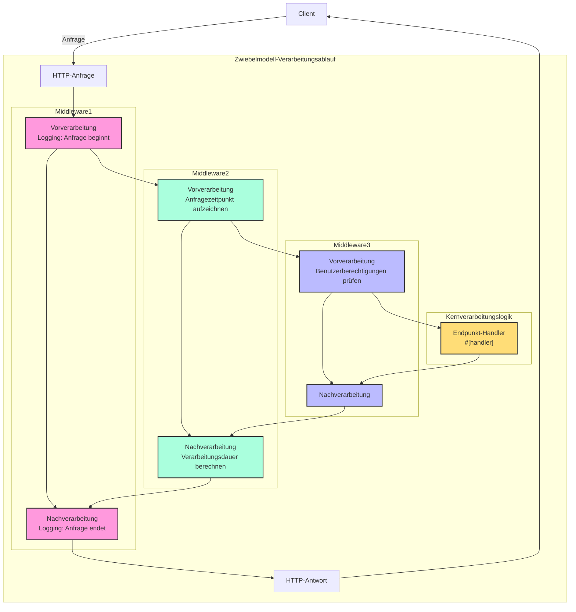

# Handler

## Kurzübersicht

Handler ist ein Kernkonzept des Salvo-Frameworks und kann vereinfacht als Anforderungsverarbeitungseinheit verstanden werden. Es hat zwei Hauptverwendungszwecke:

1. **Als Endpunkt (Endpoint)**: Objekte, die `Handler` implementieren, können als Endpunkte in das Routingsystem eingefügt werden, um Anfragen endgültig zu verarbeiten. Bei Verwendung des `#[handler]`-Makros können Funktionen direkt als Endpunkte verwendet werden; mit dem `#[endpoint]`-Makro können sie nicht nur als Endpunkt dienen, sondern auch automatisch OpenAPI-Dokumentation generieren (dies wird in späteren Dokumenten ausführlich erläutert).

2. **Als Middleware**: Derselbe `Handler` kann auch als Middleware verwendet werden, um Anfragen vor oder nach Erreichen des Endpunkts zu verarbeiten.

Der Anfrageverarbeitungsablauf von Salvo kann als "Pipeline" betrachtet werden: Eine Anfrage durchläuft zunächst eine Reihe von Middleware-Komponenten (vertikale Verarbeitung) und erreicht dann den passenden Endpunkt (horizontale Verarbeitung). Sowohl Middleware als auch Endpunkte sind Implementierungen von `Handler`, was dem gesamten System Konsistenz und Flexibilität verleiht.

### Handler-Flussdiagramm in Salvo


### Middleware und das Zwiebelmodell

Das Wesentliche des Zwiebelmodells ist, dass durch die Positionierung vor und nach `ctrl.call_next()` ein bidirektionaler Verarbeitungsfluss für Anfragen und Antworten realisiert wird, sodass jede Middleware am vollständigen Anfrage-Antwort-Zyklus teilnehmen kann.

### Vollständige Beispielstruktur einer Middleware

```rust
async fn example_middleware(req: &mut Request, depot: &mut Depot,resp: &mut Response, ctrl: &mut FlowCtrl) {
    // Vorverarbeitung (Anfragephase)
    // Hier Logik platzieren, die beim Eintreffen der Anfrage ausgeführt werden soll

    // Nächsten Handler in der Kette aufrufen
    ctrl.call_next(req, depot,resp).await;

    // Nachverarbeitung (Antwortphase)
    // Hier Logik platzieren, die nach Abschluss der Anfrageverarbeitung ausgeführt werden soll
}
```



## Was ist ein Handler

Handler ist das konkrete Objekt, das für die Verarbeitung von Request-Anfragen zuständig ist. Handler selbst ist ein Trait, das eine asynchrone Methode `handle` enthält:

```rust
#[async_trait]
pub trait Handler: Send + Sync + 'static {
    async fn handle(&self, req: &mut Request, depot: &mut Depot, res: &mut Response);
}
```

Die Standard-Signatur der Verarbeitungsfunktion `handle` umfasst vier Parameter in dieser Reihenfolge: `&mut Request, &mut Depot. &mut Response, &mut FlowCtrl`. Depot ist ein temporärer Speicher, in dem anfragebezogene Daten gespeichert werden können.

Je nach Verwendungsweise kann es als Middleware (hoop) eingesetzt werden, die vor oder nach Erreichen des eigentlichen anfrageverarbeitenden `Handler` bestimmte Verarbeitungen durchführt, z.B.: Login-Validierung, Datenkomprimierung usw.

Middleware wird über die `hoop`-Funktion des `Router` hinzugefügt. Die hinzugefügte Middleware beeinflusst den aktuellen `Router` und alle seine untergeordneten `Router`.

`Handler` kann auch als `Handler` verwendet werden, der am Routing-Matching teilnimmt und letztendlich ausgeführt wird, was als `goal` bezeichnet wird.

## `Handler` als Middleware (hoop)

Wenn `Handler` als Middleware verwendet wird, kann es zu den folgenden drei Objekten hinzugefügt werden, die Middleware unterstützen:

- `Service`: Jede Anfrage durchläuft die Middleware im `Service`.

- `Router`: Nur wenn das Routing erfolgreich ist, durchläuft die Anfrage nacheinander alle in `Service` definierten Middleware-Komponenten und alle gesammelten Middleware-Komponenten entlang des passenden Pfads.

- `Catcher`: Wenn ein Fehler auftritt und keine benutzerdefinierte Fehlermeldung geschrieben wurde, durchläuft die Anfrage die Middleware im `Catcher`.

- `Handler`: `Handler` selbst unterstützt das Hinzufügen von Middleware-Wrappern, um einige vor- oder nachgelagerte Logiken auszuführen.

## Verwendung des `#[handler]`-Makros

`#[handler]` kann das Schreiben von Code erheblich vereinfachen und die Flexibilität des Codes erhöhen.

Es kann auf eine Funktion angewendet werden, um sie `Handler` implementieren zu lassen:

```rust
#[handler]
async fn hello() -> &'static str {
    "hello world!"
}
```

Dies entspricht:

```rust
struct hello;

#[async_trait]
impl Handler for hello {
    async fn handle(&self, _req: &mut Request, _depot: &mut Depot, res: &mut Response, _ctrl: &mut FlowCtrl) {
        res.render(Text::Plain("hello world!"));
    }
}
```

Wie man sieht, wird der Code bei Verwendung von `#[handler]` viel einfacher:

- Manuelles Hinzufügen von `#[async_trait]` ist nicht mehr erforderlich.
- Nicht benötigte Parameter in der Funktion werden weggelassen, benötigte Parameter können in beliebiger Reihenfolge angeordnet werden.
- Für Objekte, die die Abstraktionen `Writer` oder `Scribe` implementieren, können sie direkt als Rückgabewert der Funktion verwendet werden. Hier implementiert `&'static str` `Scribe` und kann daher direkt als Funktionsrückgabewert zurückgegeben werden.

`#[handler]` kann nicht nur auf Funktionen, sondern auch auf `impl`-Blöcke von `struct` angewendet werden, um `struct` `Handler` implementieren zu lassen. In diesem Fall wird die `handle`-Funktion im `impl`-Block als konkrete Implementierung von `handle` in `Handler` erkannt:

```rust
struct Hello;

#[handler]
impl Hello {
    async fn handle(&self, res: &mut Response) {
        res.render(Text::Plain("hello world!"));
    }
}
```

## Fehlerbehandlung

`Handler` in Salvo kann `Result` zurückgeben, vorausgesetzt, die Typen `Ok` und `Err` in `Result` implementieren beide das `Writer`-Trait.
In Anbetracht der weit verbreiteten Verwendung von anyhow implementiert `anyhow::Error` bei Aktivierung der `anyhow`-Funktionalität das `Writer`-Trait. `anyhow::Error` wird auf `InternalServerError` abgebildet.

```rust
#[cfg(feature = "anyhow")]
#[async_trait]
impl Writer for ::anyhow::Error {
    async fn write(mut self, _req: &mut Request, _depot: &mut Depot, res: &mut Response) {
        res.render(StatusError::internal_server_error());
    }
}
```

Für benutzerdefinierte Fehlertypen können Sie je nach Bedarf unterschiedliche Fehlerseiten ausgeben.

```rust
use salvo::anyhow;
use salvo::prelude::*;

struct CustomError;
#[async_trait]
impl Writer for CustomError {
    async fn write(mut self, _req: &mut Request, _depot: &mut Depot, res: &mut Response) {
        res.status_code(StatusCode::INTERNAL_SERVER_ERROR);
        res.render("custom error");
    }
}

#[handler]
async fn handle_anyhow() -> Result<(), anyhow::Error> {
    Err(anyhow::anyhow!("anyhow error"))
}
#[handler]
async fn handle_custom() -> Result<(), CustomError> {
    Err(CustomError)
}

#[tokio::main]
async fn main() {
    let router = Router::new()
        .push(Router::new().path("anyhow").get(handle_anyhow))
        .push(Router::new().path("custom").get(handle_custom));
    let acceptor = TcpListener::new("127.0.0.1:5800").bind().await;
    Server::new(acceptor).serve(router).await;
}
```

## Direkte Implementierung des Handler-Traits

```rust
use salvo_core::prelude::*;
use crate::salvo_core::http::Body;

pub struct MaxSizeHandler(u64);
#[async_trait]
impl Handler for MaxSizeHandler {
    async fn handle(&self, req: &mut Request, depot: &mut Depot, res: &mut Response, ctrl: &mut FlowCtrl) {
        if let Some(upper) = req.body().and_then(|body| body.size_hint().upper()) {
            if upper > self.0 {
                res.render(StatusError::payload_too_large());
                ctrl.skip_rest();
            } else {
                ctrl.call_next(req, depot, res).await;
            }
        }
    }
}
```
{/* 本行由工具自动生成,原文哈希值:aba76a058ee7c27a6a982876209eae78 */}