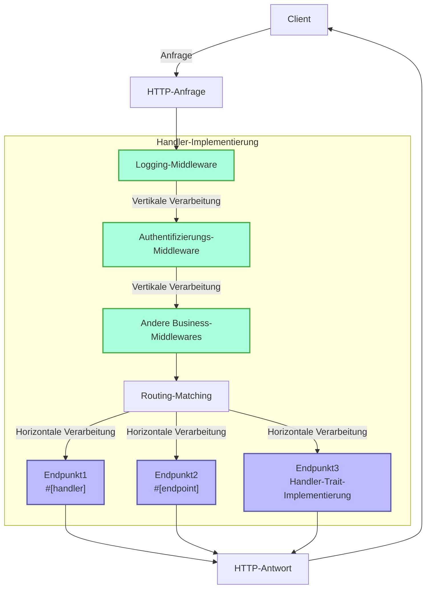
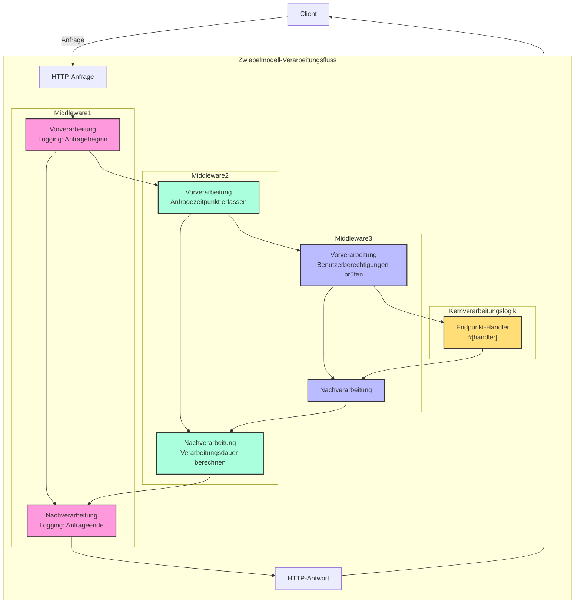

# Handler

## Schnellübersicht

Handler ist ein zentrales Konzept im Salvo-Framework und kann vereinfacht als Anfrageverarbeitungseinheit verstanden werden. Es hat zwei Hauptanwendungsfälle:

1. **Als Endpunkt (Endpoint)**: Objekte, die `Handler` implementieren, können als Endpunkte im Routingsystem platziert werden, um Anfragen final zu bearbeiten. Durch das `#[handler]`-Makro können Funktionen direkt als Endpunkte verwendet werden; mit dem `#[endpoint]`-Makro können sie nicht nur als Endpunkt dienen, sondern auch automatisch OpenAPI-Dokumentation generieren (dies wird in späteren Dokumenten näher erläutert).

2. **Als Middleware**: Derselbe `Handler` kann auch als Middleware eingesetzt werden, um Anfragen vor oder nach Erreichen des finalen Endpunkts zu verarbeiten.

Der Anfrageverarbeitungsfluss in Salvo kann als "Pipeline" betrachtet werden: Eine Anfrage durchläuft zunächst eine Reihe von Middlewares (vertikale Verarbeitung), bevor sie den passenden Endpunkt erreicht (horizontale Verarbeitung). Sowohl Middlewares als auch Endpunkte sind Implementierungen von `Handler`, was dem System Konsistenz und Flexibilität verleiht.

### Handler-Flussdiagramm in Salvo



### Middleware und das Zwiebelmodell

Das Wesen des Zwiebelmodells liegt darin, durch die Positionierung von `ctrl.call_next()` vor und nach der Verarbeitung einen bidirektionalen Anfrage-Antwort-Zyklus zu ermöglichen, sodass jede Middleware am vollständigen Anfrage-Antwort-Prozess teilnehmen kann.

### Vollständige Middleware-Beispielstruktur

```rust
async fn example_middleware(req: &mut Request, resp: &mut Response, ctrl: &mut FlowCtrl) {
    // Vorverarbeitung (Anfragephase)
    // Hier wird die Logik platziert, die beim Eintreffen der Anfrage ausgeführt werden soll

    // Aufruf des nächsten Handlers in der Kette
    ctrl.call_next(req, resp).await;

    // Nachverarbeitung (Antwortphase)
    // Hier wird die Logik platziert, die nach Abschluss der Anfrageverarbeitung ausgeführt werden soll
}
```



## Was ist ein Handler

Ein Handler ist ein Objekt, das für die Verarbeitung von Request-Anfragen verantwortlich ist. Handler ist selbst ein Trait, der eine asynchrone `handle`-Methode enthält:

```rust
#[async_trait]
pub trait Handler: Send + Sync + 'static {
    async fn handle(&self, req: &mut Request, depot: &mut Depot, res: &mut Response);
}
```

Die Standard-Signatur der `handle`-Funktion umfasst vier Parameter: `&mut Request, &mut Depot. &mut Response, &mut FlowCtrl`. Depot ist ein temporärer Speicher, der datenbezogene Informationen für die aktuelle Anfrage speichern kann.

Abhängig vom Verwendungszweck kann es als Middleware (Hoop) eingesetzt werden, die vor oder nach der eigentlichen Anfrageverarbeitung durch den `Handler` bestimmte Aufgaben erledigt, wie z.B. Login-Validierung oder Datenkomprimierung.

Middleware wird über die `hoop`-Funktion des `Router` hinzugefügt. Die hinzugefügte Middleware beeinflusst den aktuellen `Router` und alle seine untergeordneten `Router`.

Ein `Handler` kann auch als `Handler` verwendet werden, der am Routing teilnimmt und schließlich ausgeführt wird, was als `goal` bezeichnet wird.

## `Handler` als Middleware (Hoop)

Wenn `Handler` als Middleware verwendet wird, kann es zu den folgenden drei Objekten hinzugefügt werden, die Middleware unterstützen:

- `Service`: Jede Anfrage durchläuft die Middleware im `Service`.

- `Router`: Nur wenn das Routing erfolgreich ist, durchläuft die Anfrage nacheinander alle definierten Middlewares im `Service` und alle gesammelten Middlewares entlang des übereinstimmenden Pfads.

- `Catcher`: Wenn ein Fehler auftritt und keine benutzerdefinierten Fehlerinformationen geschrieben wurden, durchläuft die Anfrage die Middleware im `Catcher`.

- `Handler`: `Handler` selbst unterstützt das Hinzufügen von Middleware-Wrappern, um Vor- oder Nachbearbeitungslogik auszuführen.

## Verwendung des `#[handler]`-Makros

Das `#[handler]`-Makro kann den Code erheblich vereinfachen und die Flexibilität erhöhen.

Es kann auf eine Funktion angewendet werden, um sie als `Handler` zu implementieren:

```rust
#[handler]
async fn hello() -> &'static str {
    "hello world!"
}
```

Dies entspricht:

```rust
struct hello;

#[async_trait]
impl Handler for hello {
    async fn handle(&self, _req: &mut Request, _depot: &mut Depot, res: &mut Response, _ctrl: &mut FlowCtrl) {
        res.render(Text::Plain("hello world!"));
    }
}
```

Wie zu sehen ist, wird der Code mit `#[handler]` viel einfacher:

- Manuelles Hinzufügen von `#[async_trait]` ist nicht mehr erforderlich.
- Nicht benötigte Parameter in der Funktion werden weggelassen, und benötigte Parameter können in beliebiger Reihenfolge angeordnet werden.
- Für Objekte, die das `Writer`- oder `Scribe`-Abstraktion implementieren, können sie direkt als Rückgabewert der Funktion verwendet werden. Hier implementiert `&'static str` `Scribe` und kann daher direkt als Funktionsrückgabewert zurückgegeben werden.

Das `#[handler]`-Makro kann nicht nur auf Funktionen, sondern auch auf `impl`-Blöcke für `struct` angewendet werden, um den `struct` als `Handler` zu implementieren. In diesem Fall wird die `handle`-Funktion im `impl`-Block als spezifische Implementierung der `handle`-Methode in `Handler` erkannt:

```rust
struct Hello;

#[handler]
impl Hello {
    async fn handle(&self, res: &mut Response) {
        res.render(Text::Plain("hello world!"));
    }
}
```

## Fehlerbehandlung

Handler in Salvo können `Result` zurückgeben, solange die Typen `Ok` und `Err` in `Result` das `Writer`-Trait implementieren. 
In Anbetracht der weit verbreiteten Verwendung von anyhow implementiert `anyhow::Error` das `Writer`-Trait, wenn das `anyhow`-Feature aktiviert ist. `anyhow::Error` wird auf `InternalServerError` abgebildet.

```rust
#[cfg(feature = "anyhow")]
#[async_trait]
impl Writer for ::anyhow::Error {
    async fn write(mut self, _req: &mut Request, _depot: &mut Depot, res: &mut Response) {
        res.render(StatusError::internal_server_error());
    }
}
```

Für benutzerdefinierte Fehlertypen können Sie je nach Bedarf unterschiedliche Fehlerseiten ausgeben.

```rust
use salvo::anyhow;
use salvo::prelude::*;

struct CustomError;
#[async_trait]
impl Writer for CustomError {
    async fn write(mut self, _req: &mut Request, _depot: &mut Depot, res: &mut Response) {
        res.status_code(StatusCode::INTERNAL_SERVER_ERROR);
        res.render("custom error");
    }
}

#[handler]
async fn handle_anyhow() -> Result<(), anyhow::Error> {
    Err(anyhow::anyhow!("anyhow error"))
}
#[handler]
async fn handle_custom() -> Result<(), CustomError> {
    Err(CustomError)
}

#[tokio::main]
async fn main() {
    let router = Router::new()
        .push(Router::new().path("anyhow").get(handle_anyhow))
        .push(Router::new().path("custom").get(handle_custom));
    let acceptor = TcpListener::new("127.0.0.1:5800").bind().await;
    Server::new(acceptor).serve(router).await;
}
```

## Direkte Implementierung des Handler-Traits

```rust
use salvo_core::prelude::*;
use crate::salvo_core::http::Body;

pub struct MaxSizeHandler(u64);
#[async_trait]
impl Handler for MaxSizeHandler {
    async fn handle(&self, req: &mut Request, depot: &mut Depot, res: &mut Response, ctrl: &mut FlowCtrl) {
        if let Some(upper) = req.body().and_then(|body| body.size_hint().upper()) {
            if upper > self.0 {
                res.render(StatusError::payload_too_large());
                ctrl.skip_rest();
            } else {
                ctrl.call_next(req, depot, res).await;
            }
        }
    }
}
```
{/* 本行由工具自动生成,原文哈希值:6e138bcee73660fa82c5418d286d59cc */}