# Ablaufverarbeitung

Der `Service` wandelt die Anfrage zunächst in eine `Response` von Salvo um und tritt dann in die Phase der Routenübereinstimmung ein.

## Phase der Routenübereinstimmung

Die Routenübereinstimmung folgt der Reihenfolge der hinzugefügten Filter und wird von außen nach innen sowie von oben nach unten ausgeführt. Sobald ein Filter fehlschlägt, wird die Übereinstimmung als gescheitert betrachtet.

Während des Übereinstimmungsprozesses gibt es Pfadinformationen für die Anfrage. Sobald ein Pfadfilter erfolgreich übereinstimmt, wird der entsprechende Pfad verbraucht. Wenn alle Pfade vollständig verbraucht sind und keine Filter auf der Übereinstimmungskette fehlschlagen, und der letzte `Router` auf der aktuellen Kette über einen `goal`-`Handler` verfügt, gilt die Übereinstimmung als erfolgreich. Die Übereinstimmungsphase endet, und alle `Handler` auf den Übereinstimmungsketten werden gesammelt und in die Ausführungsphase überführt.

Wenn die Pfade nicht vollständig verbraucht sind, die Filter auf der Kette keine Fehler melden, aber keine weiteren Unterrouten zur weiteren Übereinstimmung verfügbar sind, wird die aktuelle Kette als fehlgeschlagen betrachtet, und die nächste Routenübereinstimmung wird versucht.

Wenn alle Routen überprüft wurden und keine erfolgreiche Übereinstimmung gefunden wurde, tritt die Phase der Fehlerbehandlung ein.

## Phase der Handler-Ausführung

Die gesammelten `Handler`-Listen aus der Übereinstimmungsphase werden nacheinander ausgeführt. Während der Ausführung können vorherige Middleware-Funktionen `ctrl::call_next()` aufrufen, um nachfolgende Middleware-Funktionen zuerst auszuführen, bevor sie ihre eigene Logik ausführen. Wenn während der Ausführung ein Statuscodefehler oder eine Umleitung auftritt, werden die nachfolgenden `Handler` nicht mehr ausgeführt. In diesem Fall, wenn der Statuscode ein Fehler ist und der `Body` der `Response` nicht gesetzt oder `ResBody::Error` ist, tritt die Phase der Fehlerbehandlung ein. Andernfalls wird diese Phase übersprungen.

## Phase der Fehlerbehandlung

`Catcher` ist ein Typ zur Fehlerbehandlung, der ebenfalls Middleware-Funktionen (Hoops) hinzufügen kann. Fehler durchlaufen nacheinander alle `Handler` innerhalb des `Catchers`. Wenn ein `Handler` den Fehler bereits behandelt hat und nicht möchte, dass nachfolgende `Handler` weiter ausgeführt werden, kann er `ctrl.skip_rest()` aufrufen, um die nachfolgenden `Handler` zu überspringen und die Fehlerbehandlungsphase direkt zu beenden.

Ein `Catcher` muss standardmäßig einen `Handler` enthalten, der als Standardfehlerbehandlung dient. Standardmäßig ist dies `DefaultGoal`. Sie können jedoch auch einen vollständig benutzerdefinierten `Handler` als Standardimplementierung für die Fehlerbehandlung verwenden. Basierend auf dem im Anfrage-Header angeforderten `content-type` zeigt es Fehlermeldungen in den entsprechenden Formaten an, unterstützt werden `json`, `xml`, `text` und `html`. `DefaultGoal` bietet auch einige Anzeigeeinstellungen. Standardmäßig zeigt es beispielsweise beim Anzeigen im HTML-Format Links zu Salvo an. Sie können `DefaultGoal::footer` oder `DefaultGoal::with_footer` aufrufen, um den Footer nach Ihren Wünschen anzupassen.

Der `Service` wandelt die `Response` von Salvo in den `Response`-Typ von Hyper um und gibt sie schließlich an Clients wie Browser zurück.

## Lebenszyklus einer Salvo-Anfrage
Dies ist eine visuelle Darstellung und Erläuterung des Lebenszyklus einer HTTP-Anfrage im Salvo-Web-Framework.

```mermaid
flowchart TD
    subgraph MainGraph[Salvo-Framework-Anfragelebenszyklus]
        Start[Client-Anfrage] --> Convert[Service wandelt HTTP-Anfrage in Salvo-Response um]
        
        %% Phase der Routenübereinstimmung
        subgraph RoutingPhase[1. Phase der Routenübereinstimmung]
            Convert --> Routing[Routenübereinstimmung in Reihenfolge, von außen nach innen, von oben nach unten]
            Routing --> FilterCheck{Sind alle Filter erfolgreich?}
            FilterCheck -->|Nein| NextRoute[Nächste Route versuchen]
            FilterCheck -->|Ja| PathConsume[Übereinstimmenden Pfadteil verbrauchen]
            PathConsume --> PathCheck{Wurde der Pfad vollständig verbraucht und gibt es einen goal-Handler?}
            PathCheck -->|Nein| SubRouteCheck{Gibt es Unterrouten zur weiteren Übereinstimmung?}
            SubRouteCheck -->|Ja| Routing
            SubRouteCheck -->|Nein| NextRoute
            NextRoute --> RouteLeft{Gibt es weitere Routen?}
            RouteLeft -->|Ja| Routing
            RouteLeft -->|Nein| NoMatchRoute[Routenübereinstimmung fehlgeschlagen]
            PathCheck -->|Ja| MatchSuccess[Routenübereinstimmung erfolgreich]
            MatchSuccess --> CollectHandlers[Alle Handler auf Übereinstimmungskette sammeln]
        end
        
        %% Phase der Handler-Ausführung
        subgraph HandlerPhase[2. Phase der Handler-Ausführung]
            CollectHandlers --> ExecHandlers[Handler in Reihenfolge ausführen]
            ExecHandlers --> ErrorCheck{Fehler oder Umleitung während der Ausführung?}
            ErrorCheck -->|Nein| FinishHandlers[Alle Handler ausgeführt]
            ErrorCheck -->|Ja| StatusCheck{Ist Statuscode ein Fehler und Body nicht gesetzt oder Error?}
            StatusCheck -->|Ja| EnterCatcher[Fehlerbehandlungsphase starten]
            StatusCheck -->|Nein| SkipCatcher[Fehlerbehandlungsphase überspringen]
        end
        
        %% Phase der Fehlerbehandlung
        subgraph CatcherPhase[3. Phase der Fehlerbehandlung]
            EnterCatcher --> CatcherHandlers[Handler des Catchers nacheinander ausführen]
            NoMatchRoute --> CatcherHandlers
            CatcherHandlers --> DefaultHandler[DefaultGoal oder benutzerdefinierte Fehlerbehandlung]
        end
        
        %% Endgültige Antwort
        FinishHandlers --> FinalConvert[Service wandelt Salvo-Response in Hyper-Response um]
        SkipCatcher --> FinalConvert
        DefaultHandler --> FinalConvert
        
        FinalConvert --> End[Antwort an Client zurückgeben]
    end
    
    %% Stile
    class RoutingPhase,HandlerPhase,CatcherPhase phase;
    class MainGraph mainGraph;
    classDef mainGraph fill:#f5f5f5,stroke:#333,stroke-width:1px;
    classDef phase fill:#e6f3ff,stroke:#333,stroke-width:2px;
```

{/* 本行由工具自动生成,原文哈希值:2934d9d3636688c10dfde8c3c36424c3 */}