# Ablaufverarbeitung

Der `Service` wandelt die Anfrage zunächst in die `Response` von Salvo um und tritt dann in die Routing-Matching-Phase ein.

## Routing-Matching-Phase

Beim Routing-Matching werden Filter in der Reihenfolge ihrer Hinzufügung ausgeführt, von außen nach innen und von oben nach unten. Wenn ein Filter fehlschlägt, gilt der Match als nicht erfolgreich.

Während des Matching-Prozesses werden die Pfadinformationen der Anfrage schrittweise verbraucht. Sobald ein Pfadfilter erfolgreich matched, verbraucht er den gematchten Teil des Pfads. Wenn alle Pfadsegmente verbraucht sind, kein Filter in der Matching-Kette fehlschlägt und der letzte `Router` in der aktuellen Kette ein `goal`-`Handler` hat, ist der Match erfolgreich und die Matching-Phase endet. Alle `Handler`, die aus der Matching-Kette gesammelt wurden, gehen in die Ausführungsphase über.

Wenn der Pfad nicht vollständig verbraucht ist, keine Fehler in der Kette auftreten, aber keine weiteren untergeordneten Routen zum Fortsetzen des Matchings vorhanden sind, gilt die aktuelle Kette als Match-Fehler, und der Prozess wechselt zur nächsten Route für das Matching.

Wenn alle Routen ohne Erfolg gematcht wurden, tritt der Prozess in die Fehlerbehandlungsphase ein.

## Handler-Ausführungsphase

Die während der Matching-Phase gesammelten `Handler` werden nacheinander ausgeführt. Während der Ausführung können vorherige Middleware `ctrl::call_next()` aufrufen, um nachfolgende Middleware zuerst ausführen zu lassen, bevor ihre eigene Logik ausgeführt wird. Wenn während der Ausführung ein Fehlerstatuscode oder eine Weiterleitung auftritt, werden nachfolgende `Handler` nicht ausgeführt. Wenn der Statuscode einen Fehler anzeigt und der `Body` der `Response` nicht gesetzt ist oder `ResBody::Error` ist, tritt der Prozess in die Fehlerbehandlungsphase ein; andernfalls wird die Fehlerbehandlungsphase übersprungen.

## Fehlerbehandlungsphase

`Catcher` ist ein Typ zur Fehlerbehandlung und kann auch Middleware (Hoops) enthalten. Fehler durchlaufen nacheinander alle `Handler` innerhalb des `Catchers`. Wenn ein `Handler` den Fehler bereits behandelt hat und nicht möchte, dass nachfolgende `Handler` fortfahren, kann er den Rest mit `ctrl.skip_rest()` überspringen und die Fehlerbehandlungsphase direkt beenden.

`Catcher` muss mindestens einen `Handler` als Standard-Fehlerbehandler enthalten. Der Standard ist `DefaultGoal`, aber Sie können Ihren eigenen `Handler` vollständig anpassen, um die Standard-Fehlerbehandlung zu implementieren. Es zeigt Fehlerinformationen im vom `content-type`-Header angeforderten Format an und unterstützt `json`, `xml`, `text` und `html` Formate. `DefaultGoal` bietet auch Anzeigeeinstellungen; standardmäßig zeigt es beispielsweise Salvo-bezogene Links an, wenn das HTML-Format angezeigt wird. Sie können `DefaultGoal::footer` oder `DefaultGoal::with_footer` aufrufen, um eine benutzerdefinierte Fußzeile nach Wunsch festzulegen.

`Service` wandelt die `Response` von Salvo in den Hyper-`Response`-Typ um, der letztendlich an Clients wie Browser zurückgegeben wird.

## Salvo-Anfragelebenszyklus
Dies ist eine visuelle Darstellung und Erklärung des HTTP-Anfragelebenszyklus im Salvo-Web-Framework.

```mermaid
flowchart TD
    subgraph MainGraph[Salvo Framework Request Lifecycle]
        Start[Client Request] --> Convert[Service converts HTTP request to Salvo Response]
        
        %% Routing Matching Phase
        subgraph RoutingPhase[1. Routing Matching Phase]
            Convert --> Routing[Match routes in added order, outer to inner, top to bottom]
            Routing --> FilterCheck{Do all filters pass?}
            FilterCheck -->|No| NextRoute[Try next route]
            FilterCheck -->|Yes| PathConsume[Consume matched path segment]
            PathConsume --> PathCheck{Is path fully consumed with a goal Handler?}
            PathCheck -->|No| SubRouteCheck{Are there sub-routes to continue matching?}
            SubRouteCheck -->|Yes| Routing
            SubRouteCheck -->|No| NextRoute
            NextRoute --> RouteLeft{Are there other routes?}
            RouteLeft -->|Yes| Routing
            RouteLeft -->|No| NoMatchRoute[Routing match failed]
            PathCheck -->|Yes| MatchSuccess[Routing match successful]
            MatchSuccess --> CollectHandlers[Collect all Handlers from the matching chain]
        end
        
        %% Handler Execution Phase
        subgraph HandlerPhase[2. Handler Execution Phase]
            CollectHandlers --> ExecHandlers[Execute Handlers sequentially]
            ExecHandlers --> ErrorCheck{Error or redirect during execution?}
            ErrorCheck -->|No| FinishHandlers[All Handlers executed]
            ErrorCheck -->|Yes| StatusCheck{Is status code an error and Body unset or Error?}
            StatusCheck -->|Yes| EnterCatcher[Enter error-catching phase]
            StatusCheck -->|No| SkipCatcher[Skip error-catching phase]
        end
        
        %% Error-Catching Phase
        subgraph CatcherPhase[3. Error-Catching Phase]
            EnterCatcher --> CatcherHandlers[Execute Catcher's Handlers sequentially]
            NoMatchRoute --> CatcherHandlers
            CatcherHandlers --> DefaultHandler[DefaultGoal or custom error handling]
        end
        
        %% Final Response
        FinishHandlers --> FinalConvert[Service converts Salvo Response to Hyper Response]
        SkipCatcher --> FinalConvert
        DefaultHandler --> FinalConvert
        
        FinalConvert --> End[Return response to client]
    end
    
    %% Styling
    class RoutingPhase,HandlerPhase,CatcherPhase phase;
    class MainGraph mainGraph;
    classDef mainGraph fill:#f5f5f5,stroke:#333,stroke-width:1px;
    classDef phase fill:#e6f3ff,stroke:#333,stroke-width:2px;
```

{/* Auto generated, origin file hash:76cc6c9018ddf6bdbf1b59044abae994 */}