# Verarbeitungsablauf

Der `Service` wandelt die Anfrage zunächst in eine `Response` von Salvo um, bevor die Phase des Routen-Matchings beginnt.

## Routen-Matching-Phase

Das Routen-Matching erfolgt in der Reihenfolge der hinzugefügten Filter, von außen nach innen und von oben nach unten. Scheitert ein Filter, gilt das Matching als fehlgeschlagen.

Während des Matchings werden die Pfadinformationen der Anfrage schrittweise verarbeitet. Sobald ein Pfadfilter erfolgreich matched, wird der entsprechende Pfadteil verbraucht. Sind alle Pfadteile verbraucht und kein Filter in der Kette gescheitert, wird das Matching erfolgreich abgeschlossen, sofern der letzte `Router` in der Kette über einen `goal`-`Handler` verfügt. Die gesammelten `Handler` aller erfolgreichen Matching-Ketten werden dann in die Ausführungsphase übergeben.

Falls Pfadteile unverbraucht bleiben, die Filterkette fehlerfrei ist, aber keine weiteren Subrouten mehr zur Verfügung stehen, wird die aktuelle Kette als fehlgeschlagen betrachtet und mit dem nächsten Routen-Matching fortgefahren.

Scheitern alle Routen-Matching-Versuche, wird die Fehlerbehandlungsphase eingeleitet.

## Handler-Ausführungsphase

Die in der Matching-Phase gesammelten `Handler` werden nacheinander ausgeführt. Vorherige Middleware kann `ctrl::call_next()` aufrufen, um nachfolgende Middleware vorzeitig auszuführen, bevor sie ihre eigene Logik verarbeitet. Treten während der Ausführung Fehlercodes oder Umleitungen auf, werden nachfolgende `Handler` nicht mehr ausgeführt. Ist der Statuscode ein Fehler und der `Body` der `Response` nicht gesetzt oder vom Typ `ResBody::Error`, wird die Fehlerbehandlungsphase eingeleitet. Andernfalls wird sie übersprungen.

## Fehlerbehandlungsphase

`Catcher` dient der Fehlerbehandlung und kann ebenfalls Middleware (Hoops) enthalten. Fehler durchlaufen nacheinander alle `Handler` innerhalb des `Catcher`. Falls ein `Handler` den Fehler bereits behandelt hat und weitere Bearbeitung unterbinden möchte, kann er mit `ctrl.skip_rest()` die nachfolgenden `Handler` überspringen und die Fehlerbehandlungsphase direkt beenden.

Ein `Catcher` muss standardmäßig einen `Handler` als Standard-Fehlerbehandlung enthalten. Die voreingestellte ist `DefaultGoal`, aber Sie können auch eine vollständig eigene `Handler`-Implementierung verwenden. Basierend auf dem im Anfrage-Header angeforderten `content-type` zeigt sie Fehlermeldungen in den Formaten `json`, `xml`, `text` oder `html` an. `DefaultGoal` bietet zusätzliche Anzeigeoptionen, z.B. zeigt es im HTML-Format standardmäßig Links zu Salvo an. Mit `DefaultGoal::footer` oder `DefaultGoal::with_footer` können Sie eine eigene benutzerdefinierte Fußzeile festlegen.

Der `Service` konvertiert die `Response` von Salvo in den `Response`-Typ von Hyper und sendet sie schließlich an den Client (z.B. Browser).

## Lebenszyklus einer Salvo-Anfrage
Dies ist eine visuelle Darstellung und Erläuterung des Lebenszyklus einer HTTP-Anfrage im Salvo Web-Framework.

```mermaid
flowchart TD
    subgraph MainGraph[Salvo-Framework-Anfragelebenszyklus]
        Start[Client-Anfrage] --> Convert[Service wandelt HTTP-Anfrage in Salvo-Response um]
        
        %% Routen-Matching-Phase
        subgraph RoutingPhase[1. Routen-Matching-Phase]
            Convert --> Routing[Routen-Matching in Reihenfolge: von außen nach innen, oben nach unten]
            Routing --> FilterCheck{Alle Filter erfolgreich?}
            FilterCheck -->|Nein| NextRoute[Nächste Route versuchen]
            FilterCheck -->|Ja| PathConsume[Matcheden Pfadteil verbrauchen]
            PathConsume --> PathCheck{Pfad vollständig verbraucht und goal-Handler vorhanden?}
            PathCheck -->|Nein| SubRouteCheck{Weitere Subrouten verfügbar?}
            SubRouteCheck -->|Ja| Routing
            SubRouteCheck -->|Nein| NextRoute
            NextRoute --> RouteLeft{Weitere Routen vorhanden?}
            RouteLeft -->|Ja| Routing
            RouteLeft -->|Nein| NoMatchRoute[Routen-Matching fehlgeschlagen]
            PathCheck -->|Ja| MatchSuccess[Routen-Matching erfolgreich]
            MatchSuccess --> CollectHandlers[Sammle alle Handler der Matching-Kette]
        end
        
        %% Handler-Ausführungsphase
        subgraph HandlerPhase[2. Handler-Ausführungsphase]
            CollectHandlers --> ExecHandlers[Handler nacheinander ausführen]
            ExecHandlers --> ErrorCheck{Fehler oder Umleitung aufgetreten?}
            ErrorCheck -->|Nein| FinishHandlers[Alle Handler abgeschlossen]
            ErrorCheck -->|Ja| StatusCheck{Fehlercode und Body nicht gesetzt oder Error?}
            StatusCheck -->|Ja| EnterCatcher[Fehlerbehandlungsphase starten]
            StatusCheck -->|Nein| SkipCatcher[Fehlerbehandlungsphase überspringen]
        end
        
        %% Fehlerbehandlungsphase
        subgraph CatcherPhase[3. Fehlerbehandlungsphase]
            EnterCatcher --> CatcherHandlers[Catcher-Handler nacheinander ausführen]
            NoMatchRoute --> CatcherHandlers
            CatcherHandlers --> DefaultHandler[DefaultGoal oder benutzerdefinierte Fehlerbehandlung]
        end
        
        %% Finale Antwort
        FinishHandlers --> FinalConvert[Service wandelt Salvo-Response in Hyper-Response um]
        SkipCatcher --> FinalConvert
        DefaultHandler --> FinalConvert
        
        FinalConvert --> End[Antwort an Client senden]
    end
    
    %% Stile
    class RoutingPhase,HandlerPhase,CatcherPhase phase;
    class MainGraph mainGraph;
    classDef mainGraph fill:#f5f5f5,stroke:#333,stroke-width:1px;
    classDef phase fill:#e6f3ff,stroke:#333,stroke-width:2px;
```

{/* 本行由工具自动生成,原文哈希值:2934d9d3636688c10dfde8c3c36424c3 */}