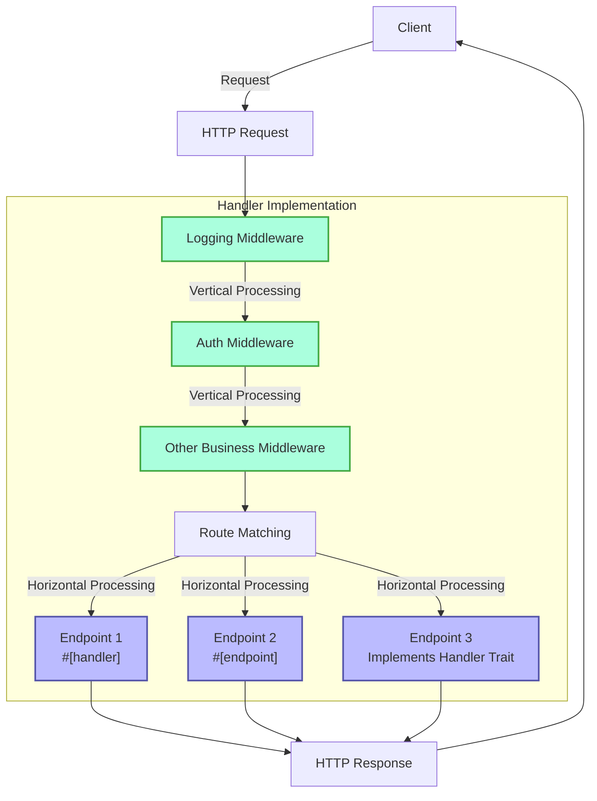
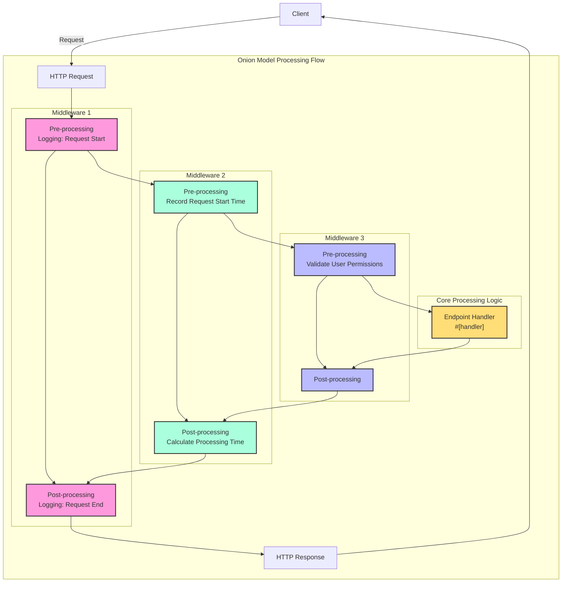

# Handler

## Quick Overview

Handler is a core concept in the Salvo framework, which can be simply understood as a request processing unit. It has two main purposes:

1. **As an Endpoint**: An object implementing `Handler` can be placed into the routing system as the final endpoint to process requests. When using the `#[handler]` macro, a function can be directly used as an endpoint; while using the `#[endpoint]` macro not only allows it to serve as an endpoint but also automatically generates OpenAPI documentation (this will be detailed in subsequent documentation).

2. **As Middleware**: The same `Handler` can also be used as middleware to process requests before or after they reach the final endpoint.

Salvo's request processing flow can be viewed as a "pipeline": a request first passes through a series of middleware (vertical processing) and then reaches the matching endpoint (horizontal processing). Both middleware and endpoints are implementations of `Handler`, which ensures consistency and flexibility throughout the system.

### Handler Flowchart in Salvo



### Middleware and the Onion Model

The essence of the onion model is that by placing `ctrl.call_next()` before and after specific logic, it implements a bidirectional processing flow for requests and responses, allowing each middleware to participate in the complete request-response cycle.

### Complete Middleware Example Structure

```rust
async fn example_middleware(req: &mut Request, depot: &mut Depot, resp: &mut Response, ctrl: &mut FlowCtrl) {
    // Pre-processing (Request Phase)
    // Place logic to execute when the request enters here.

    // Call the next handler in the chain.
    ctrl.call_next(req, depot, resp).await;

    // Post-processing (Response Phase)
    // Place logic to execute after the request is processed here.
}
```



## What is a Handler

A Handler is the concrete object responsible for processing Request objects. Handler itself is a Trait containing an asynchronous `handle` method:

```rust
#[async_trait]
pub trait Handler: Send + Sync + 'static {
    async fn handle(&self, req: &mut Request, depot: &mut Depot, res: &mut Response);
}
```

The default signature of the `handle` function includes four parameters, in order: `&mut Request, &mut Depot, &mut Response, &mut FlowCtrl`. Depot is temporary storage that can hold data related to the current request.

Depending on how it's used, it can serve as middleware (hoop), which can perform processing before or after the request reaches the formal request-processing `Handler`, such as: login verification, data compression, etc.

Middleware is added via the `hoop` function of a `Router`. The added middleware affects the current `Router` and all its descendant `Router`s.

A `Handler` can also be used as a `Handler` that participates in route matching and is ultimately executed, known as a `goal`.

## `Handler` as Middleware (hoop)

When a `Handler` acts as middleware, it can be added to the following three types of objects that support middleware:

- `Service`: Any request will pass through the middleware in the `Service`.
- `Router`: Only when route matching succeeds will the request pass through the middleware defined in the `Service` and all middleware collected along the matching path.
- `Catcher`: When an error occurs and no custom error information has been written, the request will pass through the middleware in the `Catcher`.
- `Handler`: The `Handler` itself supports adding middleware wrappers to execute some pre- or post-logic.

## Using the `#[handler]` Macro

The `#[handler]` macro can greatly simplify code writing and improve code flexibility.

It can be applied to a function to make it implement `Handler`:

```rust
#[handler]
async fn hello() -> &'static str {
    "hello world!"
}
```

This is equivalent to:

```rust
struct hello;

#[async_trait]
impl Handler for hello {
    async fn handle(&self, _req: &mut Request, _depot: &mut Depot, res: &mut Response, _ctrl: &mut FlowCtrl) {
        res.render(Text::Plain("hello world!"));
    }
}
```

As you can see, with `#[handler]`, the code becomes much simpler:

- No need to manually add `#[async_trait]`.
- Unnecessary parameters in the function are omitted, and the required parameters can be arranged in any order.
- For objects implementing the `Writer` or `Scribe` abstractions, they can be directly returned as the function's return value. Here, `&'static str` implements `Scribe`, so it can be directly returned.

`#[handler]` can not only be applied to functions but also to the `impl` block of a `struct` to make the `struct` implement `Handler`. In this case, the `handle` function within the `impl` block is recognized as the concrete implementation of the `handle` method in `Handler`:

```rust
struct Hello;

#[handler]
impl Hello {
    async fn handle(&self, res: &mut Response) {
        res.render(Text::Plain("hello world!"));
    }
}
```

## Handling Errors

In Salvo, a `Handler` can return a `Result`, provided that both the `Ok` and `Err` types within the `Result` implement the `Writer` trait.
Considering the widespread use of anyhow, when the `anyhow` feature is enabled, `anyhow::Error` will implement the `Writer` trait. `anyhow::Error` will be mapped to `InternalServerError`.

```rust
#[cfg(feature = "anyhow")]
#[async_trait]
impl Writer for ::anyhow::Error {
    async fn write(mut self, _req: &mut Request, _depot: &mut Depot, res: &mut Response) {
        res.render(StatusError::internal_server_error());
    }
}
```

For custom error types, you can output different error pages as needed.

```rust
use salvo::anyhow;
use salvo::prelude::*;

struct CustomError;
#[async_trait]
impl Writer for CustomError {
    async fn write(mut self, _req: &mut Request, _depot: &mut Depot, res: &mut Response) {
        res.status_code(StatusCode::INTERNAL_SERVER_ERROR);
        res.render("custom error");
    }
}

#[handler]
async fn handle_anyhow() -> Result<(), anyhow::Error> {
    Err(anyhow::anyhow!("anyhow error"))
}
#[handler]
async fn handle_custom() -> Result<(), CustomError> {
    Err(CustomError)
}

#[tokio::main]
async fn main() {
    let router = Router::new()
        .push(Router::new().path("anyhow").get(handle_anyhow))
        .push(Router::new().path("custom").get(handle_custom));
    let acceptor = TcpListener::new("127.0.0.1:5800").bind().await;
    Server::new(acceptor).serve(router).await;
}
```

## Directly Implementing the Handler Trait

```rust
use salvo_core::prelude::*;
use crate::salvo_core::http::Body;

pub struct MaxSizeHandler(u64);
#[async_trait]
impl Handler for MaxSizeHandler {
    async fn handle(&self, req: &mut Request, depot: &mut Depot, res: &mut Response, ctrl: &mut FlowCtrl) {
        if let Some(upper) = req.body().and_then(|body| body.size_hint().upper()) {
            if upper > self.0 {
                res.render(StatusError::payload_too_large());
                ctrl.skip_rest();
            } else {
                ctrl.call_next(req, depot, res).await;
            }
        }
    }
}
```
{/* 本行由工具自动生成,原文哈希值:aba76a058ee7c27a6a982876209eae78 */}