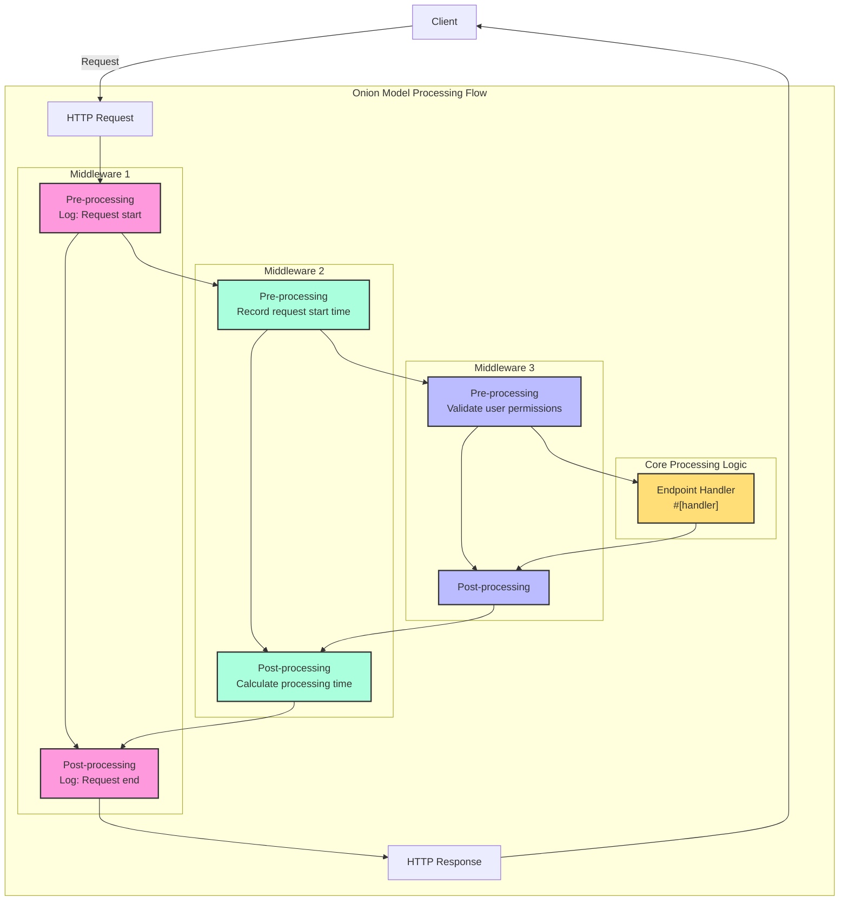

# Handler  

## Quick Overview  

Handler is a core concept in the Salvo framework, which can be simply understood as a request processing unit. It has two main purposes:  

1. **As an Endpoint**: Objects implementing `Handler` can be placed in the routing system as endpoints to handle requests. When using the `#[handler]` macro, functions can directly serve as endpoints. The `#[endpoint]` macro not only allows functions to act as endpoints but also automatically generates OpenAPI documentation (this will be detailed in later documentation).  

2. **As Middleware**: The same `Handler` can also function as middleware, processing requests before or after they reach the final endpoint.  

Salvo's request processing flow can be visualized as a "pipeline": requests first pass through a series of middleware (vertical processing) before reaching the matched endpoint (horizontal processing). Both middleware and endpoints are implementations of `Handler`, ensuring system-wide consistency and flexibility.  

### Handler Flowchart in Salvo  


### Middleware and the Onion Model  

The essence of the onion model lies in the placement of `ctrl.call_next()`, enabling bidirectional processing of requests and responses. This allows each middleware to participate in the complete request-response cycle.  

### Complete Middleware Example Structure  

```rust  
async fn example_middleware(req: &mut Request, resp: &mut Response, ctrl: &mut FlowCtrl) {  
    // Pre-processing (Request Phase)  
    // Place logic to execute when the request enters here  

    // Invoke the next handler in the chain  
    ctrl.call_next(req, resp).await;  

    // Post-processing (Response Phase)  
    // Place logic to execute after request processing completes here  
}  
```  



## What is a Handler  

A Handler is an object responsible for processing Request objects. The Handler itself is a Trait containing an asynchronous `handle` method:  

```rust  
#[async_trait]  
pub trait Handler: Send + Sync + 'static {  
    async fn handle(&self, req: &mut Request, depot: &mut Depot, res: &mut Response);  
}  
```  

The `handle` function's default signature includes four parameters: `&mut Request`, `&mut Depot`, `&mut Response`, and `&mut FlowCtrl`. Depot is temporary storage for request-related data.  

Depending on usage, a Handler can serve as middleware (hoop), processing requests before or after they reach the final Handler—e.g., for authentication, data compression, etc.  

Middleware is added via the `hoop` function of `Router`. Added middleware affects the current `Router` and all its descendant `Router`s.  

A `Handler` can also serve as a goal—participating in routing matching and final execution.  

## `Handler` as Middleware (hoop)  

When a `Handler` acts as middleware, it can be added to three types of middleware-supporting objects:  

- `Service`: All requests pass through middleware defined in `Service`.  
- `Router`: Only successfully matched requests pass through middleware defined in `Service` and all middleware collected along the matched path.  
- `Catcher`: When an error occurs and no custom error message is written, requests pass through middleware in `Catcher`.  
- `Handler`: A `Handler` itself supports adding middleware wrappers for pre- or post-processing logic.  

## Using the `#[handler]` Macro  

The `#[handler]` macro significantly simplifies code and enhances flexibility.  

It can be applied to a function to implement `Handler`:  

```rust  
#[handler]  
async fn hello() -> &'static str {  
    "hello world!"  
}  
```  

This is equivalent to:  

```rust  
struct hello;  

#[async_trait]  
impl Handler for hello {  
    async fn handle(&self, _req: &mut Request, _depot: &mut Depot, res: &mut Response, _ctrl: &mut FlowCtrl) {  
        res.render(Text::Plain("hello world!"));  
    }  
}  
```  

As shown, using `#[handler]` makes the code much simpler:  

- Manual `#[async_trait]` is no longer needed.  
- Unnecessary parameters can be omitted, and required parameters can be arranged in any order.  
- Objects implementing the `Writer` or `Scribe` traits can be directly returned. Here, `&'static str` implements `Scribe`, so it can be returned directly.  

The `#[handler]` macro can also be applied to a `struct`'s `impl` block to implement `Handler`. In this case, the `handle` function in the `impl` block is recognized as the concrete implementation of `Handler`'s `handle`:  

```rust  
struct Hello;  

#[handler]  
impl Hello {  
    async fn handle(&self, res: &mut Response) {  
        res.render(Text::Plain("hello world!"));  
    }  
}  
```  

## Handling Errors  

In Salvo, a `Handler` can return `Result`, provided the `Ok` and `Err` types both implement the `Writer` trait.  
Given the widespread use of `anyhow`, when the `anyhow` feature is enabled, `anyhow::Error` implements the `Writer` trait and is mapped to `InternalServerError`.  

```rust  
#[cfg(feature = "anyhow")]  
#[async_trait]  
impl Writer for ::anyhow::Error {  
    async fn write(mut self, _req: &mut Request, _depot: &mut Depot, res: &mut Response) {  
        res.render(StatusError::internal_server_error());  
    }  
}  
```  

For custom error types, you can render different error pages as needed:  

```rust  
use salvo::anyhow;  
use salvo::prelude::*;  

struct CustomError;  
#[async_trait]  
impl Writer for CustomError {  
    async fn write(mut self, _req: &mut Request, _depot: &mut Depot, res: &mut Response) {  
        res.status_code(StatusCode::INTERNAL_SERVER_ERROR);  
        res.render("custom error");  
    }  
}  

#[handler]  
async fn handle_anyhow() -> Result<(), anyhow::Error> {  
    Err(anyhow::anyhow!("anyhow error"))  
}  
#[handler]  
async fn handle_custom() -> Result<(), CustomError> {  
    Err(CustomError)  
}  

#[tokio::main]  
async fn main() {  
    let router = Router::new()  
        .push(Router::new().path("anyhow").get(handle_anyhow))  
        .push(Router::new().path("custom").get(handle_custom));  
    let acceptor = TcpListener::new("127.0.0.1:5800").bind().await;  
    Server::new(acceptor).serve(router).await;  
}  
```  

## Directly Implementing the Handler Trait  

```rust  
use salvo_core::prelude::*;  
use crate::salvo_core::http::Body;  

pub struct MaxSizeHandler(u64);  
#[async_trait]  
impl Handler for MaxSizeHandler {  
    async fn handle(&self, req: &mut Request, depot: &mut Depot, res: &mut Response, ctrl: &mut FlowCtrl) {  
        if let Some(upper) = req.body().and_then(|body| body.size_hint().upper()) {  
            if upper > self.0 {  
                res.render(StatusError::payload_too_large());  
                ctrl.skip_rest();  
            } else {  
                ctrl.call_next(req, depot, res).await;  
            }  
        }  
    }  
}  
```
{/* 本行由工具自动生成,原文哈希值:6e138bcee73660fa82c5418d286d59cc */}