# Processing Flow

`Service` first converts the request into Salvo's `Response`, then proceeds to the route matching phase.

## Route Matching Phase

During route matching, filters are executed sequentially in the order they were added, from outer to inner and top to bottom. If any filter fails to execute, the match is considered unsuccessful.

During the matching process, the path information of the request is processed. As matching progresses, once a path filter successfully matches, it consumes the matched portion of the path. If all path segments are consumed and no filters in the matching chain fail, and the last `Router` in the current chain has a `goal` `Handler`, the match is successful, concluding the matching phase. All `Handlers` from the matching chain are collected and proceed to the execution phase.

If the path is not fully consumed, no errors occur in the filter chain, but there are no more sub-routes to continue matching, the current chain is considered a failed match, and the process moves to the next route matching attempt.

If all routes are matched without success, the process enters the error-catching phase.

## Handler Execution Phase

The collected `Handlers` from the matching phase are executed sequentially. During execution, preceding middleware can call `ctrl::call_next()` to allow subsequent middleware to execute first before running its own logic. If an error status code or redirection occurs during execution, subsequent `Handlers` will not be executed. If the status code indicates an error and the `Response`'s `Body` is unset or is `ResBody::Error`, the process enters the error-catching phase; otherwise, it skips this phase.

## Error-Catching Phase

`Catcher` is a type designed to handle errors and can also include middleware (hoops). Errors pass through all `Handlers` within the `Catcher` sequentially. If a `Handler` has processed the error and wishes to skip subsequent `Handlers`, it can use `ctrl.skip_rest()` to bypass the remaining `Handlers` and directly conclude the error-catching phase.

A `Catcher` must include at least one `Handler` as the default error handler. The default is `DefaultGoal`, but you can fully customize your own `Handler` as the default error-handling implementation. It displays error messages in formats corresponding to the `content-type` requested in the headers, supporting `json`, `xml`, `text`, and `html` formats. `DefaultGoal` also provides display settings—for example, by default, when displaying in HTML format, it includes Salvo-related links. You can call `DefaultGoal::footer` or `DefaultGoal::with_footer` to customize the footer as desired.

`Service` converts Salvo's `Response` into Hyper's `Response` type, which is ultimately returned to clients such as browsers.

## Salvo Request Lifecycle
This is a visual representation and explanation of the HTTP request lifecycle in the Salvo web framework.

```mermaid
flowchart TD
    subgraph MainGraph[Salvo Framework Request Lifecycle]
        Start[Client Request] --> Convert[Service converts HTTP request to Salvo Response]
        
        %% Route Matching Phase
        subgraph RoutingPhase[1. Route Matching Phase]
            Convert --> Routing[Match routes in added order, outer to inner, top to bottom]
            Routing --> FilterCheck{Do all filters pass?}
            FilterCheck -->|No| NextRoute[Try next route]
            FilterCheck -->|Yes| PathConsume[Consume matched path segment]
            PathConsume --> PathCheck{Is path fully consumed with a goal Handler?}
            PathCheck -->|No| SubRouteCheck{Are there sub-routes to continue matching?}
            SubRouteCheck -->|Yes| Routing
            SubRouteCheck -->|No| NextRoute
            NextRoute --> RouteLeft{Are there more routes?}
            RouteLeft -->|Yes| Routing
            RouteLeft -->|No| NoMatchRoute[Route matching failed]
            PathCheck -->|Yes| MatchSuccess[Route matching succeeded]
            MatchSuccess --> CollectHandlers[Collect all Handlers from matching chain]
        end
        
        %% Handler Execution Phase
        subgraph HandlerPhase[2. Handler Execution Phase]
            CollectHandlers --> ExecHandlers[Execute Handlers sequentially]
            ExecHandlers --> ErrorCheck{Error or redirection during execution?}
            ErrorCheck -->|No| FinishHandlers[All Handlers executed]
            ErrorCheck -->|Yes| StatusCheck{Is status code an error and Body unset or Error?}
            StatusCheck -->|Yes| EnterCatcher[Enter error-catching phase]
            StatusCheck -->|No| SkipCatcher[Skip error-catching phase]
        end
        
        %% Error-Catching Phase
        subgraph CatcherPhase[3. Error-Catching Phase]
            EnterCatcher --> CatcherHandlers[Execute Catcher's Handlers sequentially]
            NoMatchRoute --> CatcherHandlers
            CatcherHandlers --> DefaultHandler[DefaultGoal or custom error handling]
        end
        
        %% Final Response
        FinishHandlers --> FinalConvert[Service converts Salvo Response to Hyper Response]
        SkipCatcher --> FinalConvert
        DefaultHandler --> FinalConvert
        
        FinalConvert --> End[Return response to client]
    end
    
    %% Styling
    class RoutingPhase,HandlerPhase,CatcherPhase phase;
    class MainGraph mainGraph;
    classDef mainGraph fill:#f5f5f5,stroke:#333,stroke-width:1px;
    classDef phase fill:#e6f3ff,stroke:#333,stroke-width:2px;
```

{/* 本行由工具自动生成,原文哈希值:2934d9d3636688c10dfde8c3c36424c3 */}