# Processing Flow

`Service` first converts the request into Salvo's `Response`, then enters the routing matching phase.

## Routing Matching Phase

Routing matching runs filters in the order they were added, proceeding from outer to inner and top to bottom. If any filter fails, the match is considered unsuccessful.

During the matching process, the request's path information is consumed progressively. Once a path filter matches successfully, it consumes the matched portion of the path. When all path segments are consumed, and no filter fails along the matching chain, and the last `Router` on the current chain has a `goal` `Handler`, the match is successful, and the matching phase ends. All `Handler`s collected from the matching chain proceed to the execution phase.

If the path is not fully consumed, no errors occur along the chain, but there are no further child routes to continue matching, the current chain is considered a match failure, and the process moves to the next route for matching.

If all routes are matched without success, the process enters the error-catching phase.

## Handler Execution Phase

The `Handler`s collected during the matching phase are executed sequentially. During execution, preceding middleware can call `ctrl::call_next()` to allow subsequent middleware to execute first before running its own logic. If an error status code or a redirect occurs during execution, subsequent `Handler`s will not be executed. If the status code indicates an error and the `Response`'s `Body` is unset or is `ResBody::Error`, the process enters the error-catching phase; otherwise, it skips the catching phase.

## Error-Catching Phase

`Catcher` is a type used to handle errors and can also include middleware (hoops). Errors pass through all `Handler`s within the `Catcher` sequentially. If a `Handler` has already handled the error and does not want subsequent `Handler`s to continue, it can skip the rest using `ctrl.skip_rest()`, directly ending the catching phase.

`Catcher` must include at least one `Handler` as the default error handler. The default is `DefaultGoal`, but you can fully customize your own `Handler` as the default error-handling implementation. It displays error information in the format requested by the `content-type` header, supporting `json`, `xml`, `text`, and `html` formats. `DefaultGoal` also provides display settings; for example, by default, it displays Salvo-related links when showing HTML format. You can call `DefaultGoal::footer` or `DefaultGoal::with_footer` to set a custom footer as desired.

`Service` converts Salvo's `Response` into Hyper's `Response` type, which is ultimately returned to clients such as browsers.

## Salvo Request Lifecycle
This is a visual representation and explanation of the HTTP request lifecycle in the Salvo web framework.

```mermaid
flowchart TD
    subgraph MainGraph[Salvo Framework Request Lifecycle]
        Start[Client Request] --> Convert[Service converts HTTP request to Salvo Response]
        
        %% Routing Matching Phase
        subgraph RoutingPhase[1. Routing Matching Phase]
            Convert --> Routing[Match routes in added order, outer to inner, top to bottom]
            Routing --> FilterCheck{Do all filters pass?}
            FilterCheck -->|No| NextRoute[Try next route]
            FilterCheck -->|Yes| PathConsume[Consume matched path segment]
            PathConsume --> PathCheck{Is path fully consumed with a goal Handler?}
            PathCheck -->|No| SubRouteCheck{Are there sub-routes to continue matching?}
            SubRouteCheck -->|Yes| Routing
            SubRouteCheck -->|No| NextRoute
            NextRoute --> RouteLeft{Are there other routes?}
            RouteLeft -->|Yes| Routing
            RouteLeft -->|No| NoMatchRoute[Routing match failed]
            PathCheck -->|Yes| MatchSuccess[Routing match successful]
            MatchSuccess --> CollectHandlers[Collect all Handlers from the matching chain]
        end
        
        %% Handler Execution Phase
        subgraph HandlerPhase[2. Handler Execution Phase]
            CollectHandlers --> ExecHandlers[Execute Handlers sequentially]
            ExecHandlers --> ErrorCheck{Error or redirect during execution?}
            ErrorCheck -->|No| FinishHandlers[All Handlers executed]
            ErrorCheck -->|Yes| StatusCheck{Is status code an error and Body unset or Error?}
            StatusCheck -->|Yes| EnterCatcher[Enter error-catching phase]
            StatusCheck -->|No| SkipCatcher[Skip error-catching phase]
        end
        
        %% Error-Catching Phase
        subgraph CatcherPhase[3. Error-Catching Phase]
            EnterCatcher --> CatcherHandlers[Execute Catcher's Handlers sequentially]
            NoMatchRoute --> CatcherHandlers
            CatcherHandlers --> DefaultHandler[DefaultGoal or custom error handling]
        end
        
        %% Final Response
        FinishHandlers --> FinalConvert[Service converts Salvo Response to Hyper Response]
        SkipCatcher --> FinalConvert
        DefaultHandler --> FinalConvert
        
        FinalConvert --> End[Return response to client]
    end
    
    %% Styling
    class RoutingPhase,HandlerPhase,CatcherPhase phase;
    class MainGraph mainGraph;
    classDef mainGraph fill:#f5f5f5,stroke:#333,stroke-width:1px;
    classDef phase fill:#e6f3ff,stroke:#333,stroke-width:2px;
```

