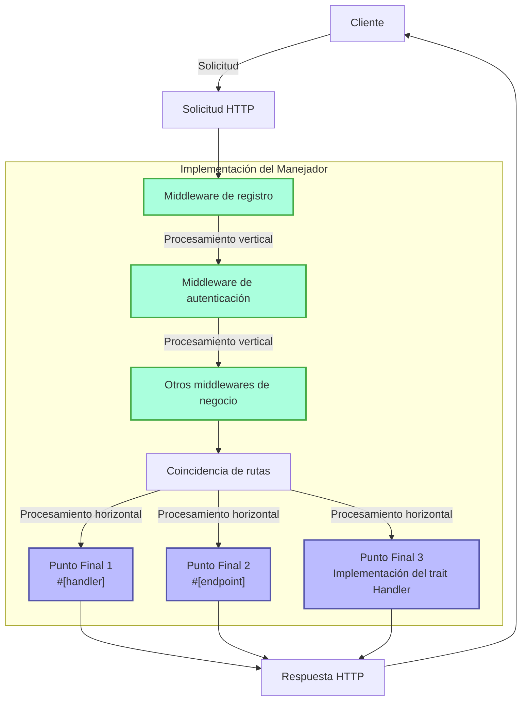
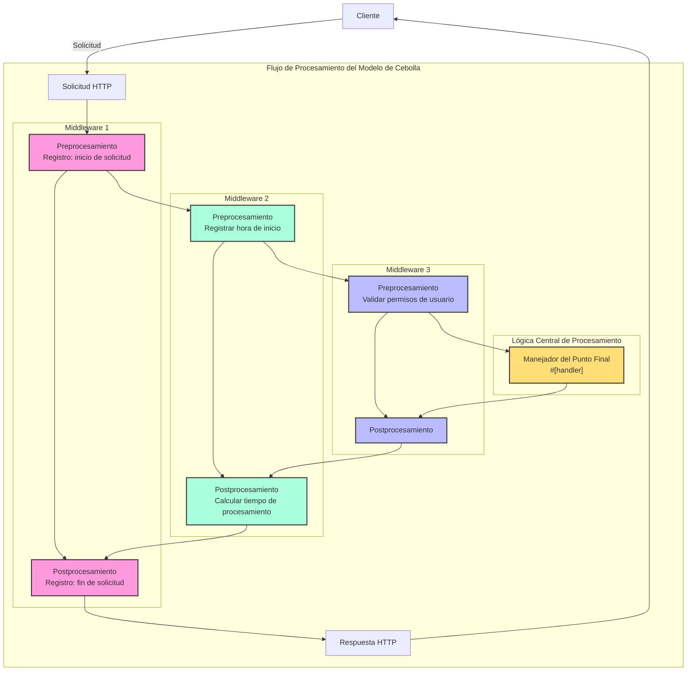

# Manejador (Handler)

## Resumen Rápido

El Manejador es un concepto central en el framework Salvo, que puede entenderse como una unidad de procesamiento de solicitudes. Tiene dos usos principales:

1. **Como Punto Final (Endpoint)**: Un objeto que implementa `Handler` puede colocarse en el sistema de enrutamiento como punto final para procesar solicitudes. Cuando se usa la macro `#[handler]`, una función puede actuar directamente como punto final; mientras que con la macro `#[endpoint]`, no solo funciona como punto final, sino que también genera automáticamente documentación OpenAPI (esto se detallará más adelante).

2. **Como Middleware**: El mismo `Handler` también puede usarse como middleware, para procesar solicitudes antes o después de que lleguen al punto final.

El flujo de procesamiento de solicitudes en Salvo puede verse como una "tubería": la solicitud primero pasa por una serie de middlewares (procesamiento vertical), luego llega al punto final coincidente (procesamiento horizontal). Tanto los middlewares como los puntos finales son implementaciones de `Handler`, lo que brinda consistencia y flexibilidad al sistema.

### Diagrama de Flujo del Manejador en Salvo



### Middleware y Modelo de Cebolla

La esencia del modelo de cebolla es que, mediante la posición de `ctrl.call_next()`, se logra un flujo bidireccional de procesamiento de solicitudes y respuestas, permitiendo que cada middleware participe en el ciclo completo de solicitud-respuesta.

### Estructura Completa de Ejemplo de Middleware

```rust
async fn middleware_ejemplo(req: &mut Request, resp: &mut Response, ctrl: &mut FlowCtrl) {
    // Preprocesamiento (fase de solicitud)
    // Aquí va la lógica a ejecutar cuando llega la solicitud

    // Llama al siguiente manejador en la cadena
    ctrl.call_next(req, resp).await;

    // Postprocesamiento (fase de respuesta)
    // Aquí va la lógica a ejecutar después de procesar la solicitud
}
```



## Qué es un Manejador

El Manejador es el objeto responsable de procesar las solicitudes Request. Es un Trait que contiene un método asíncrono `handle`:

```rust
#[async_trait]
pub trait Handler: Send + Sync + 'static {
    async fn handle(&self, req: &mut Request, depot: &mut Depot, res: &mut Response);
}
```

La función `handle` tiene por defecto cuatro parámetros: `&mut Request, &mut Depot, &mut Response, &mut FlowCtrl`. Depot es un almacenamiento temporal para datos relacionados con la solicitud actual.

Dependiendo de su uso, puede funcionar como middleware (hoop), que puede procesar la solicitud antes o después de que llegue al `Handler` principal, como validación de inicio de sesión, compresión de datos, etc.

Los middlewares se añaden mediante la función `hoop` de `Router`. Los middlewares añadidos afectan al `Router` actual y a todos sus `Router` descendientes.

El `Handler` también puede usarse como `goal`, que participa en el enrutamiento y se ejecuta al final.

## `Handler` como Middleware (hoop)

Cuando `Handler` actúa como middleware, puede añadirse a tres tipos de objetos que admiten middlewares:

- `Service`: Todas las solicitudes pasan por los middlewares de `Service`.

- `Router`: Solo cuando coincide la ruta, la solicitud pasa por los middlewares definidos en `Service` y todos los middlewares recopilados en la ruta coincidente.

- `Catcher`: Cuando ocurre un error y no se ha escrito información de error personalizada, la solicitud pasa por los middlewares de `Catcher`.

- `Handler`: El propio `Handler` admite añadir middlewares para ejecutar lógica previa o posterior.

## Uso de la Macro `#[handler]`

La macro `#[handler]` simplifica enormemente la escritura de código y aumenta su flexibilidad.

Puede aplicarse a una función para que implemente `Handler`:

```rust
#[handler]
async fn hola() -> &'static str {
    "¡Hola mundo!"
}
```

Equivale a:

```rust
struct hola;

#[async_trait]
impl Handler for hola {
    async fn handle(&self, _req: &mut Request, _depot: &mut Depot, res: &mut Response, _ctrl: &mut FlowCtrl) {
        res.render(Text::Plain("¡Hola mundo!"));
    }
}
```

Como se ve, con `#[handler]` el código es mucho más simple:

- No es necesario añadir manualmente `#[async_trait]`.
- Los parámetros no necesarios se omiten, y los necesarios pueden ordenarse en cualquier secuencia.
- Los objetos que implementan `Writer` o `Scribe` pueden devolverse directamente. Aquí, `&'static str` implementa `Scribe`, por lo que puede devolverse directamente.

`#[handler]` no solo puede aplicarse a funciones, sino también a bloques `impl` de `struct`, haciendo que la `struct` implemente `Handler`. En este caso, la función `handle` dentro del bloque `impl` se reconoce como la implementación concreta de `handle` en `Handler`:

```rust
struct Hola;

#[handler]
impl Hola {
    async fn handle(&self, res: &mut Response) {
        res.render(Text::Plain("¡Hola mundo!"));
    }
}
```

## Manejo de Errores

En Salvo, `Handler` puede devolver `Result`, siempre que `Ok` y `Err` implementen el trait `Writer`. Dado que anyhow es bastante utilizado, al activar la función `anyhow`, `anyhow::Error` implementará `Writer`. `anyhow::Error` se mapea a `InternalServerError`.

```rust
#[cfg(feature = "anyhow")]
#[async_trait]
impl Writer for ::anyhow::Error {
    async fn write(mut self, _req: &mut Request, _depot: &mut Depot, res: &mut Response) {
        res.render(StatusError::internal_server_error());
    }
}
```

Para tipos de error personalizados, puedes mostrar diferentes páginas de error según sea necesario.

```rust
use salvo::anyhow;
use salvo::prelude::*;

struct ErrorPersonalizado;
#[async_trait]
impl Writer for ErrorPersonalizado {
    async fn write(mut self, _req: &mut Request, _depot: &mut Depot, res: &mut Response) {
        res.status_code(StatusCode::INTERNAL_SERVER_ERROR);
        res.render("error personalizado");
    }
}

#[handler]
async fn manejar_anyhow() -> Result<(), anyhow::Error> {
    Err(anyhow::anyhow!("error anyhow"))
}
#[handler]
async fn manejar_personalizado() -> Result<(), ErrorPersonalizado> {
    Err(ErrorPersonalizado)
}

#[tokio::main]
async fn main() {
    let router = Router::new()
        .push(Router::new().path("anyhow").get(manejar_anyhow))
        .push(Router::new().path("personalizado").get(manejar_personalizado));
    let acceptor = TcpListener::new("127.0.0.1:5800").bind().await;
    Server::new(acceptor).serve(router).await;
}
```

## Implementación Directa del Trait Handler

```rust
use salvo_core::prelude::*;
use crate::salvo_core::http::Body;

pub struct ManejadorTamañoMáximo(u64);
#[async_trait]
impl Handler for ManejadorTamañoMáximo {
    async fn handle(&self, req: &mut Request, depot: &mut Depot, res: &mut Response, ctrl: &mut FlowCtrl) {
        if let Some(superior) = req.body().and_then(|body| body.size_hint().upper()) {
            if superior > self.0 {
                res.render(StatusError::payload_too_large());
                ctrl.skip_rest();
            } else {
                ctrl.call_next(req, depot, res).await;
            }
        }
    }
}
```
{/* 本行由工具自动生成,原文哈希值:6e138bcee73660fa82c5418d286d59cc */}