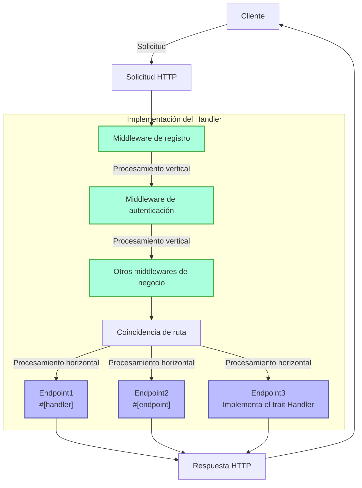
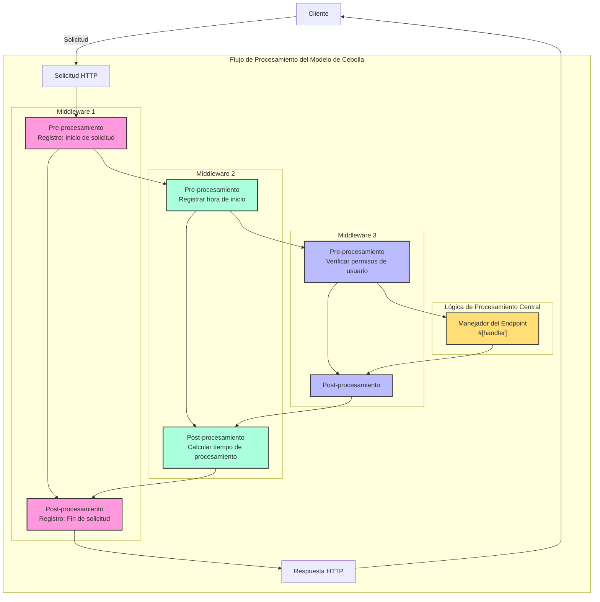

# Handler

## Resumen Rápido

Handler es un concepto central en el framework Salvo. Puede entenderse simplemente como una unidad de procesamiento de solicitudes y tiene dos usos principales:

1.  **Como Punto Final (Endpoint)**: Un objeto que implementa `Handler` puede colocarse en el sistema de enrutamiento para actuar como el punto final que procesa la solicitud. Cuando se usa la macro `#[handler]`, una función puede usarse directamente como punto final; mientras que al usar la macro `#[endpoint]`, no solo actúa como punto final, sino que también genera automáticamente documentación OpenAPI (esto se detallará en documentación posterior).

2.  **Como Middleware**: El mismo `Handler` también puede usarse como middleware, para procesar la solicitud antes o después de que llegue al punto final.

El flujo de procesamiento de solicitudes en Salvo puede verse como una "tubería": la solicitud primero pasa por una serie de middlewares (procesamiento vertical), y luego llega al punto final coincidente (procesamiento horizontal). Tanto los middlewares como los endpoints son implementaciones de `Handler`, lo que mantiene coherencia y flexibilidad en todo el sistema.

### Diagrama de Flujo del Handler en Salvo



### Middleware y el Modelo de Cebolla

La esencia del modelo de cebolla es que, mediante la posición (antes o después) de `ctrl.call_next()`, se implementa un flujo bidireccional de procesamiento de solicitud y respuesta, permitiendo que cada middleware participe en el ciclo completo de solicitud-respuesta.

### Estructura de Ejemplo Completa de Middleware

```rust
async fn example_middleware(req: &mut Request, depot: &mut Depot,resp: &mut Response, ctrl: &mut FlowCtrl) {
    // Pre-procesamiento (fase de solicitud)
    // Coloca aquí la lógica a ejecutar cuando entra la solicitud

    // Llama al siguiente manejador en la cadena
    ctrl.call_next(req, depot,resp).await;

    // Post-procesamiento (fase de respuesta)
    // Coloca aquí la lógica a ejecutar después de procesar la solicitud
}
```



## ¿Qué es un Handler?

Handler es el objeto concreto responsable de procesar las solicitudes Request. Handler es en sí mismo un Trait, que contiene internamente un método asíncrono `handle`:

```rust
#[async_trait]
pub trait Handler: Send + Sync + 'static {
    async fn handle(&self, req: &mut Request, depot: &mut Depot, res: &mut Response);
}
```

La firma predeterminada de la función de procesamiento `handle` incluye cuatro parámetros, en orden: `&mut Request, &mut Depot. &mut Response, &mut FlowCtrl`. Depot es un almacenamiento temporal que puede guardar datos relacionados con la solicitud actual.

Dependiendo de cómo se use, puede actuar como middleware (hoop), que puede realizar algún procesamiento antes o después de que la solicitud llegue al `Handler` que la procesa formalmente, como: verificación de inicio de sesión, compresión de datos, etc.

Los middlewares se agregan mediante la función `hoop` del `Router`. El middleware agregado afectará al `Router` actual y a todos sus `Router` descendientes.

`Handler` también puede usarse como un `Handler` que participa en la coincidencia de rutas y se ejecuta finalmente, conocido como `goal`.

## `Handler` como Middleware (hoop)

Cuando `Handler` actúa como middleware, puede agregarse a los siguientes tres objetos que admiten middleware:

-   `Service`: Cualquier solicitud pasará por los middlewares en `Service`.
-   `Router`: Solo cuando la coincidencia de ruta es exitosa, la solicitud pasa secuencialmente por los middlewares definidos en `Service` y todos los middlewares recopilados a lo largo de la ruta coincidente.
-   `Catcher`: Cuando ocurre un error y no se ha escrito información de error personalizada, la solicitud pasará por los middlewares en `Catcher`.
-   `Handler`: `Handler` en sí mismo admite agregar middleware envolvente para ejecutar lógica previa o posterior.

## Uso de la Macro `#[handler]`

`#[handler]` puede simplificar enormemente la escritura del código y mejorar su flexibilidad.

Puede aplicarse a una función para hacer que implemente `Handler`:

```rust
#[handler]
async fn hello() -> &'static str {
    "hello world!"
}
```

Esto es equivalente a:

```rust
struct hello;

#[async_trait]
impl Handler for hello {
    async fn handle(&self, _req: &mut Request, _depot: &mut Depot, res: &mut Response, _ctrl: &mut FlowCtrl) {
        res.render(Text::Plain("hello world!"));
    }
}
```

Como se puede ver, al usar `#[handler]`, el código se vuelve mucho más simple:

-   Ya no es necesario agregar manualmente `#[async_trait]`.
-   Los parámetros no necesarios en la función se omiten, y los parámetros necesarios pueden ordenarse en cualquier secuencia.
-   Para objetos que implementan las abstracciones `Writer` o `Scribe`, pueden devolverse directamente como valor de retorno de la función. Aquí, `&'static str` implementa `Scribe`, por lo que puede devolverse directamente como valor de retorno.

`#[handler]` no solo puede aplicarse a funciones, sino también al bloque `impl` de un `struct`, haciendo que el `struct` implemente `Handler`. En este caso, la función `handle` dentro del bloque de código `impl` se reconocerá como la implementación concreta de `handle` en `Handler`:

```rust
struct Hello;

#[handler]
impl Hello {
    async fn handle(&self, res: &mut Response) {
        res.render(Text::Plain("hello world!"));
    }
}
```

## Manejo de Errores

En Salvo, `Handler` puede devolver un `Result`, siempre que los tipos `Ok` y `Err` dentro de `Result` implementen el trait `Writer`.
Considerando que anyhow es bastante utilizado, cuando se habilita la función `anyhow`, `anyhow::Error` implementará el trait `Writer`. `anyhow::Error` se mapeará a `InternalServerError`.

```rust
#[cfg(feature = "anyhow")]
#[async_trait]
impl Writer for ::anyhow::Error {
    async fn write(mut self, _req: &mut Request, _depot: &mut Depot, res: &mut Response) {
        res.render(StatusError::internal_server_error());
    }
}
```

Para tipos de error personalizados, puedes generar diferentes páginas de error según sea necesario.

```rust
use salvo::anyhow;
use salvo::prelude::*;

struct CustomError;
#[async_trait]
impl Writer for CustomError {
    async fn write(mut self, _req: &mut Request, _depot: &mut Depot, res: &mut Response) {
        res.status_code(StatusCode::INTERNAL_SERVER_ERROR);
        res.render("custom error");
    }
}

#[handler]
async fn handle_anyhow() -> Result<(), anyhow::Error> {
    Err(anyhow::anyhow!("anyhow error"))
}
#[handler]
async fn handle_custom() -> Result<(), CustomError> {
    Err(CustomError)
}

#[tokio::main]
async fn main() {
    let router = Router::new()
        .push(Router::new().path("anyhow").get(handle_anyhow))
        .push(Router::new().path("custom").get(handle_custom));
    let acceptor = TcpListener::new("127.0.0.1:5800").bind().await;
    Server::new(acceptor).serve(router).await;
}
```

## Implementación Directa del Trait Handler

```rust
use salvo_core::prelude::*;
use crate::salvo_core::http::Body;

pub struct MaxSizeHandler(u64);
#[async_trait]
impl Handler for MaxSizeHandler {
    async fn handle(&self, req: &mut Request, depot: &mut Depot, res: &mut Response, ctrl: &mut FlowCtrl) {
        if let Some(upper) = req.body().and_then(|body| body.size_hint().upper()) {
            if upper > self.0 {
                res.render(StatusError::payload_too_large());
                ctrl.skip_rest();
            } else {
                ctrl.call_next(req, depot, res).await;
            }
        }
    }
}
```
{/* Auto generated, origin file hash:aba76a058ee7c27a6a982876209eae78 */}