# Flujo de Procesamiento

El `Service` primero convierte la solicitud en la `Response` de Salvo, luego entra en la fase de coincidencia de enrutamiento.

## Fase de Coincidencia de Enrutamiento

La coincidencia de enrutamiento ejecuta los filtros en el orden en que fueron agregados, procediendo de afuera hacia adentro y de arriba hacia abajo. Si algún filtro falla, la coincidencia se considera fallida.

Durante el proceso de coincidencia, la información de la ruta de la solicitud se consume progresivamente. Una vez que un filtro de ruta coincide exitosamente, consume la porción coincidente de la ruta. Cuando todos los segmentos de la ruta son consumidos, y ningún filtro falla a lo largo de la cadena de coincidencia, y el último `Router` en la cadena actual tiene un `Handler` `goal`, la coincidencia es exitosa y la fase de coincidencia termina. Todos los `Handler`s recopilados de la cadena de coincidencia proceden a la fase de ejecución.

Si la ruta no está completamente consumida, no ocurren errores a lo largo de la cadena, pero no hay más rutas hijas para continuar la coincidencia, la cadena actual se considera un fallo de coincidencia, y el proceso pasa a la siguiente ruta para coincidir.

Si todas las rutas se intentan sin éxito, el proceso entra en la fase de captura de errores.

## Fase de Ejecución del Handler

Los `Handler`s recopilados durante la fase de coincidencia se ejecutan secuencialmente. Durante la ejecución, el middleware anterior puede llamar a `ctrl::call_next()` para permitir que el middleware posterior se ejecute primero antes de ejecutar su propia lógica. Si ocurre un código de estado de error o una redirección durante la ejecución, los `Handler`s posteriores no se ejecutarán. Si el código de estado indica un error y el `Body` de la `Response` no está configurado o es `ResBody::Error`, el proceso entra en la fase de captura de errores; de lo contrario, omite la fase de captura.

## Fase de Captura de Errores

`Catcher` es un tipo utilizado para manejar errores y también puede incluir middleware (hoops). Los errores pasan secuencialmente por todos los `Handler`s dentro del `Catcher`. Si un `Handler` ya ha manejado el error y no desea que los `Handler`s posteriores continúen, puede omitir el resto usando `ctrl.skip_rest()`, finalizando directamente la fase de captura.

`Catcher` debe incluir al menos un `Handler` como el manejador de errores predeterminado. El predeterminado es `DefaultGoal`, pero puedes personalizar completamente tu propio `Handler` como la implementación predeterminada de manejo de errores. Muestra la información de error en el formato solicitado por el encabezado `content-type`, admitiendo formatos `json`, `xml`, `text` y `html`. `DefaultGoal` también proporciona configuraciones de visualización; por ejemplo, por defecto, muestra enlaces relacionados con Salvo cuando se muestra en formato HTML. Puedes llamar a `DefaultGoal::footer` o `DefaultGoal::with_footer` para establecer un pie de página personalizado según lo desees.

`Service` convierte la `Response` de Salvo en el tipo `Response` de Hyper, que finalmente se devuelve a los clientes, como navegadores.

## Ciclo de Vida de la Solicitud en Salvo
Esta es una representación visual y explicación del ciclo de vida de una solicitud HTTP en el framework web Salvo.

```mermaid
flowchart TD
    subgraph MainGraph[Ciclo de Vida de la Solicitud en el Framework Salvo]
        Start[Solicitud del Cliente] --> Convert[Service convierte la solicitud HTTP a Response de Salvo]
        
        %% Fase de Coincidencia de Enrutamiento
        subgraph RoutingPhase[1. Fase de Coincidencia de Enrutamiento]
            Convert --> Routing[Coincidir rutas en el orden agregado, de afuera hacia adentro, de arriba hacia abajo]
            Routing --> FilterCheck{¿Pasan todos los filtros?}
            FilterCheck -->|No| NextRoute[Intentar siguiente ruta]
            FilterCheck -->|Sí| PathConsume[Consumir segmento de ruta coincidente]
            PathConsume --> PathCheck{¿Está la ruta completamente consumida con un Handler goal?}
            PathCheck -->|No| SubRouteCheck{¿Hay sub-rutas para continuar la coincidencia?}
            SubRouteCheck -->|Sí| Routing
            SubRouteCheck -->|No| NextRoute
            NextRoute --> RouteLeft{¿Hay otras rutas?}
            RouteLeft -->|Sí| Routing
            RouteLeft -->|No| NoMatchRoute[Coincidencia de enrutamiento fallida]
            PathCheck -->|Sí| MatchSuccess[Coincidencia de enrutamiento exitosa]
            MatchSuccess --> CollectHandlers[Recopilar todos los Handlers de la cadena de coincidencia]
        end
        
        %% Fase de Ejecución del Handler
        subgraph HandlerPhase[2. Fase de Ejecución del Handler]
            CollectHandlers --> ExecHandlers[Ejecutar Handlers secuencialmente]
            ExecHandlers --> ErrorCheck{¿Error o redirección durante la ejecución?}
            ErrorCheck -->|No| FinishHandlers[Todos los Handlers ejecutados]
            ErrorCheck -->|Sí| StatusCheck{¿Es el código de estado un error y Body no configurado o Error?}
            StatusCheck -->|Sí| EnterCatcher[Entrar en fase de captura de errores]
            StatusCheck -->|No| SkipCatcher[Omitir fase de captura de errores]
        end
        
        %% Fase de Captura de Errores
        subgraph CatcherPhase[3. Fase de Captura de Errores]
            EnterCatcher --> CatcherHandlers[Ejecutar Handlers del Catcher secuencialmente]
            NoMatchRoute --> CatcherHandlers
            CatcherHandlers --> DefaultHandler[DefaultGoal o manejo de errores personalizado]
        end
        
        %% Respuesta Final
        FinishHandlers --> FinalConvert[Service convierte Response de Salvo a Response de Hyper]
        SkipCatcher --> FinalConvert
        DefaultHandler --> FinalConvert
        
        FinalConvert --> End[Devolver respuesta al cliente]
    end
    
    %% Estilos
    class RoutingPhase,HandlerPhase,CatcherPhase phase;
    class MainGraph mainGraph;
    classDef mainGraph fill:#f5f5f5,stroke:#333,stroke-width:1px;
    classDef phase fill:#e6f3ff,stroke:#333,stroke-width:2px;
```

{/* Auto generated, origin file hash:76cc6c9018ddf6bdbf1b59044abae994 */}