# Flujo de Procesamiento

`Service` primero convierte la solicitud en `Response` de Salvo, luego entra en la fase de coincidencia de rutas.

## Fase de Coincidencia de Rutas

La coincidencia de rutas sigue el orden de agregación, ejecutando los filtros de arriba hacia abajo y de afuera hacia adentro. Si cualquier filtro falla, se considera que la coincidencia ha fallado.

Durante el proceso de coincidencia, existe información de ruta para la solicitud. A medida que avanza la coincidencia, una vez que un filtro de ruta coincide con éxito, consume la parte de la ruta que coincidió. Cuando toda la ruta se ha consumido y no hay filtros en la cadena que hayan fallado, y el último `Router` en la cadena actual tiene un `Handler` `goal`, entonces la coincidencia es exitosa y termina la fase de coincidencia. Se recopilan todos los `Handler` de las cadenas coincidentes para pasar a la fase de ejecución.

Si la ruta no se ha consumido por completo, los filtros en la cadena no han generado errores, pero no hay más subrutas para continuar la coincidencia, se considera que la coincidencia en la cadena actual ha fallado y se pasa a la siguiente coincidencia de ruta.

Si todas las rutas se han intentado sin éxito, se entra en la fase de captura de errores.

## Fase de Ejecución de Handler

Los `Handler` recopilados en la fase de coincidencia se ejecutan secuencialmente. Durante la ejecución, los middleware anteriores pueden llamar a `ctrl::call_next()` para que los middleware posteriores se ejecuten primero, y luego ejecutar su propia lógica. Si durante la ejecución ocurre un código de estado de error o una redirección, los `Handler` posteriores no se ejecutarán. En este caso, si el código de estado es un error y el `Body` de `Response` no está configurado o es `ResBody::Error`, se entra en la fase de captura de errores; de lo contrario, se omite esta fase.

## Fase de Captura de Errores

`Catcher` es un tipo utilizado para manejar errores y también puede agregar middleware (hoops). Los errores pasan secuencialmente por todos los `Handler` dentro de `Catcher`. Si un `Handler` ya ha manejado el error y no desea que los `Handler` posteriores continúen ejecutándose, puede omitirlos llamando a `ctrl.skip_rest()`, finalizando directamente la fase de captura.

`Catcher` debe incluir obligatoriamente un `Handler` predeterminado para el manejo de errores. El predeterminado es `DefaultGoal`, pero también puedes personalizar completamente tu propio `Handler` como implementación predeterminada para el manejo de errores. Este mostrará mensajes de error en el formato correspondiente según el `content-type` solicitado en los encabezados, admitiendo cuatro formatos: `json`, `xml`, `text` y `html`. `DefaultGoal` también proporciona algunas configuraciones de visualización; por ejemplo, por defecto, al mostrar el formato html, muestra enlaces relacionados con Salvo. Puedes llamar a `DefaultGoal::footer` o `DefaultGoal::with_footer` para configurar un pie de página personalizado según tus preferencias.

`Service` convierte la `Response` de Salvo en el tipo `Response` de hyper, que finalmente se devuelve al cliente, como un navegador.

## Ciclo de Vida de una Solicitud en Salvo
Esta es una representación visual y explicación del ciclo de vida que sigue el framework web Salvo al procesar una solicitud HTTP.

```mermaid
flowchart TD
    subgraph MainGraph[Ciclo de Vida de una Solicitud en Salvo]
        Start[Solicitud del Cliente] --> Convert[Service convierte la solicitud HTTP en Response de Salvo]
        
        %% Fase de Coincidencia de Rutas
        subgraph RoutingPhase[1. Fase de Coincidencia de Rutas]
            Convert --> Routing[Coincidencia de rutas en orden de agregación, de afuera hacia adentro, de arriba hacia abajo]
            Routing --> FilterCheck{¿Pasaron todos los filtros?}
            FilterCheck -->|No| NextRoute[Intentar con la siguiente ruta]
            FilterCheck -->|Sí| PathConsume[Consumir parte coincidente de la ruta]
            PathConsume --> PathCheck{¿Se consumió toda la ruta y hay un Handler goal?}
            PathCheck -->|No| SubRouteCheck{¿Hay subrutas para continuar?}
            SubRouteCheck -->|Sí| Routing
            SubRouteCheck -->|No| NextRoute
            NextRoute --> RouteLeft{¿Quedan más rutas?}
            RouteLeft -->|Sí| Routing
            RouteLeft -->|No| NoMatchRoute[Fallo en coincidencia de rutas]
            PathCheck -->|Sí| MatchSuccess[Coincidencia exitosa]
            MatchSuccess --> CollectHandlers[Recopilar todos los Handler de las cadenas coincidentes]
        end
        
        %% Fase de Ejecución de Handler
        subgraph HandlerPhase[2. Fase de Ejecución de Handler]
            CollectHandlers --> ExecHandlers[Ejecutar Handler en orden]
            ExecHandlers --> ErrorCheck{¿Hubo error o redirección durante la ejecución?}
            ErrorCheck -->|No| FinishHandlers[Todos los Handler se ejecutaron]
            ErrorCheck -->|Sí| StatusCheck{¿El código de estado es error y Body no está configurado o es Error?}
            StatusCheck -->|Sí| EnterCatcher[Entrar en fase de captura de errores]
            StatusCheck -->|No| SkipCatcher[Omitir fase de captura de errores]
        end
        
        %% Fase de Captura de Errores
        subgraph CatcherPhase[3. Fase de Captura de Errores]
            EnterCatcher --> CatcherHandlers[Ejecutar Handler de Catcher secuencialmente]
            NoMatchRoute --> CatcherHandlers
            CatcherHandlers --> DefaultHandler[DefaultGoal o manejo de errores personalizado]
        end
        
        %% Respuesta Final
        FinishHandlers --> FinalConvert[Service convierte Response de Salvo en Response de hyper]
        SkipCatcher --> FinalConvert
        DefaultHandler --> FinalConvert
        
        FinalConvert --> End[Devolver respuesta al cliente]
    end
    
    %% Estilos
    class RoutingPhase,HandlerPhase,CatcherPhase phase;
    class MainGraph mainGraph;
    classDef mainGraph fill:#f5f5f5,stroke:#333,stroke-width:1px;
    classDef phase fill:#e6f3ff,stroke:#333,stroke-width:2px;
```

{/* 本行由工具自动生成,原文哈希值:2934d9d3636688c10dfde8c3c36424c3 */}