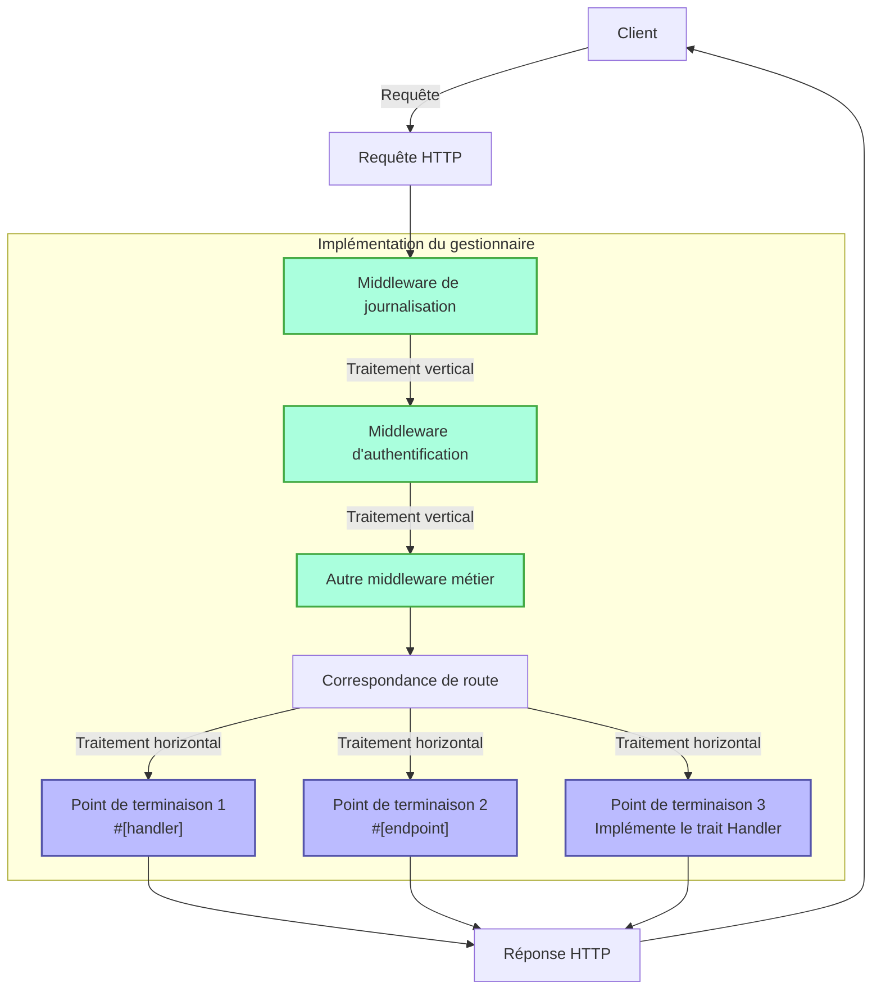
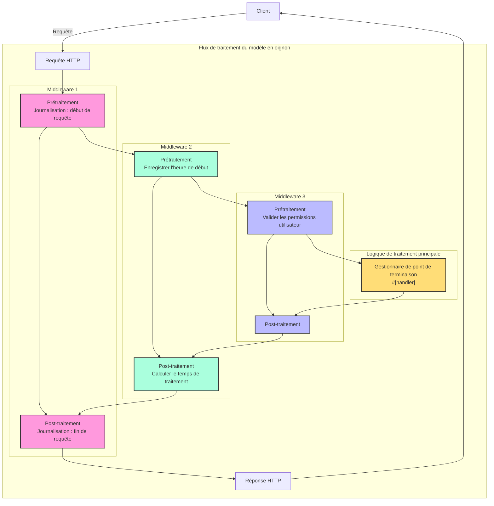

# Gestionnaire

## Aperçu rapide

Le gestionnaire est un concept central dans le framework Salvo, qui peut être simplement compris comme une unité de traitement des requêtes. Il a deux objectifs principaux :

1. **En tant que point de terminaison** : Un objet implémentant `Handler` peut être placé dans le système de routage comme point de terminaison final pour traiter les requêtes. Lors de l'utilisation de la macro `#[handler]`, une fonction peut être directement utilisée comme point de terminaison ; tandis que l'utilisation de la macro `#[endpoint]` permet non seulement de servir de point de terminaison, mais génère également automatiquement la documentation OpenAPI (cela sera détaillé dans la documentation ultérieure).

2. **En tant que middleware** : Le même `Handler` peut également être utilisé comme middleware pour traiter les requêtes avant ou après qu'elles atteignent le point de terminaison final.

Le flux de traitement des requêtes de Salvo peut être vu comme un "pipeline" : une requête passe d'abord par une série de middlewares (traitement vertical) puis atteint le point de terminaison correspondant (traitement horizontal). Les middlewares et les points de terminaison sont tous deux des implémentations de `Handler`, ce qui garantit la cohérence et la flexibilité de l'ensemble du système.

### Diagramme de flux du gestionnaire dans Salvo



### Middleware et modèle en oignon

L'essence du modèle en oignon est qu'en plaçant `ctrl.call_next()` avant et après une logique spécifique, il met en œuvre un flux de traitement bidirectionnel pour les requêtes et les réponses, permettant à chaque middleware de participer au cycle complet requête-réponse.

### Structure d'exemple complète de middleware

```rust
async fn example_middleware(req: &mut Request, depot: &mut Depot, resp: &mut Response, ctrl: &mut FlowCtrl) {
    // Prétraitement (phase de requête)
    // Placer ici la logique à exécuter lorsque la requête entre.

    // Appeler le gestionnaire suivant dans la chaîne.
    ctrl.call_next(req, depot, resp).await;

    // Post-traitement (phase de réponse)
    // Placer ici la logique à exécuter après le traitement de la requête.
}
```



## Qu'est-ce qu'un gestionnaire

Un gestionnaire est l'objet concret responsable du traitement des objets Request. Handler est lui-même un trait contenant une méthode asynchrone `handle` :

```rust
#[async_trait]
pub trait Handler: Send + Sync + 'static {
    async fn handle(&self, req: &mut Request, depot: &mut Depot, res: &mut Response);
}
```

La signature par défaut de la fonction `handle` comprend quatre paramètres, dans l'ordre : `&mut Request, &mut Depot, &mut Response, &mut FlowCtrl`. Depot est un stockage temporaire qui peut contenir des données liées à la requête en cours.

Selon son utilisation, il peut servir de middleware (hoop), qui peut effectuer un traitement avant ou après que la requête atteigne le `Handler` de traitement formel des requêtes, comme : vérification de connexion, compression de données, etc.

Le middleware est ajouté via la fonction `hoop` d'un `Router`. Le middleware ajouté affecte le `Router` actuel et tous ses `Router` descendants.

Un `Handler` peut également être utilisé comme un `Handler` qui participe à la correspondance de route et est finalement exécuté, appelé `goal`.

## `Handler` en tant que middleware (hoop)

Lorsqu'un `Handler` agit en tant que middleware, il peut être ajouté aux trois types d'objets suivants qui prennent en charge le middleware :

- `Service` : Toute requête passera par le middleware dans le `Service`.
- `Router` : Ce n'est que lorsque la correspondance de route réussit que la requête passera par le middleware défini dans le `Service` et tout le middleware collecté le long du chemin de correspondance.
- `Catcher` : Lorsqu'une erreur se produit et qu'aucune information d'erreur personnalisée n'a été écrite, la requête passera par le middleware dans le `Catcher`.
- `Handler` : Le `Handler` lui-même prend en charge l'ajout d'encapsulations de middleware pour exécuter une logique pré- ou post-traitement.

## Utilisation de la macro `#[handler]`

La macro `#[handler]` peut grandement simplifier l'écriture du code et améliorer la flexibilité du code.

Elle peut être appliquée à une fonction pour la faire implémenter `Handler` :

```rust
#[handler]
async fn hello() -> &'static str {
    "hello world!"
}
```

Cela équivaut à :

```rust
struct hello;

#[async_trait]
impl Handler for hello {
    async fn handle(&self, _req: &mut Request, _depot: &mut Depot, res: &mut Response, _ctrl: &mut FlowCtrl) {
        res.render(Text::Plain("hello world!"));
    }
}
```

Comme vous pouvez le voir, avec `#[handler]`, le code devient beaucoup plus simple :

- Pas besoin d'ajouter manuellement `#[async_trait]`.
- Les paramètres inutiles dans la fonction sont omis, et les paramètres requis peuvent être arrangés dans n'importe quel ordre.
- Pour les objets implémentant les abstractions `Writer` ou `Scribe`, ils peuvent être directement retournés comme valeur de retour de la fonction. Ici, `&'static str` implémente `Scribe`, donc il peut être directement retourné.

`#[handler]` peut non seulement être appliqué à des fonctions, mais aussi au bloc `impl` d'une `struct` pour faire implémenter `Handler` par la `struct`. Dans ce cas, la fonction `handle` à l'intérieur du bloc `impl` est reconnue comme l'implémentation concrète de la méthode `handle` dans `Handler` :

```rust
struct Hello;

#[handler]
impl Hello {
    async fn handle(&self, res: &mut Response) {
        res.render(Text::Plain("hello world!"));
    }
}
```

## Gestion des erreurs

Dans Salvo, un `Handler` peut retourner un `Result`, à condition que les types `Ok` et `Err` à l'intérieur du `Result` implémentent le trait `Writer`.
Considérant l'utilisation répandue d'anyhow, lorsque la fonctionnalité `anyhow` est activée, `anyhow::Error` implémentera le trait `Writer`. `anyhow::Error` sera mappé sur `InternalServerError`.

```rust
#[cfg(feature = "anyhow")]
#[async_trait]
impl Writer for ::anyhow::Error {
    async fn write(mut self, _req: &mut Request, _depot: &mut Depot, res: &mut Response) {
        res.render(StatusError::internal_server_error());
    }
}
```

Pour les types d'erreur personnalisés, vous pouvez afficher différentes pages d'erreur selon les besoins.

```rust
use salvo::anyhow;
use salvo::prelude::*;

struct CustomError;
#[async_trait]
impl Writer for CustomError {
    async fn write(mut self, _req: &mut Request, _depot: &mut Depot, res: &mut Response) {
        res.status_code(StatusCode::INTERNAL_SERVER_ERROR);
        res.render("custom error");
    }
}

#[handler]
async fn handle_anyhow() -> Result<(), anyhow::Error> {
    Err(anyhow::anyhow!("anyhow error"))
}
#[handler]
async fn handle_custom() -> Result<(), CustomError> {
    Err(CustomError)
}

#[tokio::main]
async fn main() {
    let router = Router::new()
        .push(Router::new().path("anyhow").get(handle_anyhow))
        .push(Router::new().path("custom").get(handle_custom));
    let acceptor = TcpListener::new("127.0.0.1:8698").bind().await;
    Server::new(acceptor).serve(router).await;
}
```

## Implémentation directe du trait Handler

```rust
use salvo_core::prelude::*;
use crate::salvo_core::http::Body;

pub struct MaxSizeHandler(u64);
#[async_trait]
impl Handler for MaxSizeHandler {
    async fn handle(&self, req: &mut Request, depot: &mut Depot, res: &mut Response, ctrl: &mut FlowCtrl) {
        if let Some(upper) = req.body().and_then(|body| body.size_hint().upper()) {
            if upper > self.0 {
                res.render(StatusError::payload_too_large());
                ctrl.skip_rest();
            } else {
                ctrl.call_next(req, depot, res).await;
            }
        }
    }
}
```
{/* Auto generated, origin file hash:d20a5e643c01f98f895dfcba095711b2 */}