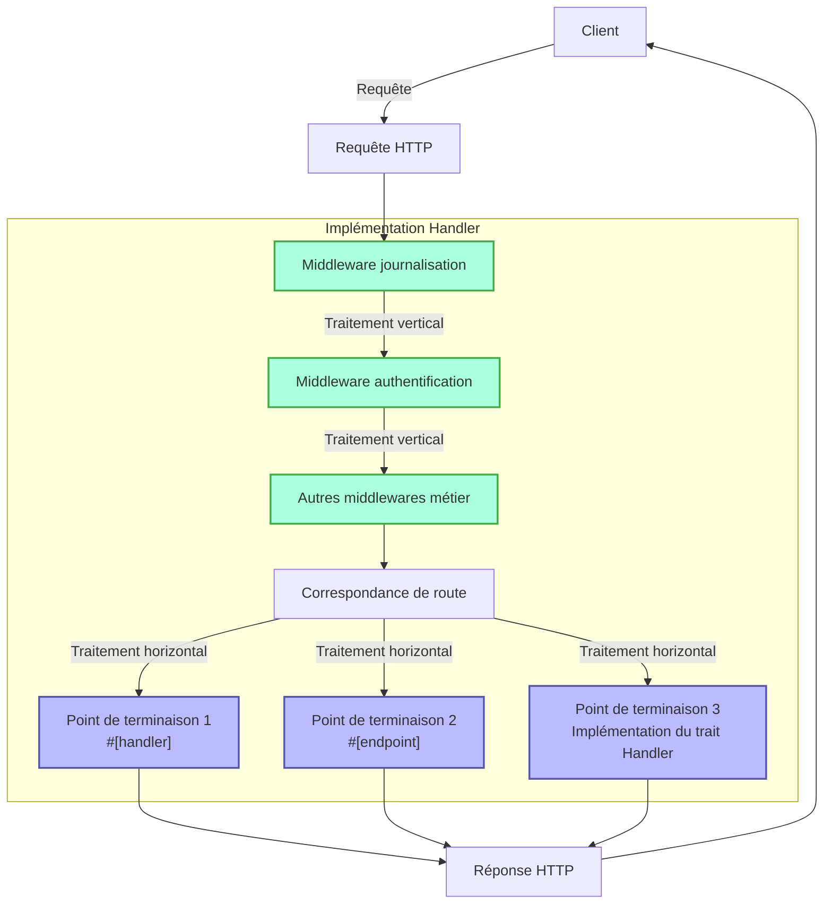
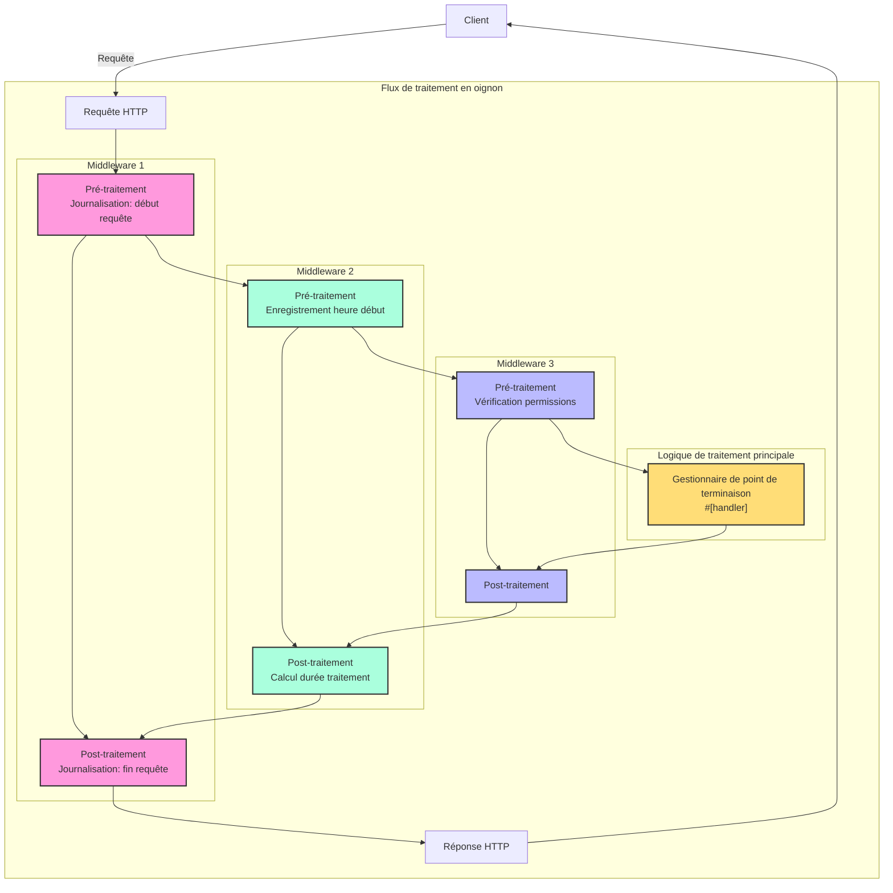

# Gestionnaire (Handler)

## Aperçu rapide

Le Handler est un concept central du framework Salvo, que l'on peut simplement comprendre comme une unité de traitement des requêtes. Il a deux utilisations principales :

1. **En tant que point de terminaison (Endpoint)** : Un objet implémentant `Handler` peut être placé dans le système de routage comme point final de traitement des requêtes. Lorsqu'on utilise la macro `#[handler]`, une fonction peut directement servir de point de terminaison ; tandis qu'avec la macro `#[endpoint]`, elle peut non seulement servir de point de terminaison, mais aussi générer automatiquement une documentation OpenAPI (ce point sera détaillé dans la documentation ultérieure).

2. **En tant que middleware** : Le même `Handler` peut aussi servir de middleware, pour traiter la requête avant ou après qu'elle n'atteigne le point de terminaison final.

Le flux de traitement des requêtes dans Salvo peut être vu comme un "pipeline" : la requête passe d'abord par une série de middlewares (traitement vertical), puis atteint le point de terminaison correspondant (traitement horizontal). Qu'il s'agisse de middlewares ou de points de terminaison, tous sont des implémentations de `Handler`, ce qui assure la cohérence et la flexibilité du système.

### Diagramme de flux des Handlers dans Salvo



### Middleware et modèle en oignon

L'essence du modèle en oignon réside dans l'utilisation de `ctrl.call_next()` avant et après le traitement, permettant ainsi un flux bidirectionnel de traitement des requêtes et réponses, où chaque middleware participe au cycle complet requête-réponse.

### Structure complète d'un exemple de middleware

```rust
async fn example_middleware(req: &mut Request, resp: &mut Response, ctrl: &mut FlowCtrl) {
    // Pré-traitement (phase requête)
    // Logique à exécuter lors de la réception de la requête

    // Appel du prochain gestionnaire dans la chaîne
    ctrl.call_next(req, resp).await;

    // Post-traitement (phase réponse)
    // Logique à exécuter après le traitement de la requête
}
```



## Qu'est-ce qu'un Handler

Un Handler est un objet responsable du traitement des requêtes Request. Le Handler est lui-même un Trait, contenant une méthode asynchrone `handle` :

```rust
#[async_trait]
pub trait Handler: Send + Sync + 'static {
    async fn handle(&self, req: &mut Request, depot: &mut Depot, res: &mut Response);
}
```

La fonction de traitement `handle` a par défaut quatre paramètres, dans l'ordre : `&mut Request, &mut Depot. &mut Response, &mut FlowCtrl`. Depot est un stockage temporaire pouvant contenir des données relatives à la requête en cours.

Selon son utilisation, il peut servir de middleware (hoop), permettant d'effectuer des traitements avant ou après que la requête n'atteigne le `Handler` final - par exemple : vérification de connexion, compression de données, etc.

Les middlewares sont ajoutés via la fonction `hoop` du `Router`. Les middlewares ajoutés affectent le `Router` courant et tous ses descendants.

Le `Handler` peut aussi servir de `Handler` final participant au routage, appelé `goal`.

## `Handler` en tant que middleware (hoop)

Lorsque le `Handler` sert de middleware, il peut être ajouté à trois types d'objets supportant les middlewares :

- `Service` : Toute requête passera par les middlewares du `Service`.

- `Router` : Seules les requêtes correspondant à une route passeront par tous les middlewares définis dans le `Service` et ceux collectés le long du chemin correspondant.

- `Catcher` : Lorsqu'une erreur survient et qu'aucune information d'erreur personnalisée n'est écrite, la requête passera par les middlewares du `Catcher`.

- `Handler` : Le `Handler` lui-même supporte l'ajout de middlewares pour exécuter une logique pré ou post traitement.

## Utilisation de la macro `#[handler]`

`#[handler]` simplifie considérablement l'écriture du code et améliore sa flexibilité.

Elle peut être appliquée à une fonction pour implémenter `Handler` :

```rust
#[handler]
async fn hello() -> &'static str {
    "hello world!"
}
```

Ce qui équivaut à :

```rust
struct hello;

#[async_trait]
impl Handler for hello {
    async fn handle(&self, _req: &mut Request, _depot: &mut Depot, res: &mut Response, _ctrl: &mut FlowCtrl) {
        res.render(Text::Plain("hello world!"));
    }
}
```

On constate qu'avec `#[handler]`, le code devient beaucoup plus simple :

- Plus besoin d'ajouter manuellement `#[async_trait]`.
- Les paramètres non nécessaires dans la fonction sont omis, et les paramètres requis peuvent être ordonnés librement.
- Pour les objets implémentant les abstractions `Writer` ou `Scribe`, ils peuvent être directement retournés comme valeur de fonction. Ici, `&'static str` implémente `Scribe`, donc peut être directement retourné.

`#[handler]` peut non seulement être appliqué à des fonctions, mais aussi aux blocs `impl` de `struct`, faisant implémenter `Handler` à la `struct`. Dans ce cas, la fonction `handle` dans le bloc `impl` sera reconnue comme l'implémentation concrète de `handle` dans `Handler` :

```rust
struct Hello;

#[handler]
impl Hello {
    async fn handle(&self, res: &mut Response) {
        res.render(Text::Plain("hello world!"));
    }
}
```

## Gestion des erreurs

Dans Salvo, le `Handler` peut retourner un `Result`, à condition que les types `Ok` et `Err` de `Result` implémentent le trait `Writer`.
Considérant qu'anyhow est largement utilisé, lorsque la fonctionnalité `anyhow` est activée, `anyhow::Error` implémentera le trait `Writer`. `anyhow::Error` sera mappé à `InternalServerError`.

```rust
#[cfg(feature = "anyhow")]
#[async_trait]
impl Writer for ::anyhow::Error {
    async fn write(mut self, _req: &mut Request, _depot: &mut Depot, res: &mut Response) {
        res.render(StatusError::internal_server_error());
    }
}
```

Pour les types d'erreur personnalisés, vous pouvez afficher différentes pages d'erreur selon les besoins.

```rust
use salvo::anyhow;
use salvo::prelude::*;

struct CustomError;
#[async_trait]
impl Writer for CustomError {
    async fn write(mut self, _req: &mut Request, _depot: &mut Depot, res: &mut Response) {
        res.status_code(StatusCode::INTERNAL_SERVER_ERROR);
        res.render("custom error");
    }
}

#[handler]
async fn handle_anyhow() -> Result<(), anyhow::Error> {
    Err(anyhow::anyhow!("anyhow error"))
}
#[handler]
async fn handle_custom() -> Result<(), CustomError> {
    Err(CustomError)
}

#[tokio::main]
async fn main() {
    let router = Router::new()
        .push(Router::new().path("anyhow").get(handle_anyhow))
        .push(Router::new().path("custom").get(handle_custom));
    let acceptor = TcpListener::new("127.0.0.1:5800").bind().await;
    Server::new(acceptor).serve(router).await;
}
```

## Implémentation directe du trait Handler

```rust
use salvo_core::prelude::*;
use crate::salvo_core::http::Body;

pub struct MaxSizeHandler(u64);
#[async_trait]
impl Handler for MaxSizeHandler {
    async fn handle(&self, req: &mut Request, depot: &mut Depot, res: &mut Response, ctrl: &mut FlowCtrl) {
        if let Some(upper) = req.body().and_then(|body| body.size_hint().upper()) {
            if upper > self.0 {
                res.render(StatusError::payload_too_large());
                ctrl.skip_rest();
            } else {
                ctrl.call_next(req, depot, res).await;
            }
        }
    }
}
```
{/* 本行由工具自动生成,原文哈希值:6e138bcee73660fa82c5418d286d59cc */}