# Processus de Traitement

Le `Service` convertit d'abord la requête en `Response` de Salvo, puis entre dans la phase de correspondance des routes.

## Phase de Correspondance des Routes

La correspondance des routes suit l'ordre d'ajout, exécutant les filtres de haut en bas et de l'extérieur vers l'intérieur. Si un filtre échoue, la correspondance est considérée comme un échec.

Pendant le processus de correspondance, les informations du chemin de la requête sont traitées. Une fois qu'un filtre de chemin correspond avec succès, il consomme la partie du chemin correspondante. Si tout le chemin est consommé et qu'aucun filtre dans la chaîne n'a échoué, et que le dernier `Router` de la chaîne possède un `Handler` `goal`, alors la correspondance est réussie. La phase de correspondance se termine et tous les `Handler` des chaînes correspondantes sont collectés pour entrer dans la phase d'exécution.

Si le chemin n'est pas entièrement consommé, qu'aucune erreur n'est survenue dans la chaîne, mais qu'il n'y a plus de sous-routes à matcher, la correspondance de la chaîne actuelle est considérée comme un échec et passe à la correspondance de la route suivante.

Si toutes les routes ont été parcourues sans succès, le processus entre dans la phase de capture d'erreurs.

## Phase d'Exécution des Handlers

Les `Handler` collectés lors de la phase de correspondance sont exécutés séquentiellement. Pendant l'exécution, les middlewares précédents peuvent appeler `ctrl::call_next()` pour laisser les middlewares suivants s'exécuter en premier avant de poursuivre leur propre logique. Si une erreur de statut ou une redirection survient pendant l'exécution, les `Handler` suivants ne seront pas exécutés. Si le code de statut est une erreur et que le `Body` de la `Response` n'est pas défini ou est `ResBody::Error`, le processus entre dans la phase de capture d'erreurs. Sinon, cette phase est ignorée.

## Phase de Capture d'Erreurs

Le `Catcher` est utilisé pour gérer les erreurs et peut également inclure des middlewares (hoops). Les erreurs passent séquentiellement à travers tous les `Handler` du `Catcher`. Si un `Handler` a déjà traité l'erreur et ne souhaite pas que les `Handler` suivants s'exécutent, il peut appeler `ctrl.skip_rest()` pour ignorer les `Handler` restants et terminer directement la phase de capture.

Un `Catcher` doit obligatoirement inclure un `Handler` par défaut pour la gestion des erreurs. Par défaut, il s'agit de `DefaultGoal`, mais vous pouvez également personnaliser entièrement votre propre `Handler` comme implémentation par défaut. Il affiche les messages d'erreur dans le format correspondant au `content-type` demandé par l'en-tête de la requête, prenant en charge `json`, `xml`, `text` et `html`. `DefaultGoal` offre également des options d'affichage, comme l'affichage des liens liés à Salvo dans le format HTML par défaut. Vous pouvez appeler `DefaultGoal::footer` ou `DefaultGoal::with_footer` pour personnaliser le pied de page selon vos besoins.

Le `Service` convertit la `Response` de Salvo en `Response` de hyper, qui est finalement renvoyée au client (navigateur, etc.).

## Cycle de Vie d'une Requête Salvo
Voici une représentation visuelle et une explication du cycle de vie du traitement d'une requête HTTP par le framework web Salvo.

```mermaid
flowchart TD
    subgraph MainGraph[Cycle de Vie d'une Requête Salvo]
        Start[Requête Client] --> Convert[Service convertit la requête HTTP en Response Salvo]
        
        %% Phase de Correspondance des Routes
        subgraph RoutingPhase[1. Phase de Correspondance des Routes]
            Convert --> Routing[Correspondance des routes par ordre d'ajout, de l'extérieur vers l'intérieur, de haut en bas]
            Routing --> FilterCheck{Tous les filtres sont-ils passés?}
            FilterCheck -->|Non| NextRoute[Essayer la route suivante]
            FilterCheck -->|Oui| PathConsume[Consommer la partie correspondante du chemin]
            PathConsume --> PathCheck{Le chemin est-il entièrement consommé avec un Handler goal?}
            PathCheck -->|Non| SubRouteCheck{Y a-t-il des sous-routes à matcher?}
            SubRouteCheck -->|Oui| Routing
            SubRouteCheck -->|Non| NextRoute
            NextRoute --> RouteLeft{Y a-t-il d'autres routes?}
            RouteLeft -->|Oui| Routing
            RouteLeft -->|Non| NoMatchRoute[Échec de la correspondance des routes]
            PathCheck -->|Oui| MatchSuccess[Correspondance réussie]
            MatchSuccess --> CollectHandlers[Collecter tous les Handlers des chaînes correspondantes]
        end
        
        %% Phase d'Exécution des Handlers
        subgraph HandlerPhase[2. Phase d'Exécution des Handlers]
            CollectHandlers --> ExecHandlers[Exécuter les Handlers séquentiellement]
            ExecHandlers --> ErrorCheck{Erreur ou redirection pendant l'exécution?}
            ErrorCheck -->|Non| FinishHandlers[Tous les Handlers exécutés]
            ErrorCheck -->|Oui| StatusCheck{Le code de statut est-il une erreur avec Body non défini ou Error?}
            StatusCheck -->|Oui| EnterCatcher[Entrer en phase de capture d'erreurs]
            StatusCheck -->|Non| SkipCatcher[Ignorer la phase de capture]
        end
        
        %% Phase de Capture d'Erreurs
        subgraph CatcherPhase[3. Phase de Capture d'Erreurs]
            EnterCatcher --> CatcherHandlers[Exécuter les Handlers du Catcher séquentiellement]
            NoMatchRoute --> CatcherHandlers
            CatcherHandlers --> DefaultHandler[DefaultGoal ou gestion personnalisée]
        end
        
        %% Réponse Finale
        FinishHandlers --> FinalConvert[Service convertit la Response Salvo en Response hyper]
        SkipCatcher --> FinalConvert
        DefaultHandler --> FinalConvert
        
        FinalConvert --> End[Renvoi de la réponse au client]
    end
    
    %% Styles
    class RoutingPhase,HandlerPhase,CatcherPhase phase;
    class MainGraph mainGraph;
    classDef mainGraph fill:#f5f5f5,stroke:#333,stroke-width:1px;
    classDef phase fill:#e6f3ff,stroke:#333,stroke-width:2px;
```

{/* 本行由工具自动生成,原文哈希值:2934d9d3636688c10dfde8c3c36424c3 */}