# Processus de traitement

Le `Service` convertit d'abord la requête en `Response` de Salvo, puis entre dans la phase de correspondance de routage.

## Phase de correspondance de routage

La correspondance de routage exécute les filtres dans l'ordre d'ajout, de l'extérieur vers l'intérieur et de haut en bas. Si un filtre échoue, la correspondance est considérée comme un échec.

Pendant le processus de correspondance, les informations de chemin de la requête sont disponibles. Au fur et à mesure de la correspondance, une fois qu'un filtre de chemin correspond avec succès, il consomme la partie du chemin qu'il a correspondue. Lorsque tout le chemin est consommé et qu'aucun filtre sur la chaîne de correspondance n'a échoué, et que le dernier `Router` sur la chaîne actuelle possède un `Handler` `goal`, alors la correspondance est réussie. La phase de correspondance se termine, et tous les `Handler` collectés sur les chaînes de correspondance entrent dans la phase d'exécution.

Si le chemin n'est pas entièrement consommé, qu'aucune erreur n'est survenue sur la chaîne, mais qu'il n'y a plus de sous-routes à correspondre, alors la correspondance de la chaîne actuelle est considérée comme un échec, et on passe à la correspondance de la route suivante.

Si toutes les routes ont été tentées sans succès, on entre dans la phase de capture d'erreurs.

## Phase d'exécution des Handler

Les `Handler` collectés lors de la phase de correspondance sont exécutés séquentiellement. Pendant l'exécution, les middlewares précédents peuvent appeler `ctrl::call_next()` pour laisser les middlewares suivants s'exécuter d'abord, puis exécuter leur propre logique. Si une erreur de code d'état ou une redirection survient pendant l'exécution, les `Handler` suivants ne seront pas exécutés. Dans ce cas, si le code d'état est une erreur et que le `Body` de la `Response` n'est pas défini ou est `ResBody::Error`, on entre dans la phase de capture d'erreurs. Sinon, on saute la phase de capture.

## Phase de capture d'erreurs

`Catcher` est un type utilisé pour gérer les erreurs. Il peut également ajouter des middlewares (hoops). Les erreurs passent séquentiellement à travers tous les `Handler` du `Catcher`. Si un `Handler` a déjà traité l'erreur et ne souhaite pas que les `Handler` suivants continuent, il peut utiliser `ctrl.skip_rest()` pour sauter les `Handler` suivants et terminer directement la phase de capture.

Un `Catcher` doit par défaut contenir un `Handler` pour servir de gestionnaire d'erreurs par défaut. Par défaut, c'est `DefaultGoal`. Vous pouvez également entièrement personnaliser votre propre `Handler` comme implémentation par défaut de la gestion des erreurs. Il affichera les informations d'erreur dans le format correspondant au `content-type` demandé dans l'en-tête de la requête, prenant en charge quatre formats d'affichage : `json`, `xml`, `text` et `html`. `DefaultGoal` offre également quelques paramètres d'affichage. Par exemple, par défaut, lors de l'affichage au format HTML, il affiche des liens liés à Salvo. Vous pouvez appeler `DefaultGoal::footer` ou `DefaultGoal::with_footer` pour définir un pied de page personnalisé selon vos souhaits.

Le `Service` convertit la `Response` de Salvo en type `Response` de Hyper, qui est finalement renvoyée au navigateur ou à d'autres clients.

## Cycle de vie d'une requête Salvo
Ceci est une représentation visuelle et une explication du cycle de vie du traitement d'une requête HTTP par le framework web Salvo.

```mermaid
flowchart TD
    subgraph MainGraph[Cycle de vie d'une requête dans le framework Salvo]
        Start[Requête client] --> Convert[Service convertit la requête HTTP en Response Salvo]
        
        %% Phase de correspondance de routage
        subgraph RoutingPhase[1. Phase de correspondance de routage]
            Convert --> Routing[Correspondance des routes dans l'ordre d'ajout, de l'extérieur vers l'intérieur, de haut en bas]
            Routing --> FilterCheck{Tous les filtres passent-ils?}
            FilterCheck -->|Non| NextRoute[Tentative avec la route suivante]
            FilterCheck -->|Oui| PathConsume[Consommation de la partie du chemin correspondante]
            PathConsume --> PathCheck{Le chemin est-il entièrement consommé et y a-t-il un Handler goal?}
            PathCheck -->|Non| SubRouteCheck{Y a-t-il des sous-routes pour continuer la correspondance?}
            SubRouteCheck -->|Oui| Routing
            SubRouteCheck -->|Non| NextRoute
            NextRoute --> RouteLeft{Y a-t-il d'autres routes?}
            RouteLeft -->|Oui| Routing
            RouteLeft -->|Non| NoMatchRoute[Échec de la correspondance de routage]
            PathCheck -->|Oui| MatchSuccess[Correspondance de routage réussie]
            MatchSuccess --> CollectHandlers[Collecte de tous les Handler sur la chaîne de correspondance]
        end
        
        %% Phase d'exécution des Handler
        subgraph HandlerPhase[2. Phase d'exécution des Handler]
            CollectHandlers --> ExecHandlers[Exécution séquentielle des Handler]
            ExecHandlers --> ErrorCheck{Une erreur ou une redirection survient-elle pendant l'exécution?}
            ErrorCheck -->|Non| FinishHandlers[Tous les Handler exécutés]
            ErrorCheck -->|Oui| StatusCheck{Le code d'état est-il une erreur et le Body n'est-il pas défini ou est-il Error?}
            StatusCheck -->|Oui| EnterCatcher[Entrée dans la phase de capture d'erreurs]
            StatusCheck -->|Non| SkipCatcher[Saut de la phase de capture d'erreurs]
        end
        
        %% Phase de capture d'erreurs
        subgraph CatcherPhase[3. Phase de capture d'erreurs]
            EnterCatcher --> CatcherHandlers[Exécution séquentielle des Handler du Catcher]
            NoMatchRoute --> CatcherHandlers
            CatcherHandlers --> DefaultHandler[DefaultGoal ou gestionnaire d'erreurs personnalisé]
        end
        
        %% Réponse finale
        FinishHandlers --> FinalConvert[Service convertit la Response Salvo en Response Hyper]
        SkipCatcher --> FinalConvert
        DefaultHandler --> FinalConvert
        
        FinalConvert --> End[Renvoi de la réponse au client]
    end
    
    %% Styles
    class RoutingPhase,HandlerPhase,CatcherPhase phase;
    class MainGraph mainGraph;
    classDef mainGraph fill:#f5f5f5,stroke:#333,stroke-width:1px;
    classDef phase fill:#e6f3ff,stroke:#333,stroke-width:2px;
```

{/* 本行由工具自动生成,原文哈希值:2934d9d3636688c10dfde8c3c36424c3 */}