# Flux de Traitement

Le `Service` convertit d'abord la requête en `Response` de Salvo, puis entre dans la phase de correspondance des routes.

## Phase de Correspondance des Routes

La correspondance des routes exécute les filtres dans l'ordre où ils ont été ajoutés, en procédant de l'extérieur vers l'intérieur et de haut en bas. Si un filtre échoue, la correspondance est considérée comme infructueuse.

Pendant le processus de correspondance, les informations du chemin de la requête sont consommées progressivement. Une fois qu'un filtre de chemin correspond avec succès, il consomme la partie correspondante du chemin. Lorsque tous les segments du chemin sont consommés, qu'aucun filtre n'échoue le long de la chaîne de correspondance et que le dernier `Router` de la chaîne actuelle a un `Handler` `goal`, la correspondance est réussie et la phase de correspondance se termine. Tous les `Handler` collectés à partir de la chaîne de correspondance passent à la phase d'exécution.

Si le chemin n'est pas entièrement consommé, qu'aucune erreur ne se produit le long de la chaîne, mais qu'il n'y a plus de routes enfants pour continuer la correspondance, la chaîne actuelle est considérée comme un échec de correspondance, et le processus passe à la route suivante pour la correspondance.

Si toutes les routes sont correspondues sans succès, le processus entre dans la phase de capture d'erreurs.

## Phase d'Exécution des Handlers

Les `Handler` collectés pendant la phase de correspondance sont exécutés séquentiellement. Pendant l'exécution, le middleware précédent peut appeler `ctrl::call_next()` pour permettre au middleware suivant de s'exécuter d'abord avant d'exécuter sa propre logique. Si un code d'état d'erreur ou une redirection se produit pendant l'exécution, les `Handler` suivants ne seront pas exécutés. Si le code d'état indique une erreur et que le `Body` de la `Response` n'est pas défini ou est `ResBody::Error`, le processus entre dans la phase de capture d'erreurs ; sinon, il saute la phase de capture.

## Phase de Capture d'Erreurs

`Catcher` est un type utilisé pour gérer les erreurs et peut également inclure du middleware (hoops). Les erreurs passent séquentiellement à travers tous les `Handler` du `Catcher`. Si un `Handler` a déjà traité l'erreur et ne souhaite pas que les `Handler` suivants continuent, il peut ignorer le reste en utilisant `ctrl.skip_rest()`, mettant ainsi fin directement à la phase de capture.

`Catcher` doit inclure au moins un `Handler` comme gestionnaire d'erreurs par défaut. La valeur par défaut est `DefaultGoal`, mais vous pouvez entièrement personnaliser votre propre `Handler` comme implémentation de gestion d'erreurs par défaut. Il affiche les informations d'erreur dans le format demandé par l'en-tête `content-type`, prenant en charge les formats `json`, `xml`, `text` et `html`. `DefaultGoal` fournit également des paramètres d'affichage ; par exemple, par défaut, il affiche les liens liés à Salvo lors de l'affichage au format HTML. Vous pouvez appeler `DefaultGoal::footer` ou `DefaultGoal::with_footer` pour définir un pied de page personnalisé selon vos besoins.

`Service` convertit la `Response` de Salvo en type `Response` de Hyper, qui est finalement renvoyée aux clients tels que les navigateurs.

## Cycle de Vie d'une Requête Salvo
Ceci est une représentation visuelle et une explication du cycle de vie d'une requête HTTP dans le framework web Salvo.

```mermaid
flowchart TD
    subgraph MainGraph[Cycle de Vie d'une Requête Salvo Framework]
        Start[Requête Client] --> Convert[Service convertit la requête HTTP en Response Salvo]
        
        %% Phase de Correspondance des Routes
        subgraph RoutingPhase[1. Phase de Correspondance des Routes]
            Convert --> Routing[Correspondance des routes dans l'ordre ajouté, extérieur vers intérieur, haut en bas]
            Routing --> FilterCheck{Tous les filtres passent-ils?}
            FilterCheck -->|Non| NextRoute[Essayer la route suivante]
            FilterCheck -->|Oui| PathConsume[Consommer le segment de chemin correspondant]
            PathConsume --> PathCheck{Le chemin est-il entièrement consommé avec un Handler goal?}
            PathCheck -->|Non| SubRouteCheck{Y a-t-il des sous-routes pour continuer la correspondance?}
            SubRouteCheck -->|Oui| Routing
            SubRouteCheck -->|Non| NextRoute
            NextRoute --> RouteLeft{Y a-t-il d'autres routes?}
            RouteLeft -->|Oui| Routing
            RouteLeft -->|Non| NoMatchRoute[Échec de la correspondance des routes]
            PathCheck -->|Oui| MatchSuccess[Correspondance des routes réussie]
            MatchSuccess --> CollectHandlers[Collecter tous les Handlers de la chaîne de correspondance]
        end
        
        %% Phase d'Exécution des Handlers
        subgraph HandlerPhase[2. Phase d'Exécution des Handlers]
            CollectHandlers --> ExecHandlers[Exécuter les Handlers séquentiellement]
            ExecHandlers --> ErrorCheck{Erreur ou redirection pendant l'exécution?}
            ErrorCheck -->|Non| FinishHandlers[Tous les Handlers exécutés]
            ErrorCheck -->|Oui| StatusCheck{Le code d'état est-il une erreur et le Body non défini ou Error?}
            StatusCheck -->|Oui| EnterCatcher[Entrer dans la phase de capture d'erreurs]
            StatusCheck -->|Non| SkipCatcher[Sauter la phase de capture d'erreurs]
        end
        
        %% Phase de Capture d'Erreurs
        subgraph CatcherPhase[3. Phase de Capture d'Erreurs]
            EnterCatcher --> CatcherHandlers[Exécuter les Handlers du Catcher séquentiellement]
            NoMatchRoute --> CatcherHandlers
            CatcherHandlers --> DefaultHandler[DefaultGoal ou gestion d'erreurs personnalisée]
        end
        
        %% Réponse Finale
        FinishHandlers --> FinalConvert[Service convertit la Response Salvo en Response Hyper]
        SkipCatcher --> FinalConvert
        DefaultHandler --> FinalConvert
        
        FinalConvert --> End[Renvoi de la réponse au client]
    end
    
    %% Stylisation
    class RoutingPhase,HandlerPhase,CatcherPhase phase;
    class MainGraph mainGraph;
    classDef mainGraph fill:#f5f5f5,stroke:#333,stroke-width:1px;
    classDef phase fill:#e6f3ff,stroke:#333,stroke-width:2px;
```

{/* Auto generated, origin file hash:76cc6c9018ddf6bdbf1b59044abae994 */}