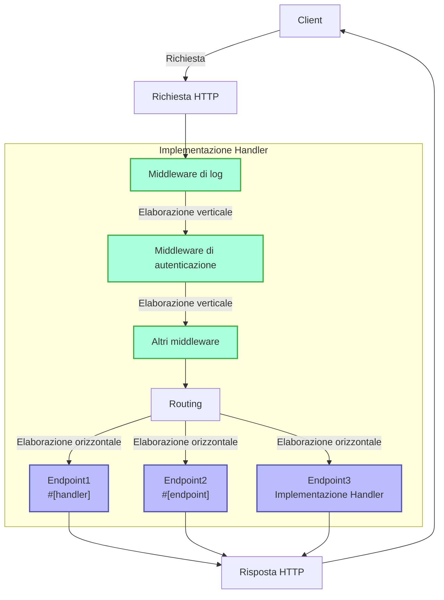
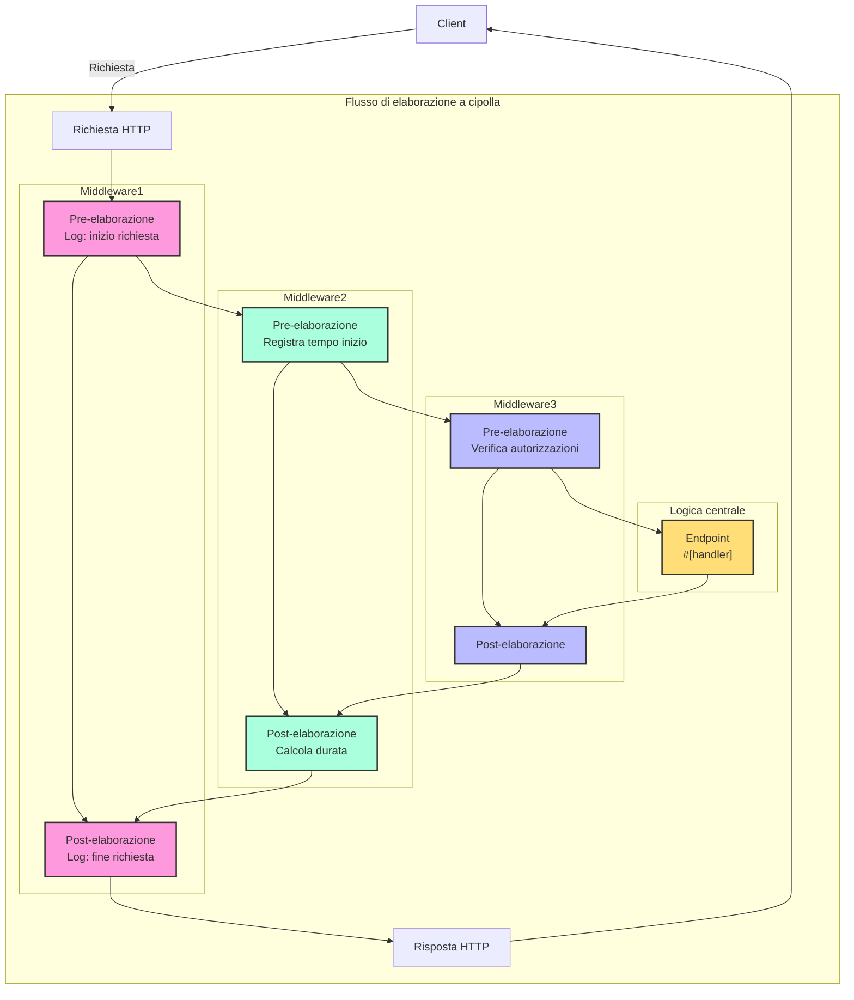

# Handler

## Panoramica rapida

Handler è un concetto fondamentale del framework Salvo, che può essere semplicemente inteso come un'unità di elaborazione delle richieste con due principali utilizzi:

1. **Come endpoint**: Gli oggetti che implementano `Handler` possono essere inseriti nel sistema di routing come punti finali per elaborare le richieste. Quando si utilizza la macro `#[handler]`, una funzione può essere usata direttamente come endpoint; mentre con la macro `#[endpoint]`, oltre a fungere da endpoint, viene generata automaticamente la documentazione OpenAPI (questo aspetto sarà approfondito in seguito).

2. **Come middleware**: Lo stesso `Handler` può essere utilizzato come middleware per elaborare le richieste prima o dopo che raggiungano l'endpoint finale.

Il flusso di elaborazione delle richieste in Salvo può essere visto come una "pipeline": la richiesta passa prima attraverso una serie di middleware (elaborazione verticale), poi raggiunge l'endpoint corrispondente (elaborazione orizzontale). Sia i middleware che gli endpoint sono implementazioni di `Handler`, garantendo coerenza e flessibilità al sistema.

### Diagramma del flusso Handler in Salvo



### Middleware e modello a cipolla

L'essenza del modello a cipolla risiede nel posizionamento di `ctrl.call_next()` prima e dopo, realizzando un flusso bidirezionale di elaborazione delle richieste e risposte, permettendo a ogni middleware di partecipare all'intero ciclo richiesta-risposta.

### Struttura completa di esempio middleware

```rust
async fn example_middleware(req: &mut Request, resp: &mut Response, ctrl: &mut FlowCtrl) {
    // Pre-elaborazione (fase di richiesta)
    // Qui va la logica da eseguire all'arrivo della richiesta

    // Chiama il prossimo handler nella catena
    ctrl.call_next(req, resp).await;

    // Post-elaborazione (fase di risposta)
    // Qui va la logica da eseguire dopo l'elaborazione della richiesta
}
```



## Cos'è un Handler

Handler è l'oggetto responsabile dell'elaborazione delle richieste Request. È un Trait che contiene un metodo asincrono `handle`:

```rust
#[async_trait]
pub trait Handler: Send + Sync + 'static {
    async fn handle(&self, req: &mut Request, depot: &mut Depot, res: &mut Response);
}
```

La funzione `handle` ha per default quattro parametri: `&mut Request, &mut Depot, &mut Response, &mut FlowCtrl`. Depot è un'area di memorizzazione temporanea per dati relativi alla richiesta corrente.

A seconda dell'uso, può fungere da middleware (hoop), elaborando la richiesta prima o dopo che raggiunga l'Handler finale, ad esempio per autenticazione, compressione dati, ecc.

I middleware vengono aggiunti tramite la funzione `hoop` del `Router` e influenzano il `Router` corrente e tutti i suoi discendenti.

`Handler` può anche essere usato come `goal`, partecipando al routing ed eseguendo l'elaborazione finale.

## `Handler` come middleware (hoop)

Come middleware, `Handler` può essere aggiunto a tre tipi di oggetti:

- `Service`: tutte le richieste passano attraverso i suoi middleware.

- `Router`: solo le richieste che corrispondono al routing passano attraverso i middleware definiti nel `Service` e quelli raccolti lungo il percorso.

- `Catcher`: elabora le richieste solo in caso di errore, quando non è stata scritta un'informazione di errore personalizzata.

- `Handler`: supporta l'aggiunta di middleware per logica pre o post elaborazione.

## Uso della macro `#[handler]`

`#[handler]` semplifica notevolmente la scrittura del codice e ne aumenta la flessibilità.

Applicata a una funzione, la fa implementare `Handler`:

```rust
#[handler]
async fn hello() -> &'static str {
    "hello world!"
}
```

Equivale a:

```rust
struct hello;

#[async_trait]
impl Handler for hello {
    async fn handle(&self, _req: &mut Request, _depot: &mut Depot, res: &mut Response, _ctrl: &mut FlowCtrl) {
        res.render(Text::Plain("hello world!"));
    }
}
```

Con `#[handler]`, il codice è molto più semplice:

- Non serve `#[async_trait]`.
- I parametri non necessari possono essere omessi e quelli necessari possono essere disposti in qualsiasi ordine.
- Gli oggetti che implementano `Writer` o `Scribe` possono essere restituiti direttamente. `&'static str` implementa `Scribe`, quindi può essere restituito direttamente.

`#[handler]` può essere applicata anche agli `impl` di `struct` per implementare `Handler`, dove la funzione `handle` diventa l'implementazione specifica:

```rust
struct Hello;

#[handler]
impl Hello {
    async fn handle(&self, res: &mut Response) {
        res.render(Text::Plain("hello world!"));
    }
}
```

## Gestione degli errori

In Salvo, `Handler` può restituire `Result`, purché `Ok` e `Err` implementino il trait `Writer`.
Con la funzionalità `anyhow` attiva, `anyhow::Error` implementa `Writer` e viene mappato su `InternalServerError`.

```rust
#[cfg(feature = "anyhow")]
#[async_trait]
impl Writer for ::anyhow::Error {
    async fn write(mut self, _req: &mut Request, _depot: &mut Depot, res: &mut Response) {
        res.render(StatusError::internal_server_error());
    }
}
```

Per errori personalizzati, è possibile personalizzare l'output:

```rust
use salvo::anyhow;
use salvo::prelude::*;

struct CustomError;
#[async_trait]
impl Writer for CustomError {
    async fn write(mut self, _req: &mut Request, _depot: &mut Depot, res: &mut Response) {
        res.status_code(StatusCode::INTERNAL_SERVER_ERROR);
        res.render("custom error");
    }
}

#[handler]
async fn handle_anyhow() -> Result<(), anyhow::Error> {
    Err(anyhow::anyhow!("anyhow error"))
}
#[handler]
async fn handle_custom() -> Result<(), CustomError> {
    Err(CustomError)
}

#[tokio::main]
async fn main() {
    let router = Router::new()
        .push(Router::new().path("anyhow").get(handle_anyhow))
        .push(Router::new().path("custom").get(handle_custom));
    let acceptor = TcpListener::new("127.0.0.1:5800").bind().await;
    Server::new(acceptor).serve(router).await;
}
```

## Implementazione diretta del Trait Handler

```rust
use salvo_core::prelude::*;
use crate::salvo_core::http::Body;

pub struct MaxSizeHandler(u64);
#[async_trait]
impl Handler for MaxSizeHandler {
    async fn handle(&self, req: &mut Request, depot: &mut Depot, res: &mut Response, ctrl: &mut FlowCtrl) {
        if let Some(upper) = req.body().and_then(|body| body.size_hint().upper()) {
            if upper > self.0 {
                res.render(StatusError::payload_too_large());
                ctrl.skip_rest();
            } else {
                ctrl.call_next(req, depot, res).await;
            }
        }
    }
}
```
{/* 本行由工具自动生成,原文哈希值:6e138bcee73660fa82c5418d286d59cc */}