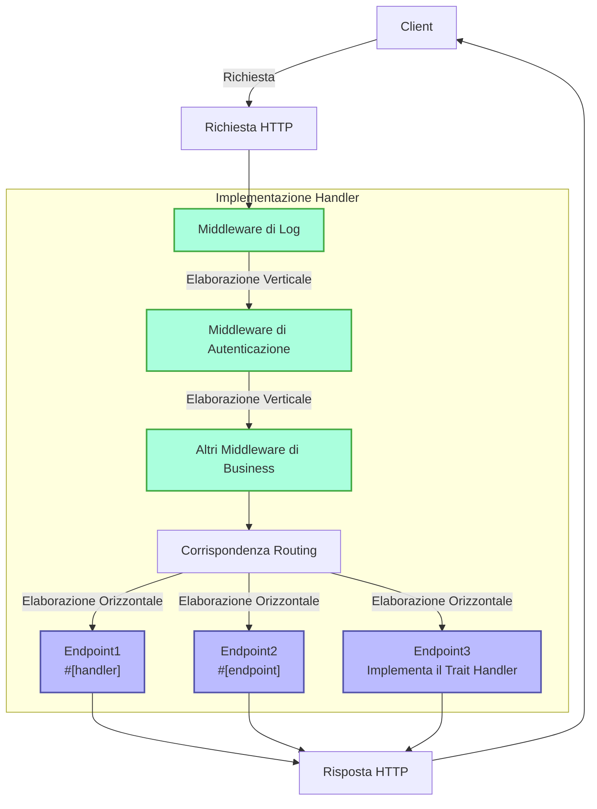
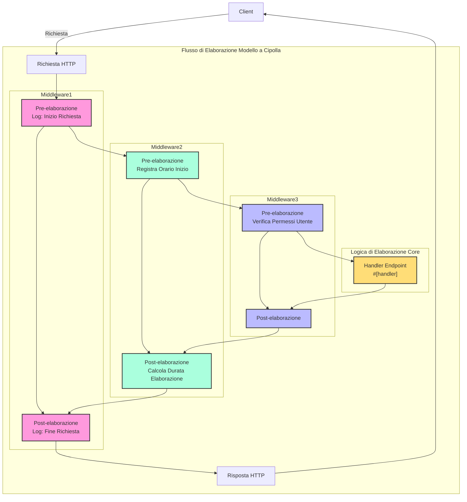

# Handler

## Panoramica Rapida

Handler è il concetto fondamentale del framework Salvo, che può essere inteso semplicemente come un'unità di elaborazione delle richieste. Ha due utilizzi principali:

1. **Come Endpoint**: Un oggetto che implementa `Handler` può essere inserito nel sistema di routing come endpoint finale per elaborare le richieste. Quando si utilizza la macro `#[handler]`, una funzione può essere usata direttamente come endpoint; mentre con la macro `#[endpoint]`, non solo può fungere da endpoint, ma può anche generare automaticamente la documentazione OpenAPI (questa parte verrà approfondita nella documentazione successiva).

2. **Come Middleware**: Lo stesso `Handler` può anche essere utilizzato come middleware, per elaborare la richiesta prima o dopo che raggiunga l'endpoint finale.

Il flusso di elaborazione delle richieste in Salvo può essere visto come una "pipeline": la richiesta passa prima attraverso una serie di middleware (elaborazione verticale), quindi raggiunge l'endpoint corrispondente (elaborazione orizzontale). Sia i middleware che gli endpoint sono implementazioni di `Handler`, il che conferisce coerenza e flessibilità all'intero sistema.

### Diagramma di Flusso del Handler in Salvo



### Middleware e il Modello a Cipolla

L'essenza del modello a cipolla risiede nella posizione della chiamata `ctrl.call_next()`, che implementa un flusso di elaborazione bidirezionale per richieste e risposte, permettendo a ogni middleware di partecipare al ciclo completo richiesta-risposta.
### Struttura di Esempio Completa per Middleware

```rust
async fn example_middleware(req: &mut Request, depot: &mut Depot,resp: &mut Response, ctrl: &mut FlowCtrl) {
    // Pre-elaborazione (Fase Richiesta)
    // Inserisci qui la logica da eseguire all'ingresso della richiesta

    // Chiama il prossimo handler nella catena
    ctrl.call_next(req, depot,resp).await;

    // Post-elaborazione (Fase Risposta)
    // Inserisci qui la logica da eseguire dopo l'elaborazione della richiesta
}
```



## Cos'è un Handler

Handler è l'oggetto specifico responsabile dell'elaborazione delle richieste Request. Handler è di per sé un Trait, che contiene internamente un metodo asincrono `handle`:

```rust
#[async_trait]
pub trait Handler: Send + Sync + 'static {
    async fn handle(&self, req: &mut Request, depot: &mut Depot, res: &mut Response);
}
```

La firma predefinita della funzione di elaborazione `handle` include quattro parametri, nell'ordine: `&mut Request, &mut Depot. &mut Response, &mut FlowCtrl`. Depot è una memoria temporanea che può memorizzare dati relativi alla richiesta corrente.

A seconda dell'utilizzo, può essere impiegato come middleware (hoop), che può eseguire alcune elaborazioni prima o dopo che la richiesta raggiunga l'`Handler` che la elabora formalmente, ad esempio: verifica dell'accesso, compressione dei dati, ecc.

I middleware vengono aggiunti tramite la funzione `hoop` del `Router`. Il middleware aggiunto influenzerà il `Router` corrente e tutti i suoi `Router` discendenti.

`Handler` può anche essere utilizzato come `Handler` che partecipa alla corrispondenza del routing e viene eseguito alla fine, chiamato `goal`.

## `Handler` come Middleware (hoop)

Quando `Handler` funge da middleware, può essere aggiunto ai seguenti tre tipi di oggetti che supportano middleware:

- `Service`: qualsiasi richiesta passerà attraverso i middleware definiti in `Service`.

- `Router`: solo quando la corrispondenza del routing ha successo, la richiesta passerà sequenzialmente attraverso i middleware definiti in `Service` e tutti i middleware raccolti lungo il percorso corrispondente.

- `Catcher`: quando si verifica un errore e non sono state scritte informazioni di errore personalizzate, la richiesta passerà attraverso i middleware definiti in `Catcher`.

- `Handler`: `Handler` stesso supporta l'aggiunta di wrapper middleware per eseguire logiche pre o post.

## Utilizzo della Macro `#[handler]`

`#[handler]` può semplificare notevolmente la scrittura del codice e migliorarne la flessibilità.

Può essere applicata a una funzione per farla implementare `Handler`:

```rust
#[handler]
async fn hello() -> &'static str {
    "hello world!"
}
```

Ciò equivale a:

```rust
struct hello;

#[async_trait]
impl Handler for hello {
    async fn handle(&self, _req: &mut Request, _depot: &mut Depot, res: &mut Response, _ctrl: &mut FlowCtrl) {
        res.render(Text::Plain("hello world!"));
    }
}
```

Come si può vedere, con l'uso di `#[handler]`, il codice diventa molto più semplice:

- Non è più necessario aggiungere manualmente `#[async_trait]`.
- I parametri non necessari nella funzione sono omessi e i parametri necessari possono essere disposti in qualsiasi ordine.
- Per gli oggetti che implementano le astrazioni `Writer` o `Scribe`, possono essere restituiti direttamente come valore di ritorno della funzione. Qui `&'static str` implementa `Scribe`, quindi può essere restituito direttamente come valore di ritorno della funzione.

`#[handler]` non può essere applicato solo alle funzioni, ma anche al blocco `impl` di uno `struct`, per far sì che lo `struct` implementi `Handler`. In questo caso, la funzione `handle` all'interno del blocco `impl` verrà riconosciuta come l'implementazione specifica di `handle` in `Handler`:

```rust
struct Hello;

#[handler]
impl Hello {
    async fn handle(&self, res: &mut Response) {
        res.render(Text::Plain("hello world!"));
    }
}
```

## Gestione degli Errori

In Salvo, `Handler` può restituire un `Result`, purché i tipi `Ok` e `Err` all'interno di `Result` implementino il trait `Writer`.
Considerando che anyhow è ampiamente utilizzato, quando la funzionalità `anyhow` è abilitata, `anyhow::Error` implementerà il trait `Writer`. `anyhow::Error` verrà mappato su `InternalServerError`.

```rust
#[cfg(feature = "anyhow")]
#[async_trait]
impl Writer for ::anyhow::Error {
    async fn write(mut self, _req: &mut Request, _depot: &mut Depot, res: &mut Response) {
        res.render(StatusError::internal_server_error());
    }
}
```

Per i tipi di errore personalizzati, puoi visualizzare pagine di errore diverse in base alle esigenze.

```rust
use salvo::anyhow;
use salvo::prelude::*;

struct CustomError;
#[async_trait]
impl Writer for CustomError {
    async fn write(mut self, _req: &mut Request, _depot: &mut Depot, res: &mut Response) {
        res.status_code(StatusCode::INTERNAL_SERVER_ERROR);
        res.render("custom error");
    }
}

#[handler]
async fn handle_anyhow() -> Result<(), anyhow::Error> {
    Err(anyhow::anyhow!("anyhow error"))
}
#[handler]
async fn handle_custom() -> Result<(), CustomError> {
    Err(CustomError)
}

#[tokio::main]
async fn main() {
    let router = Router::new()
        .push(Router::new().path("anyhow").get(handle_anyhow))
        .push(Router::new().path("custom").get(handle_custom));
    let acceptor = TcpListener::new("127.0.0.1:5800").bind().await;
    Server::new(acceptor).serve(router).await;
}
```

## Implementazione Diretta del Trait Handler

```rust
use salvo_core::prelude::*;
use crate::salvo_core::http::Body;

pub struct MaxSizeHandler(u64);
#[async_trait]
impl Handler for MaxSizeHandler {
    async fn handle(&self, req: &mut Request, depot: &mut Depot, res: &mut Response, ctrl: &mut FlowCtrl) {
        if let Some(upper) = req.body().and_then(|body| body.size_hint().upper()) {
            if upper > self.0 {
                res.render(StatusError::payload_too_large());
                ctrl.skip_rest();
            } else {
                ctrl.call_next(req, depot, res).await;
            }
        }
    }
}
```
{/* Auto generated, origin file hash:aba76a058ee7c27a6a982876209eae78 */}