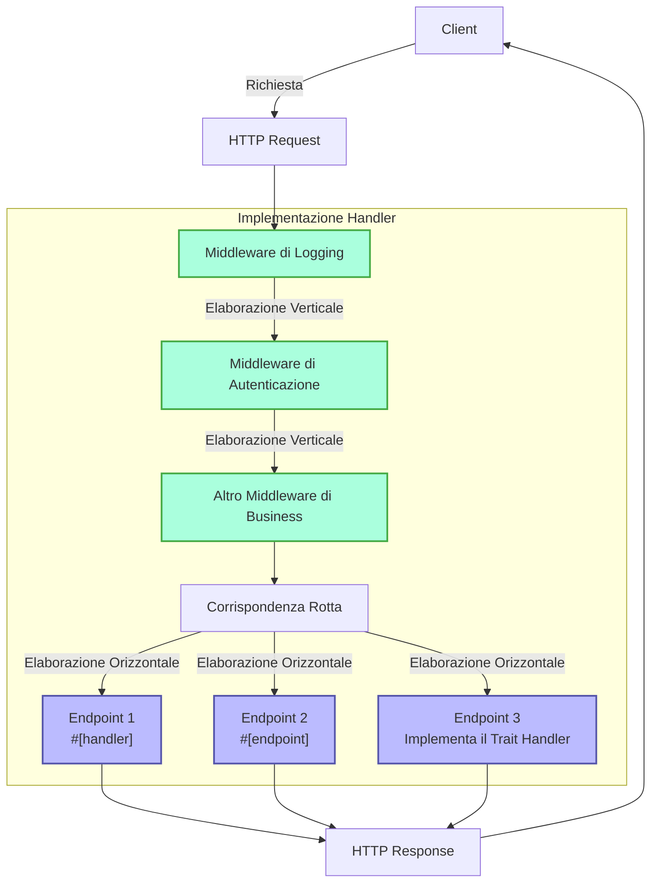

# Handler

## Panoramica Rapida

Handler è un concetto fondamentale nel framework Salvo, che può essere semplicemente inteso come un'unità di elaborazione delle richieste. Ha due scopi principali:

1. **Come Endpoint**: Un oggetto che implementa `Handler` può essere inserito nel sistema di routing come endpoint finale per elaborare le richieste. Quando si utilizza la macro `#[handler]`, una funzione può essere utilizzata direttamente come endpoint; mentre l'uso della macro `#[endpoint]` non solo consente di fungere da endpoint, ma genera automaticamente la documentazione OpenAPI (questo sarà dettagliato nella documentazione successiva).

2. **Come Middleware**: Lo stesso `Handler` può anche essere utilizzato come middleware per elaborare le richieste prima o dopo che raggiungano l'endpoint finale.

Il flusso di elaborazione delle richieste di Salvo può essere visto come una "pipeline": una richiesta passa prima attraverso una serie di middleware (elaborazione verticale) e poi raggiunge l'endpoint corrispondente (elaborazione orizzontale). Sia i middleware che gli endpoint sono implementazioni di `Handler`, il che garantisce coerenza e flessibilità in tutto il sistema.

### Diagramma di Flusso del Handler in Salvo



### Middleware e il Modello a Cipolla

L'essenza del modello a cipolla è che posizionando `ctrl.call_next()` prima e dopo una logica specifica, si implementa un flusso di elaborazione bidirezionale per richieste e risposte, consentendo a ciascun middleware di partecipare al ciclo completo richiesta-risposta.

### Struttura di Esempio Completa di Middleware

```rust
async fn example_middleware(req: &mut Request, depot: &mut Depot, resp: &mut Response, ctrl: &mut FlowCtrl) {
    // Pre-elaborazione (Fase di Richiesta)
    // Inserire qui la logica da eseguire quando la richiesta entra.

    // Chiama il prossimo handler nella catena.
    ctrl.call_next(req, depot, resp).await;

    // Post-elaborazione (Fase di Risposta)
    // Inserire qui la logica da eseguire dopo che la richiesta è stata elaborata.
}
```


## Cos'è un Handler

Un Handler è l'oggetto concreto responsabile dell'elaborazione degli oggetti Request. Handler stesso è un Trait che contiene un metodo asincrono `handle`:

```rust
#[async_trait]
pub trait Handler: Send + Sync + 'static {
    async fn handle(&self, req: &mut Request, depot: &mut Depot, res: &mut Response);
}
```

La firma predefinita della funzione `handle` include quattro parametri, in ordine: `&mut Request, &mut Depot, &mut Response, &mut FlowCtrl`. Depot è una memoria temporanea che può contenere dati relativi alla richiesta corrente.

A seconda di come viene utilizzato, può fungere da middleware (hoop), che può eseguire elaborazioni prima o dopo che la richiesta raggiunga il `Handler` formale di elaborazione delle richieste, come ad esempio: verifica dell'accesso, compressione dei dati, ecc.

Il middleware viene aggiunto tramite la funzione `hoop` di un `Router`. Il middleware aggiunto influisce sul `Router` corrente e su tutti i suoi `Router` discendenti.

Un `Handler` può anche essere utilizzato come `Handler` che partecipa alla corrispondenza delle rotte e viene eseguito alla fine, noto come `goal`.

## `Handler` come Middleware (hoop)

Quando un `Handler` agisce come middleware, può essere aggiunto ai seguenti tre tipi di oggetti che supportano middleware:

- `Service`: Qualsiasi richiesta passerà attraverso il middleware nel `Service`.
- `Router`: Solo quando la corrispondenza della rotta ha successo, la richiesta passerà attraverso il middleware definito nel `Service` e tutto il middleware raccolto lungo il percorso di corrispondenza.
- `Catcher`: Quando si verifica un errore e non sono state scritte informazioni di errore personalizzate, la richiesta passerà attraverso il middleware nel `Catcher`.
- `Handler`: Lo stesso `Handler` supporta l'aggiunta di wrapper middleware per eseguire alcune logiche pre o post.

## Utilizzo della Macro `#[handler]`

La macro `#[handler]` può semplificare notevolmente la scrittura del codice e migliorare la flessibilità del codice.

Può essere applicata a una funzione per farla implementare `Handler`:

```rust
#[handler]
async fn hello() -> &'static str {
    "hello world!"
}
```

Questo è equivalente a:

```rust
struct hello;

#[async_trait]
impl Handler for hello {
    async fn handle(&self, _req: &mut Request, _depot: &mut Depot, res: &mut Response, _ctrl: &mut FlowCtrl) {
        res.render(Text::Plain("hello world!"));
    }
}
```

Come puoi vedere, con `#[handler]`, il codice diventa molto più semplice:

- Non è necessario aggiungere manualmente `#[async_trait]`.
- I parametri non necessari nella funzione vengono omessi e i parametri richiesti possono essere disposti in qualsiasi ordine.
- Per gli oggetti che implementano le astrazioni `Writer` o `Scribe`, possono essere restituiti direttamente come valore di ritorno della funzione. Qui, `&'static str` implementa `Scribe`, quindi può essere restituito direttamente.

`#[handler]` può essere applicato non solo alle funzioni, ma anche al blocco `impl` di una `struct` per far sì che la `struct` implementi `Handler`. In questo caso, la funzione `handle` all'interno del blocco `impl` è riconosciuta come l'implementazione concreta del metodo `handle` in `Handler`:

```rust
struct Hello;

#[handler]
impl Hello {
    async fn handle(&self, res: &mut Response) {
        res.render(Text::Plain("hello world!"));
    }
}
```

## Gestione degli Errori

In Salvo, un `Handler` può restituire un `Result`, a condizione che sia il tipo `Ok` che `Err` all'interno del `Result` implementino il trait `Writer`.
Considerando l'uso diffuso di anyhow, quando la feature `anyhow` è abilitata, `anyhow::Error` implementerà il trait `Writer`. `anyhow::Error` verrà mappato su `InternalServerError`.

```rust
#[cfg(feature = "anyhow")]
#[async_trait]
impl Writer for ::anyhow::Error {
    async fn write(mut self, _req: &mut Request, _depot: &mut Depot, res: &mut Response) {
        res.render(StatusError::internal_server_error());
    }
}
```

Per i tipi di errore personalizzati, è possibile generare pagine di errore diverse secondo necessità.

```rust
use salvo::anyhow;
use salvo::prelude::*;

struct CustomError;
#[async_trait]
impl Writer for CustomError {
    async fn write(mut self, _req: &mut Request, _depot: &mut Depot, res: &mut Response) {
        res.status_code(StatusCode::INTERNAL_SERVER_ERROR);
        res.render("custom error");
    }
}

#[handler]
async fn handle_anyhow() -> Result<(), anyhow::Error> {
    Err(anyhow::anyhow!("anyhow error"))
}
#[handler]
async fn handle_custom() -> Result<(), CustomError> {
    Err(CustomError)
}

#[tokio::main]
async fn main() {
    let router = Router::new()
        .push(Router::new().path("anyhow").get(handle_anyhow))
        .push(Router::new().path("custom").get(handle_custom));
    let acceptor = TcpListener::new("127.0.0.1:5800").bind().await;
    Server::new(acceptor).serve(router).await;
}
```

## Implementazione Diretta del Trait Handler

```rust
use salvo_core::prelude::*;
use crate::salvo_core::http::Body;

pub struct MaxSizeHandler(u64);
#[async_trait]
impl Handler for MaxSizeHandler {
    async fn handle(&self, req: &mut Request, depot: &mut Depot, res: &mut Response, ctrl: &mut FlowCtrl) {
        if let Some(upper) = req.body().and_then(|body| body.size_hint().upper()) {
            if upper > self.0 {
                res.render(StatusError::payload_too_large());
                ctrl.skip_rest();
            } else {
                ctrl.call_next(req, depot, res).await;
            }
        }
    }
}
```
{/* Auto generated, origin file hash:d20a5e643c01f98f895dfcba095711b2 */}