# Flusso di Elaborazione

Il `Service` converte prima la richiesta nella `Response` di Salvo, quindi entra nella fase di corrispondenza delle route.

## Fase di Corrispondenza delle Route

La corrispondenza delle route segue l'ordine di aggiunta, eseguendo i filtri in sequenza dall'esterno verso l'interno e dall'alto verso il basso. Se un qualsiasi filtro fallisce, la corrispondenza viene considerata fallita.

Durante il processo di corrispondenza, le informazioni sul percorso della richiesta vengono progressivamente "consumate". Una volta che un filtro di percorso corrisponde con successo, consuma la parte di percorso che ha abbinato. Quando tutto il percorso è stato consumato e nessun filtro nella catena di corrispondenza ha fallito, e l'ultimo `Router` nella catena corrente ha un `Handler` `goal`, allora la corrispondenza ha successo e la fase di corrispondenza termina. Tutti gli `Handler` raccolti dalle catene corrispondenti entrano nella fase di esecuzione.

Se il percorso non è completamente consumato, nessun filtro nella catena segnala errori, ma non ci sono più sotto-route disponibili per continuare la corrispondenza, allora la corrispondenza della catena corrente viene considerata fallita e si passa alla corrispondenza della route successiva.

Se tutte le route sono state processate senza successo, si entra nella fase di cattura degli errori.

## Fase di Esecuzione degli Handler

Gli `Handler` raccolti nella fase di corrispondenza vengono eseguiti in sequenza. Durante l'esecuzione, i middleware precedenti possono chiamare `ctrl::call_next()` per far eseguire prima i middleware successivi, e poi eseguire la propria logica. Se durante l'esecuzione si verifica un codice di stato di errore o un reindirizzamento, gli `Handler` successivi non verranno eseguiti. In questo caso, se il codice di stato indica un errore e il `Body` della `Response` non è impostato o è `ResBody::Error`, si entra nella fase di cattura degli errori; altrimenti, si salta la fase di cattura.

## Fase di Cattura degli Errori

`Catcher` è il tipo utilizzato per gestire gli errori e può anche aggiungere middleware (hoops). Gli errori passano attraverso tutti gli `Handler` all'interno del `Catcher`. Se un `Handler` ha già gestito l'errore e non desidera che gli `Handler` successivi continuino l'esecuzione, può saltare gli `Handler` successivi chiamando `ctrl.skip_rest()`, terminando direttamente la fase di cattura.

Per impostazione predefinita, un `Catcher` deve contenere un `Handler` per la gestione degli errori predefinita. Quello predefinito è `DefaultGoal`, ma è possibile definire completamente un proprio `Handler` come implementazione predefinita per la gestione degli errori. In base al `content-type` richiesto nell'intestazione della richiesta, visualizzerà il messaggio di errore nel formato corrispondente, supportando `json`, `xml`, `text` e `html`. `DefaultGoal` fornisce anche alcune impostazioni di visualizzazione; ad esempio, per impostazione predefinita, quando visualizza in formato html, mostra i collegamenti relativi a Salvo. È possibile chiamare `DefaultGoal::footer` o `DefaultGoal::with_footer` per impostare un piè di pagina personalizzato secondo le proprie preferenze.

Il `Service` convertirà la `Response` di Salvo nel tipo `Response` di hyper, che verrà infine restituito al browser o ad altri client.

## Ciclo di Vita della Richiesta in Salvo
Questa è una rappresentazione visiva e una spiegazione del ciclo di vita di una richiesta HTTP nell'ambito del framework web Salvo.

```mermaid
flowchart TD
    subgraph MainGraph[Ciclo di Vita della Richiesta nel Framework Salvo]
        Start[Richiesta Client] --> Convert[Service converte la richiesta HTTP in Response di Salvo]
        
        %% Fase di corrispondenza delle route
        subgraph RoutingPhase[1. Fase di Corrispondenza delle Route]
            Convert --> Routing[Corrispondenza route in ordine di aggiunta, da esterno a interno, dall'alto verso il basso]
            Routing --> FilterCheck{Tutti i filtri superati?}
            FilterCheck -->|No| NextRoute[Prova la route successiva]
            FilterCheck -->|Sì| PathConsume[Consuma la parte di percorso corrispondente]
            PathConsume --> PathCheck{Il percorso è completamente consumato ed esiste un Handler goal?}
            PathCheck -->|No| SubRouteCheck{Sono disponibili sotto-route per continuare?}
            SubRouteCheck -->|Sì| Routing
            SubRouteCheck -->|No| NextRoute
            NextRoute --> RouteLeft{Sono presenti altre route?}
            RouteLeft -->|Sì| Routing
            RouteLeft -->|No| NoMatchRoute[Corrispondenza route fallita]
            PathCheck -->|Sì| MatchSuccess[Corrispondenza route riuscita]
            MatchSuccess --> CollectHandlers[Raccogli tutti gli Handler dalle catene corrispondenti]
        end
        
        %% Fase di esecuzione degli Handler
        subgraph HandlerPhase[2. Fase di Esecuzione degli Handler]
            CollectHandlers --> ExecHandlers[Esegui Handler in sequenza]
            ExecHandlers --> ErrorCheck{Si è verificato un errore o un reindirizzamento durante l'esecuzione?}
            ErrorCheck -->|No| FinishHandlers[Tutti gli Handler eseguiti]
            ErrorCheck -->|Sì| StatusCheck{Il codice di stato indica errore e il Body non è impostato o è Error?}
            StatusCheck -->|Sì| EnterCatcher[Entra nella fase di cattura errori]
            StatusCheck -->|No| SkipCatcher[Salta la fase di cattura errori]
        end
        
        %% Fase di cattura errori
        subgraph CatcherPhase[3. Fase di Cattura Errori]
            EnterCatcher --> CatcherHandlers[Esegui in sequenza gli Handler del Catcher]
            NoMatchRoute --> CatcherHandlers
            CatcherHandlers --> DefaultHandler[DefaultGoal o gestione errori personalizzata]
        end
        
        %% Risposta finale
        FinishHandlers --> FinalConvert[Service converte la Response di Salvo in Response di hyper]
        SkipCatcher --> FinalConvert
        DefaultHandler --> FinalConvert
        
        FinalConvert --> End[Restituisci risposta al client]
    end
    
    %% Stili
    class RoutingPhase,HandlerPhase,CatcherPhase phase;
    class MainGraph mainGraph;
    classDef mainGraph fill:#f5f5f5,stroke:#333,stroke-width:1px;
    classDef phase fill:#e6f3ff,stroke:#333,stroke-width:2px;
```

{/* 本行由工具自动生成,原文哈希值:2934d9d3636688c10dfde8c3c36424c3 */}