# Flusso di Elaborazione

Il `Service` converte prima la richiesta nella `Response` di Salvo, quindi entra nella fase di corrispondenza del routing.

## Fase di Corrispondenza del Routing

La corrispondenza del routing esegue i filtri nell'ordine in cui sono stati aggiunti, procedendo dall'esterno verso l'interno e dall'alto verso il basso. Se un filtro fallisce, la corrispondenza viene considerata non riuscita.

Durante il processo di corrispondenza, le informazioni del percorso della richiesta vengono consumate progressivamente. Una volta che un filtro di percorso corrisponde con successo, consuma la porzione corrispondente del percorso. Quando tutti i segmenti del percorso sono stati consumati, nessun filtro fallisce lungo la catena di corrispondenza e l'ultimo `Router` nella catena corrente ha un `Handler` `goal`, la corrispondenza ha successo e la fase di corrispondenza termina. Tutti gli `Handler` raccolti dalla catena di corrispondenza procedono alla fase di esecuzione.

Se il percorso non è completamente consumato, non si verificano errori lungo la catena, ma non ci sono ulteriori route figlie per continuare la corrispondenza, la catena corrente viene considerata un fallimento di corrispondenza e il processo passa alla route successiva per la corrispondenza.

Se tutte le route vengono confrontate senza successo, il processo entra nella fase di gestione degli errori.

## Fase di Esecuzione degli Handler

Gli `Handler` raccolti durante la fase di corrispondenza vengono eseguiti in sequenza. Durante l'esecuzione, il middleware precedente può chiamare `ctrl::call_next()` per consentire al middleware successivo di eseguire prima la propria logica. Se durante l'esecuzione si verifica un codice di stato di errore o un reindirizzamento, gli `Handler` successivi non verranno eseguiti. Se il codice di stato indica un errore e il `Body` della `Response` non è impostato o è `ResBody::Error`, il processo entra nella fase di gestione degli errori; altrimenti, salta la fase di gestione.

## Fase di Gestione degli Errori

`Catcher` è un tipo utilizzato per gestire gli errori e può includere anche middleware (hoops). Gli errori passano attraverso tutti gli `Handler` all'interno del `Catcher` in sequenza. Se un `Handler` ha già gestito l'errore e non desidera che gli `Handler` successivi continuino, può saltare il resto utilizzando `ctrl.skip_rest()`, terminando direttamente la fase di gestione degli errori.

`Catcher` deve includere almeno un `Handler` come gestore di errori predefinito. Il predefinito è `DefaultGoal`, ma è possibile personalizzare completamente il proprio `Handler` come implementazione predefinita di gestione degli errori. Visualizza le informazioni sull'errore nel formato richiesto dall'intestazione `content-type`, supportando i formati `json`, `xml`, `text` e `html`. `DefaultGoal` fornisce anche impostazioni di visualizzazione; ad esempio, per impostazione predefinita, mostra i collegamenti relativi a Salvo quando visualizza il formato HTML. È possibile chiamare `DefaultGoal::footer` o `DefaultGoal::with_footer` per impostare un piè di pagina personalizzato come desiderato.

Il `Service` converte la `Response` di Salvo nel tipo `Response` di Hyper, che viene infine restituito ai client come i browser.

## Ciclo di Vita della Richiesta in Salvo
Questa è una rappresentazione visiva e una spiegazione del ciclo di vita della richiesta HTTP nel framework web Salvo.

```mermaid
flowchart TD
    subgraph MainGraph[Ciclo di Vita della Richiesta nel Framework Salvo]
        Start[Richiesta Client] --> Convert[Service converte la richiesta HTTP in Salvo Response]
        
        %% Fase di Corrispondenza del Routing
        subgraph RoutingPhase[1. Fase di Corrispondenza del Routing]
            Convert --> Routing[Corrispondenza delle route nell'ordine aggiunto, da esterno a interno, dall'alto al basso]
            Routing --> FilterCheck{Tutti i filtri superano?}
            FilterCheck -->|No| NextRoute[Prova la route successiva]
            FilterCheck -->|Sì| PathConsume[Consuma il segmento del percorso corrispondente]
            PathConsume --> PathCheck{Il percorso è completamente consumato con un Handler goal?}
            PathCheck -->|No| SubRouteCheck{Ci sono sotto-route per continuare la corrispondenza?}
            SubRouteCheck -->|Sì| Routing
            SubRouteCheck -->|No| NextRoute
            NextRoute --> RouteLeft{Ci sono altre route?}
            RouteLeft -->|Sì| Routing
            RouteLeft -->|No| NoMatchRoute[Corrispondenza del routing fallita]
            PathCheck -->|Sì| MatchSuccess[Corrispondenza del routing riuscita]
            MatchSuccess --> CollectHandlers[Raccogli tutti gli Handler dalla catena di corrispondenza]
        end
        
        %% Fase di Esecuzione degli Handler
        subgraph HandlerPhase[2. Fase di Esecuzione degli Handler]
            CollectHandlers --> ExecHandlers[Esegui gli Handler in sequenza]
            ExecHandlers --> ErrorCheck{Errore o reindirizzamento durante l'esecuzione?}
            ErrorCheck -->|No| FinishHandlers[Tutti gli Handler eseguiti]
            ErrorCheck -->|Sì| StatusCheck{Il codice di stato è un errore e il Body non è impostato o è Error?}
            StatusCheck -->|Sì| EnterCatcher[Entra nella fase di gestione degli errori]
            StatusCheck -->|No| SkipCatcher[Salta la fase di gestione degli errori]
        end
        
        %% Fase di Gestione degli Errori
        subgraph CatcherPhase[3. Fase di Gestione degli Errori]
            EnterCatcher --> CatcherHandlers[Esegui gli Handler del Catcher in sequenza]
            NoMatchRoute --> CatcherHandlers
            CatcherHandlers --> DefaultHandler[DefaultGoal o gestione errori personalizzata]
        end
        
        %% Risposta Finale
        FinishHandlers --> FinalConvert[Service converte Salvo Response in Hyper Response]
        SkipCatcher --> FinalConvert
        DefaultHandler --> FinalConvert
        
        FinalConvert --> End[Restituisci risposta al client]
    end
    
    %% Styling
    class RoutingPhase,HandlerPhase,CatcherPhase phase;
    class MainGraph mainGraph;
    classDef mainGraph fill:#f5f5f5,stroke:#333,stroke-width:1px;
    classDef phase fill:#e6f3ff,stroke:#333,stroke-width:2px;
```

{/* Auto generated, origin file hash:76cc6c9018ddf6bdbf1b59044abae994 */}