# Flusso di Elaborazione

Il `Service` converte prima la richiesta in una `Response` di Salvo, quindi entra nella fase di corrispondenza delle route.

## Fase di Corrispondenza delle Route

La corrispondenza delle route avviene in base all'ordine di aggiunta, eseguendo i filtri dall'esterno verso l'interno e dall'alto verso il basso. Se un filtro fallisce, l'intera corrispondenza viene considerata fallita.

Durante il processo di corrispondenza, le informazioni sul percorso della richiesta vengono consumate man mano che i filtri corrispondono con successo. Quando tutto il percorso è stato consumato e nessun filtro nella catena ha fallito, se l'ultimo `Router` nella catena ha un `Handler` `goal`, la corrispondenza ha successo e la fase termina. Tutti gli `Handler` delle route corrispondenti vengono raccolti per la fase di esecuzione.

Se il percorso non è completamente consumato, la catena di filtri non ha errori ma non ci sono più sotto-route da controllare, la corrispondenza della catena corrente fallisce e si passa alla route successiva.

Se tutte le route sono state esaminate senza successo, si entra nella fase di gestione degli errori.

## Fase di Esecuzione degli Handler

Gli `Handler` raccolti nella fase precedente vengono eseguiti in sequenza. Durante l'esecuzione, i middleware precedenti possono chiamare `ctrl::call_next()` per far eseguire prima i middleware successivi, prima di completare la propria logica. Se durante l'esecuzione si verifica un errore di stato o un reindirizzamento, gli `Handler` successivi non verranno eseguiti. Se il codice di stato indica un errore e il `Body` della `Response` non è impostato o è `ResBody::Error`, si entra nella fase di gestione degli errori; altrimenti, questa fase viene saltata.

## Fase di Gestione degli Errori

Il `Catcher` è il tipo utilizzato per gestire gli errori e può includere middleware (hoops). Gli errori passano attraverso tutti gli `Handler` del `Catcher`. Se un `Handler` gestisce l'errore e non vuole che gli `Handler` successivi vengano eseguiti, può chiamare `ctrl.skip_rest()` per saltare il resto e terminare la fase.

Il `Catcher` deve includere per default un `Handler` per la gestione degli errori predefinita, come `DefaultGoal`. È possibile personalizzare completamente il proprio `Handler` come implementazione predefinita per la gestione degli errori. Questo mostrerà i messaggi di errore nel formato richiesto dall'header `content-type`, supportando `json`, `xml`, `text` e `html`. `DefaultGoal` offre anche opzioni di visualizzazione, ad esempio, mostra link correlati a Salvo nel formato HTML. È possibile personalizzare il piè di pagina chiamando `DefaultGoal::footer` o `DefaultGoal::with_footer`.

Il `Service` converte la `Response` di Salvo nel tipo `Response` di hyper, che viene infine restituita al client (ad esempio, un browser).

## Ciclo di Vita della Richiesta in Salvo
Questa è una rappresentazione visiva e una spiegazione del ciclo di vita di una richiesta HTTP nel framework web Salvo.

```mermaid
flowchart TD
    subgraph MainGraph[Ciclo di Vita della Richiesta in Salvo]
        Start[Richiesta Client] --> Convert[Service converte la richiesta HTTP in Response di Salvo]
        
        %% Fase di Corrispondenza delle Route
        subgraph RoutingPhase[1. Fase di Corrispondenza delle Route]
            Convert --> Routing[Corrispondenza route in ordine di aggiunta, esterno→interno, alto→basso]
            Routing --> FilterCheck{Tutti i filtri superati?}
            FilterCheck -->|No| NextRoute[Prova route successiva]
            FilterCheck -->|Sì| PathConsume[Consuma parte del percorso corrisposta]
            PathConsume --> PathCheck{Il percorso è completamente consumato con Handler goal?}
            PathCheck -->|No| SubRouteCheck{Ci sono sotto-route da controllare?}
            SubRouteCheck -->|Sì| Routing
            SubRouteCheck -->|No| NextRoute
            NextRoute --> RouteLeft{Altre route disponibili?}
            RouteLeft -->|Sì| Routing
            RouteLeft -->|No| NoMatchRoute[Corrispondenza fallita]
            PathCheck -->|Sì| MatchSuccess[Corrispondenza riuscita]
            MatchSuccess --> CollectHandlers[Raccogli tutti gli Handler delle route corrispondenti]
        end
        
        %% Fase di Esecuzione degli Handler
        subgraph HandlerPhase[2. Fase di Esecuzione degli Handler]
            CollectHandlers --> ExecHandlers[Esegui Handler in sequenza]
            ExecHandlers --> ErrorCheck{Errore o reindirizzamento durante l'esecuzione?}
            ErrorCheck -->|No| FinishHandlers[Tutti gli Handler eseguiti]
            ErrorCheck -->|Sì| StatusCheck{Codice di stato di errore e Body non impostato o Error?}
            StatusCheck -->|Sì| EnterCatcher[Entra in fase di gestione errori]
            StatusCheck -->|No| SkipCatcher[Salta gestione errori]
        end
        
        %% Fase di Gestione degli Errori
        subgraph CatcherPhase[3. Fase di Gestione degli Errori]
            EnterCatcher --> CatcherHandlers[Esegui Handler del Catcher in sequenza]
            NoMatchRoute --> CatcherHandlers
            CatcherHandlers --> DefaultHandler[DefaultGoal o gestione errori personalizzata]
        end
        
        %% Risposta Finale
        FinishHandlers --> FinalConvert[Service converte Response di Salvo in Response di hyper]
        SkipCatcher --> FinalConvert
        DefaultHandler --> FinalConvert
        
        FinalConvert --> End[Restituisci risposta al client]
    end
    
    %% Stili
    class RoutingPhase,HandlerPhase,CatcherPhase phase;
    class MainGraph mainGraph;
    classDef mainGraph fill:#f5f5f5,stroke:#333,stroke-width:1px;
    classDef phase fill:#e6f3ff,stroke:#333,stroke-width:2px;
```

{/* 本行由工具自动生成,原文哈希值:2934d9d3636688c10dfde8c3c36424c3 */}