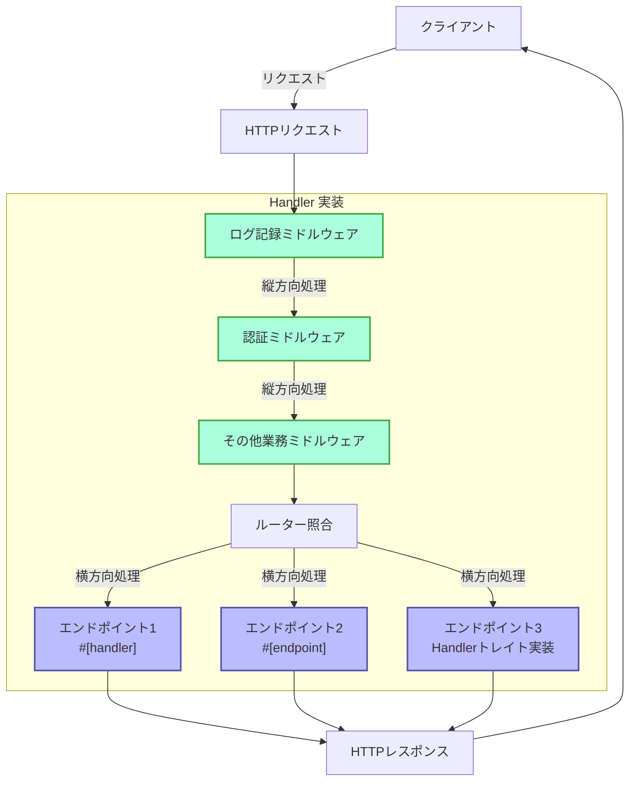
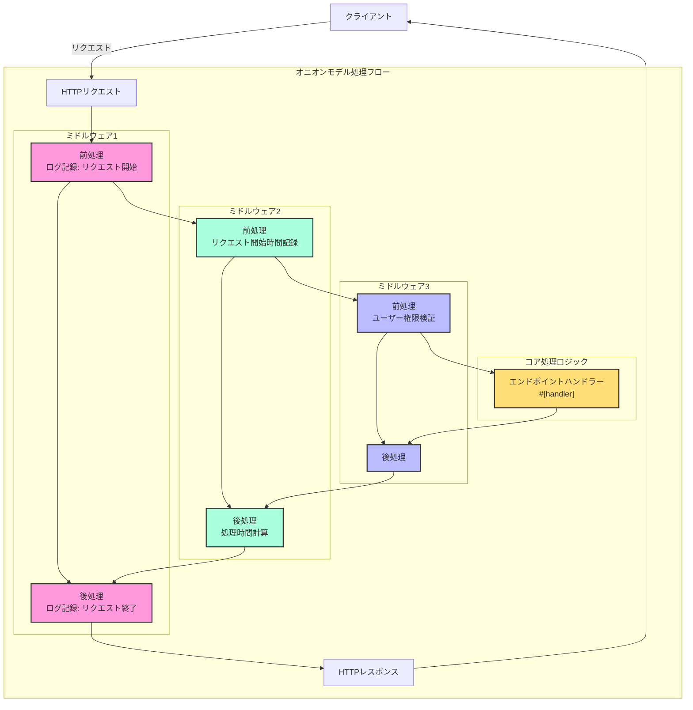

# ハンドラー

## 概要

ハンドラーはSalvoフレームワークの中核概念であり、リクエスト処理ユニットと簡単に理解できます。主に2つの用途があります：

1. **エンドポイントとして**：`Handler`を実装したオブジェクトは、ルーティングシステム内で最終的なリクエスト処理エンドポイントとして配置できます。`#[handler]`マクロを使用すると、関数を直接エンドポイントとして使用できます。`#[endpoint]`マクロを使用すると、エンドポイントとして機能するだけでなく、OpenAPIドキュメントを自動生成できます（この部分は後続のドキュメントで詳しく説明します）。

2. **ミドルウェアとして**：同じ`Handler`をミドルウェアとして使用し、リクエストが最終エンドポイントに到達する前後に処理を実行できます。

Salvoのリクエスト処理フローは「パイプライン」と見なすことができます：リクエストは最初に一連のミドルウェア（縦方向処理）を通過し、次にマッチしたエンドポイント（横方向処理）に到達します。ミドルウェアとエンドポイントの両方が`Handler`の実装であるため、システム全体に一貫性と柔軟性が保たれています。

### Salvoにおけるハンドラーのフローチャート



### ミドルウェアとオニオンモデル

オニオンモデルの本質は、ctrl.call_next()の前後の位置によって、リクエストとレスポンスの双方向処理フローを実現し、各ミドルウェアが完全なリクエスト-レスポンスサイクルに参加できるようにすることです。

### 完全なミドルウェア例の構造

```rust
async fn example_middleware(req: &mut Request, resp: &mut Response, ctrl: &mut FlowCtrl) {
    // 前処理（リクエスト段階）
    // ここにリクエスト受信時に実行するロジックを配置

    // チェーン内の次のハンドラーを呼び出し
    ctrl.call_next(req, resp).await;

    // 後処理（レスポンス段階）
    // ここにリクエスト処理完了後に実行するロジックを配置
}
```



## ハンドラーとは

ハンドラーはRequestリクエストを処理する責任を持つ具体的なオブジェクトです。ハンドラー自体はTraitであり、非同期メソッド`handle`を含んでいます：

```rust
#[async_trait]
pub trait Handler: Send + Sync + 'static {
    async fn handle(&self, req: &mut Request, depot: &mut Depot, res: &mut Response);
}
```

処理関数`handle`のデフォルトシグネチャには4つのパラメータが含まれます：`&mut Request, &mut Depot. &mut Response, &mut FlowCtrl`。Depotは一時的なストレージで、今回のリクエストに関連するデータを保存できます。

使用方法によって、ミドルウェア(hoop)として使用でき、正式なリクエスト処理`Handler`に到達する前後に処理を実行できます。例えば：ログイン検証、データ圧縮など。

ミドルウェアは`Router`の`hoop`関数を通じて追加されます。追加されたミドルウェアは現在の`Router`とそのすべての子孫`Router`に影響を与えます。

`Handler`はルーティングマッチングに参加して最終的に実行される`Handler`としても使用でき、`goal`と呼ばれます。

## `Handler`をミドルウェア(hoop)として使用

`Handler`がミドルウェアとして使用される場合、以下の3種類のミドルウェアをサポートするオブジェクトに追加できます：

- `Service`：すべてのリクエストが`Service`内のミドルウェアを通過します。

- `Router`：ルーティングが成功した場合のみ、リクエストは`Service`で定義されたミドルウェアとマッチしたパス上で収集されたすべてのミドルウェアを順次通過します。

- `Catcher`：エラーが発生し、カスタムエラーメッセージが書き込まれていない場合、リクエストは`Catcher`内のミドルウェアを通過します。

- `Handler`：`Handler`自体はミドルウェアラッピングの追加をサポートし、前処理または後処理ロジックを実行します。

## `#[handler]`マクロの使用

`#[handler]`はコードの記述を大幅に簡素化し、コードの柔軟性を向上させます。

関数に追加して`Handler`を実装できます：

```rust
#[handler]
async fn hello() -> &'static str {
    "hello world!"
}
```

これは以下と同等です：

```rust
struct hello;

#[async_trait]
impl Handler for hello {
    async fn handle(&self, _req: &mut Request, _depot: &mut Depot, res: &mut Response, _ctrl: &mut FlowCtrl) {
        res.render(Text::Plain("hello world!"));
    }
}
```

`#[handler]`を使用すると、コードが大幅に簡素化されます：

- `#[async_trait]`を手動で追加する必要がなくなります。
- 関数内で不要なパラメータは省略され、必要なパラメータも任意の順序で配置できます。
- `Writer`または`Scribe`抽象化を実装したオブジェクトは、直接関数の戻り値として返すことができます。ここでは`&'static str`が`Scribe`を実装しているため、直接関数の戻り値として返すことができます。

`#[handler]`は関数だけでなく、`struct`の`impl`にも追加でき、`struct`に`Handler`を実装させます。この場合、`impl`コードブロック内の`handle`関数は`Handler`内の`handle`の具体的な実装として認識されます：

```rust
struct Hello;

#[handler]
impl Hello {
    async fn handle(&self, res: &mut Response) {
        res.render(Text::Plain("hello world!"));
    }
}
```

## エラー処理

Salvoの`Handler`は`Result`を返すことができ、`Result`内の`Ok`と`Err`の型が両方とも`Writer`トレイトを実装している必要があります。
anyhowの使用が比較的一般的であることを考慮し、`anyhow`機能を有効にすると、`anyhow::Error`は`Writer`トレイトを実装します。`anyhow::Error`は`InternalServerError`にマッピングされます。

```rust
#[cfg(feature = "anyhow")]
#[async_trait]
impl Writer for ::anyhow::Error {
    async fn write(mut self, _req: &mut Request, _depot: &mut Depot, res: &mut Response) {
        res.render(StatusError::internal_server_error());
    }
}
```

カスタムエラータイプの場合、必要に応じて異なるエラーページを出力できます。

```rust
use salvo::anyhow;
use salvo::prelude::*;

struct CustomError;
#[async_trait]
impl Writer for CustomError {
    async fn write(mut self, _req: &mut Request, _depot: &mut Depot, res: &mut Response) {
        res.status_code(StatusCode::INTERNAL_SERVER_ERROR);
        res.render("custom error");
    }
}

#[handler]
async fn handle_anyhow() -> Result<(), anyhow::Error> {
    Err(anyhow::anyhow!("anyhow error"))
}
#[handler]
async fn handle_custom() -> Result<(), CustomError> {
    Err(CustomError)
}

#[tokio::main]
async fn main() {
    let router = Router::new()
        .push(Router::new().path("anyhow").get(handle_anyhow))
        .push(Router::new().path("custom").get(handle_custom));
    let acceptor = TcpListener::new("127.0.0.1:5800").bind().await;
    Server::new(acceptor).serve(router).await;
}
```

## 直接Handlerトレイトを実装

```rust
use salvo_core::prelude::*;
use crate::salvo_core::http::Body;

pub struct MaxSizeHandler(u64);
#[async_trait]
impl Handler for MaxSizeHandler {
    async fn handle(&self, req: &mut Request, depot: &mut Depot, res: &mut Response, ctrl: &mut FlowCtrl) {
        if let Some(upper) = req.body().and_then(|body| body.size_hint().upper()) {
            if upper > self.0 {
                res.render(StatusError::payload_too_large());
                ctrl.skip_rest();
            } else {
                ctrl.call_next(req, depot, res).await;
            }
        }
    }
}
```
{/* 本行由工具自动生成,原文哈希值:6e138bcee73660fa82c5418d286d59cc */}