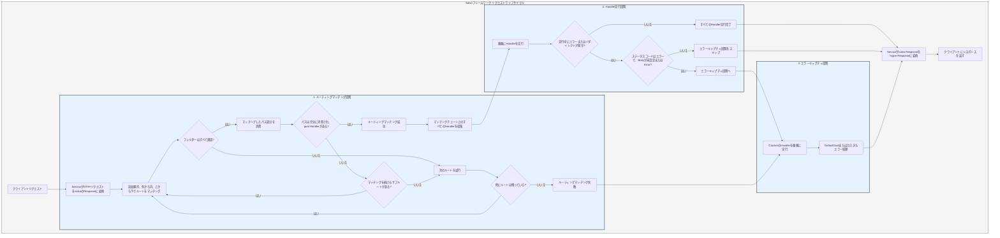

# 処理フロー

`Service` はまずリクエストをSalvoの `Response` に変換し、その後ルーティングマッチング段階に入ります。

## ルーティングマッチング段階

ルーティングマッチングは、追加された順序に従い、外側から内側へ、上から下へと順番にフィルターを実行します。いずれかのフィルターが失敗すると、マッチング失敗と見なされます。

マッチングプロセスでは、リクエストのパス情報が存在します。マッチングが進むにつれて、パスフィルターが一度マッチングに成功すると、そのマッチングしたパス部分が消費されます。すべてのパスが消費され、マッチングチェーン上のフィルターが失敗せず、現在のチェーンの最後の `Router` に `goal` `Handler` が存在する場合、マッチング成功となり、マッチング段階が終了します。マッチングしたすべてのチェーン上の `Handler` を収集し、実行段階へ進みます。

パスが完全に消費されず、チェーン上のフィルターがエラーを起こさないが、さらにマッチングを続けるサブルートが存在しない場合、現在のチェーンのマッチングは失敗と見なされ、次のルートマッチングへ進みます。

すべてのルートのマッチングが完了し、成功しなかった場合、エラーキャプチャ段階へ進みます。

## Handler 実行段階

マッチング段階で収集された `Handler` リストに従い、順番に `Handler` を実行します。実行プロセスでは、前のミドルウェアが `ctrl::call_next()` を呼び出すことで、後続のミドルウェアを先に実行し、その後自身のロジックを実行できます。実行中にステータスコードエラーやリダイレクトが発生した場合、後続の `Handler` は実行されません。この時、ステータスコードがエラーであり、かつ `Response` の `Body` が設定されていないか `ResBody::Error` である場合、エラーキャプチャ段階へ進みます。それ以外の場合はキャプチャ段階をスキップします。

## エラーキャプチャ段階

`Catcher` はエラーを処理するための型であり、ミドルウェア(hoops)を追加することもできます。エラーは `Catcher` 内のすべての `Handler` を順番に通過します。ある `Handler` がエラーを処理し、後続の `Handler` の実行を続けたくない場合は、 `ctrl.skip_rest()` を呼び出して後続の `Handler` をスキップし、直接キャプチャ段階を終了できます。

`Catcher` はデフォルトで、デフォルトのエラー処理として機能する1つの `Handler` を含んでいる必要があります。デフォルトは `DefaultGoal` です。エラー処理のデフォルト実装として、完全に独自の `Handler` をカスタマイズすることもできます。これはリクエストヘッダーで要求される `content-type` に応じて対応する形式のエラーメッセージを表示し、`json`、`xml`、`text`、`html` の4つの表示形式をサポートしています。 `DefaultGoal` はまた、いくつかの表示設定を提供しています。例えば、デフォルトではHTML形式を表示する際にSalvo関連のリンクを表示しますが、 `DefaultGoal::footer` または `DefaultGoal::with_footer` を呼び出して、独自に希望するカスタムフッターに設定することもできます。

`Service` はSalvoの `Response` をhyperの `Response` 型に変換し、最終的にブラウザなどのクライアントに返します。

## Salvo リクエストライフサイクル
これは、Salvo WebフレームワークがHTTPリクエストを処理するライフサイクルの視覚的表現と説明です。

{/* 本行由工具自动生成,原文哈希值:2934d9d3636688c10dfde8c3c36424c3 */}