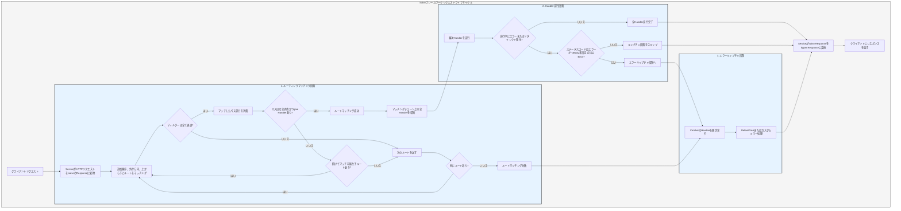

# 処理フロー

`Service`はまずリクエストをsalvoの`Response`に変換し、その後ルーティングマッチング段階に入ります。

## ルーティングマッチング段階

ルーティングマッチングは追加順序に従い、外から内へ、上から下へ順にフィルターを実行します。いずれかのフィルターが失敗すると、マッチング失敗と見なされます。

マッチング過程では、リクエストのパス情報が存在します。マッチングが進むにつれ、パスフィルターがマッチングに成功すると、そのマッチしたパス部分が消費されます。全てのパスが消費され、かつマッチングチェーン上でフィルターのマッチング失敗がなく、現在のチェーンの最後の`Router`に`goal`の`Handler`が存在する場合、マッチング成功となり、マッチング段階が終了します。マッチングチェーン上の全ての`Handler`を収集し、実行段階に進みます。

パスが消費し尽くされていない状態で、チェーン上のフィルターがエラーを起こさず、かつ続けてマッチング可能な子ルートがなくなった場合、現在のチェーンはマッチング失敗と見なし、次のルートマッチングに進みます。

全てのルートのマッチングが終了し、成功しなかった場合、エラーキャプチャ段階に入ります。

## Handler実行段階

マッチング段階で収集された`Handler`リストに従い、順次`Handler`を実行します。実行過程で、前段のミドルウェアは`ctrl::call_next()`を呼び出して後続のミドルウェアを先に実行させ、その後自身のロジックを実行できます。実行過程でステータスコードエラーやリダイレクトが発生した場合、後続の`Handler`は実行されません。この時、ステータスコードがエラーかつ`Response`の`Body`が未設定または`ResBody::Error`の場合、エラーキャプチャ段階に入ります。そうでない場合はキャプチャ段階をスキップします。

## エラーキャプチャ段階

`Catcher`はエラー処理を行うための型で、ミドルウェア(hoops)を追加することもできます。エラーは`Catcher`内の全ての`Handler`を順次通過します。ある`Handler`がエラーを処理し、後続の`Handler`の実行を継続したくない場合、`ctrl.skip_rest()`を呼び出して後続の`Handler`をスキップし、直接キャプチャ段階を終了させることができます。

`Catcher`はデフォルトで、デフォルトエラー処理として機能する1つの`Handler`を含む必要があります。デフォルトは`DeaultGoal`ですが、完全に独自の`Handler`をエラー処理のデフォルト実装としてカスタマイズすることも可能です。これはリクエストヘッダーで要求される`content-type`に応じて対応する形式のエラーメッセージを表示し、`json`、`xml`、`text`、`html`の4つの表示形式をサポートしています。`DeaultGoal`はまたいくつかの表示設定を提供しており、例えばデフォルトではhtml形式表示時にsalvo関連リンクを表示しますが、`DefaultGoal::footer`または`DefaultGoal::with_footer`を呼び出して独自のカスタムフッターに設定することもできます。

`Service`はsalvoの`Response`をhyperの`Response`型に変換し、最終的にブラウザなどのクライアントに返されます。

## Salvoリクエストライフサイクル
これはSalvo WebフレームワークがHTTPリクエストを処理するライフサイクルの視覚的表現と説明です。

{/* 本行由工具自动生成,原文哈希值:2934d9d3636688c10dfde8c3c36424c3 */}