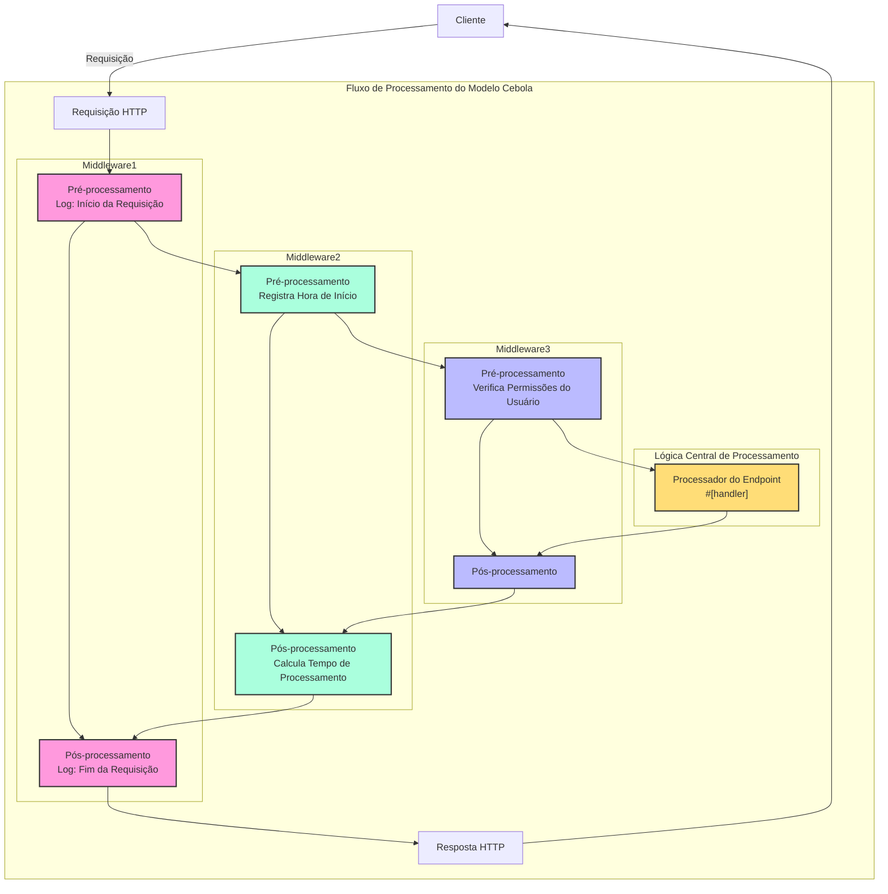

# Handler

## Visão Geral Rápida

Handler é um conceito central do framework Salvo, que pode ser entendido de forma simplificada como uma unidade de processamento de requisições. Ele tem duas finalidades principais:

1. **Como um Endpoint**: Um objeto que implementa `Handler` pode ser colocado no sistema de roteamento para atuar como o ponto final que processa a requisição. Ao usar a macro `#[handler]`, uma função pode ser usada diretamente como um endpoint; já a macro `#[endpoint]`, além de permitir seu uso como endpoint, também gera automaticamente a documentação OpenAPI (este tópico será detalhado em documentação posterior).

2. **Como um Middleware**: O mesmo `Handler` também pode ser usado como middleware, para processar a requisição antes ou depois dela chegar ao endpoint final.

O fluxo de processamento de requisições no Salvo pode ser visto como um "pipeline": a requisição passa primeiro por uma série de middlewares (processamento vertical) e depois chega ao endpoint correspondente (processamento horizontal). Tanto os middlewares quanto os endpoints são implementações de `Handler`, o que confere consistência e flexibilidade a todo o sistema.

### Diagrama de Fluxo do Handler no Salvo


### Middleware e o Modelo Cebola

A essência do modelo cebola é que, através da posição (antes/depois) da chamada `ctrl.call_next()`, é implementado um fluxo bidirecional de processamento da requisição e da resposta, permitindo que cada middleware participe do ciclo completo requisição-resposta.
### Estrutura de Exemplo Completa de Middleware

```rust
async fn example_middleware(req: &mut Request, depot: &mut Depot,resp: &mut Response, ctrl: &mut FlowCtrl) {
    // Pré-processamento (Fase da Requisição)
    // Coloque aqui a lógica a ser executada quando a requisição entra

    // Chama o próximo handler na cadeia
    ctrl.call_next(req, depot,resp).await;

    // Pós-processamento (Fase da Resposta)
    // Coloque aqui a lógica a ser executada após o processamento da requisição
}
```



## O que é um Handler

Handler é o objeto concreto responsável por processar uma requisição (Request). Handler é em si uma Trait, que contém internamente um método assíncrono `handle`:

```rust
#[async_trait]
pub trait Handler: Send + Sync + 'static {
    async fn handle(&self, req: &mut Request, depot: &mut Depot, res: &mut Response);
}
```

A função de processamento `handle` tem, por padrão, uma assinatura que inclui quatro parâmetros, na ordem: `&mut Request, &mut Depot. &mut Response, &mut FlowCtrl`. Depot é um armazenamento temporário que pode guardar dados relacionados à requisição atual.

Dependendo do modo de uso, ele pode ser empregado como middleware (hoop), que pode realizar algum processamento antes ou depois que a requisição chegue ao `Handler` que a processará formalmente. Exemplos: verificação de login, compressão de dados, etc.

Middlewares são adicionados através da função `hoop` do `Router`. O middleware adicionado afetará o `Router` atual e todos os seus `Router` descendentes.

`Handler` também pode ser usado como um `Handler` que participa da correspondência de rotas e é executado no final, sendo chamado de `goal`.

## `Handler` como Middleware (hoop)

Quando `Handler` atua como middleware, ele pode ser adicionado a três tipos de objetos que suportam middleware:

- `Service`: Qualquer requisição passará pelos middlewares definidos no `Service`.

- `Router`: Apenas quando a correspondência de rota for bem-sucedida, a requisição passará sequencialmente pelos middlewares definidos no `Service` e por todos os middlewares coletados ao longo do caminho correspondente.

- `Catcher`: Quando ocorre um erro e nenhuma informação de erro personalizada foi escrita, a requisição passará pelos middlewares do `Catcher`.

- `Handler`: O próprio `Handler` suporta a adição de um wrapper de middleware para executar lógica pré ou pós-processamento.

## Uso da Macro `#[handler]`

`#[handler]` pode simplificar significativamente a escrita do código e aumentar sua flexibilidade.

Ela pode ser aplicada a uma função, fazendo com que ela implemente `Handler`:

```rust
#[handler]
async fn hello() -> &'static str {
    "hello world!"
}
```

Isso é equivalente a:

```rust
struct hello;

#[async_trait]
impl Handler for hello {
    async fn handle(&self, _req: &mut Request, _depot: &mut Depot, res: &mut Response, _ctrl: &mut FlowCtrl) {
        res.render(Text::Plain("hello world!"));
    }
}
```

Como pode ser visto, ao usar `#[handler]`, o código se torna muito mais simples:

- Não é mais necessário adicionar manualmente `#[async_trait]`.
- Parâmetros não necessários na função são omitidos, e os parâmetros necessários podem ser organizados em qualquer ordem.
- Para objetos que implementam as abstrações `Writer` ou `Scribe`, eles podem ser retornados diretamente como valor da função. Aqui, `&'static str` implementa `Scribe`, portanto pode ser retornado diretamente.

`#[handler]` não pode ser aplicada apenas a funções, mas também ao bloco `impl` de um `struct`, fazendo com que o `struct` implemente `Handler`. Neste caso, a função `handle` dentro do bloco `impl` será reconhecida como a implementação concreta do método `handle` da trait `Handler`:

```rust
struct Hello;

#[handler]
impl Hello {
    async fn handle(&self, res: &mut Response) {
        res.render(Text::Plain("hello world!"));
    }
}
```

## Tratamento de Erros

Em Salvo, um `Handler` pode retornar um `Result`, desde que os tipos `Ok` e `Err` dentro do `Result` implementem a trait `Writer`.
Considerando que o uso do anyhow é bastante difundido, ao habilitar o recurso `anyhow`, `anyhow::Error` implementará a trait `Writer`. `anyhow::Error` será mapeado para `InternalServerError`.

```rust
#[cfg(feature = "anyhow")]
#[async_trait]
impl Writer for ::anyhow::Error {
    async fn write(mut self, _req: &mut Request, _depot: &mut Depot, res: &mut Response) {
        res.render(StatusError::internal_server_error());
    }
}
```

Para tipos de erro personalizados, você pode gerar páginas de erro diferentes conforme necessário.

```rust
use salvo::anyhow;
use salvo::prelude::*;

struct CustomError;
#[async_trait]
impl Writer for CustomError {
    async fn write(mut self, _req: &mut Request, _depot: &mut Depot, res: &mut Response) {
        res.status_code(StatusCode::INTERNAL_SERVER_ERROR);
        res.render("custom error");
    }
}

#[handler]
async fn handle_anyhow() -> Result<(), anyhow::Error> {
    Err(anyhow::anyhow!("anyhow error"))
}
#[handler]
async fn handle_custom() -> Result<(), CustomError> {
    Err(CustomError)
}

#[tokio::main]
async fn main() {
    let router = Router::new()
        .push(Router::new().path("anyhow").get(handle_anyhow))
        .push(Router::new().path("custom").get(handle_custom));
    let acceptor = TcpListener::new("127.0.0.1:5800").bind().await;
    Server::new(acceptor).serve(router).await;
}
```

## Implementando Diretamente a Trait Handler

```rust
use salvo_core::prelude::*;
use crate::salvo_core::http::Body;

pub struct MaxSizeHandler(u64);
#[async_trait]
impl Handler for MaxSizeHandler {
    async fn handle(&self, req: &mut Request, depot: &mut Depot, res: &mut Response, ctrl: &mut FlowCtrl) {
        if let Some(upper) = req.body().and_then(|body| body.size_hint().upper()) {
            if upper > self.0 {
                res.render(StatusError::payload_too_large());
                ctrl.skip_rest();
            } else {
                ctrl.call_next(req, depot, res).await;
            }
        }
    }
}
```
{/* Auto generated, origin file hash:aba76a058ee7c27a6a982876209eae78 */}