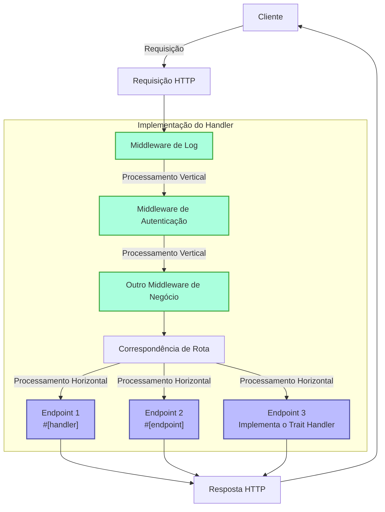
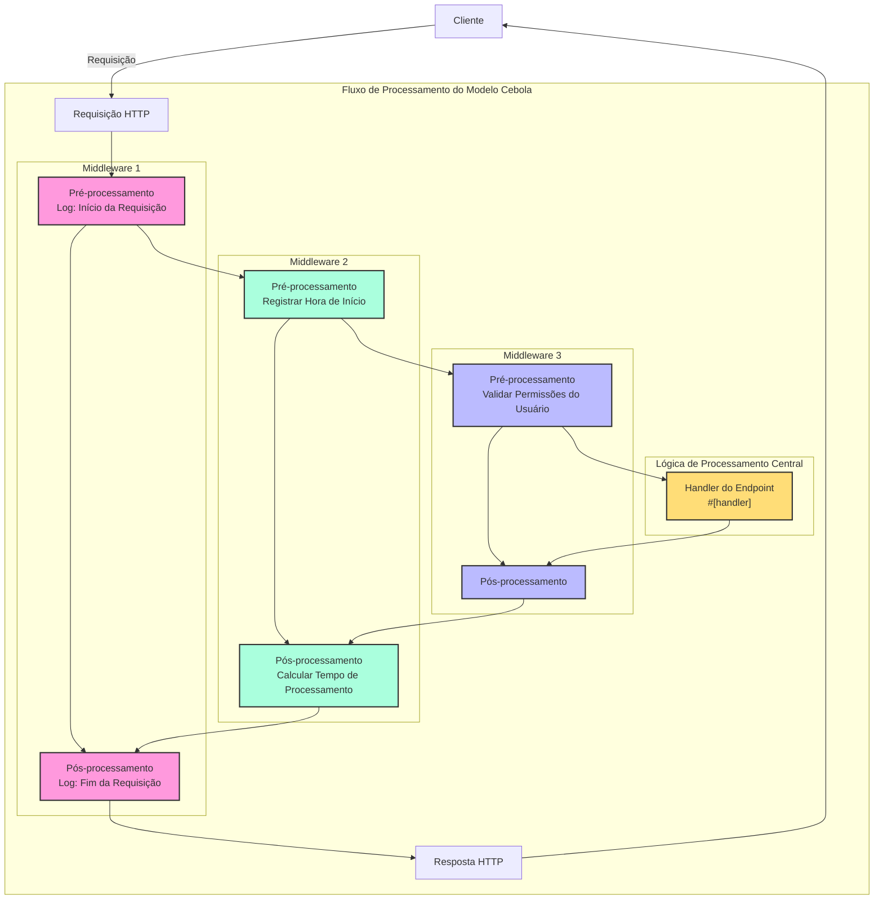

# Handler

## Visão Geral Rápida

Handler é um conceito central no framework Salvo, que pode ser entendido simplesmente como uma unidade de processamento de requisições. Ele tem dois propósitos principais:

1. **Como um Endpoint**: Um objeto que implementa `Handler` pode ser colocado no sistema de roteamento como o endpoint final para processar requisições. Ao usar a macro `#[handler]`, uma função pode ser usada diretamente como um endpoint; enquanto o uso da macro `#[endpoint]` não só permite que sirva como endpoint, mas também gera automaticamente a documentação OpenAPI (isso será detalhado na documentação subsequente).

2. **Como Middleware**: O mesmo `Handler` também pode ser usado como middleware para processar requisições antes ou depois que elas cheguem ao endpoint final.

O fluxo de processamento de requisições do Salvo pode ser visto como um "pipeline": uma requisição primeiro passa por uma série de middlewares (processamento vertical) e depois chega ao endpoint correspondente (processamento horizontal). Tanto middleware quanto endpoints são implementações de `Handler`, o que garante consistência e flexibilidade em todo o sistema.

### Fluxograma do Handler no Salvo



### Middleware e o Modelo Cebola

A essência do modelo cebola é que, ao colocar `ctrl.call_next()` antes e depois da lógica específica, ele implementa um fluxo de processamento bidirecional para requisições e respostas, permitindo que cada middleware participe do ciclo completo de requisição-resposta.

### Estrutura de Exemplo Completo de Middleware

```rust
async fn example_middleware(req: &mut Request, depot: &mut Depot, resp: &mut Response, ctrl: &mut FlowCtrl) {
    // Pré-processamento (Fase da Requisição)
    // Coloque aqui a lógica a ser executada quando a requisição entra.

    // Chama o próximo handler na cadeia.
    ctrl.call_next(req, depot, resp).await;

    // Pós-processamento (Fase da Resposta)
    // Coloque aqui a lógica a ser executada após o processamento da requisição.
}
```



## O que é um Handler

Um Handler é o objeto concreto responsável por processar objetos Request. O próprio Handler é um Trait contendo um método assíncrono `handle`:

```rust
#[async_trait]
pub trait Handler: Send + Sync + 'static {
    async fn handle(&self, req: &mut Request, depot: &mut Depot, res: &mut Response);
}
```

A assinatura padrão da função `handle` inclui quatro parâmetros, na ordem: `&mut Request, &mut Depot, &mut Response, &mut FlowCtrl`. Depot é um armazenamento temporário que pode conter dados relacionados à requisição atual.

Dependendo de como é usado, pode servir como middleware (hoop), que pode executar processamento antes ou depois que a requisição chegue ao `Handler` formal de processamento de requisições, como: verificação de login, compactação de dados, etc.

O middleware é adicionado através da função `hoop` de um `Router`. O middleware adicionado afeta o `Router` atual e todos os seus `Router`s descendentes.

Um `Handler` também pode ser usado como um `Handler` que participa da correspondência de rota e é finalmente executado, conhecido como `goal`.

## `Handler` como Middleware (hoop)

Quando um `Handler` atua como middleware, ele pode ser adicionado aos três tipos de objetos que suportam middleware:

- `Service`: Qualquer requisição passará pelo middleware no `Service`.
- `Router`: Somente quando a correspondência de rota for bem-sucedida, a requisição passará pelo middleware definido no `Service` e todo o middleware coletado ao longo do caminho correspondente.
- `Catcher`: Quando ocorre um erro e nenhuma informação de erro personalizada foi escrita, a requisição passará pelo middleware no `Catcher`.
- `Handler`: O próprio `Handler` suporta a adição de wrappers de middleware para executar alguma lógica pré ou pós.

## Usando a Macro `#[handler]`

A macro `#[handler]` pode simplificar muito a escrita de código e melhorar a flexibilidade do código.

Pode ser aplicada a uma função para fazê-la implementar `Handler`:

```rust
#[handler]
async fn hello() -> &'static str {
    "olá mundo!"
}
```

Isso é equivalente a:

```rust
struct hello;

#[async_trait]
impl Handler for hello {
    async fn handle(&self, _req: &mut Request, _depot: &mut Depot, res: &mut Response, _ctrl: &mut FlowCtrl) {
        res.render(Text::Plain("olá mundo!"));
    }
}
```

Como você pode ver, com `#[handler]`, o código se torna muito mais simples:

- Não é necessário adicionar manualmente `#[async_trait]`.
- Parâmetros desnecessários na função são omitidos, e os parâmetros necessários podem ser organizados em qualquer ordem.
- Para objetos que implementam as abstrações `Writer` ou `Scribe`, eles podem ser retornados diretamente como valor de retorno da função. Aqui, `&'static str` implementa `Scribe`, então pode ser retornado diretamente.

`#[handler]` pode não só ser aplicado a funções, mas também ao bloco `impl` de uma `struct` para fazer a `struct` implementar `Handler`. Nesse caso, a função `handle` dentro do bloco `impl` é reconhecida como a implementação concreta do método `handle` em `Handler`:

```rust
struct Hello;

#[handler]
impl Hello {
    async fn handle(&self, res: &mut Response) {
        res.render(Text::Plain("olá mundo!"));
    }
}
```

## Tratamento de Erros

No Salvo, um `Handler` pode retornar um `Result`, desde que tanto o tipo `Ok` quanto `Err` dentro do `Result` implementem o trait `Writer`.
Considerando o uso generalizado do anyhow, quando o recurso `anyhow` está ativado, `anyhow::Error` implementará o trait `Writer`. `anyhow::Error` será mapeado para `InternalServerError`.

```rust
#[cfg(feature = "anyhow")]
#[async_trait]
impl Writer for ::anyhow::Error {
    async fn write(mut self, _req: &mut Request, _depot: &mut Depot, res: &mut Response) {
        res.render(StatusError::internal_server_error());
    }
}
```

Para tipos de erro personalizados, você pode gerar diferentes páginas de erro conforme necessário.

```rust
use salvo::anyhow;
use salvo::prelude::*;

struct CustomError;
#[async_trait]
impl Writer for CustomError {
    async fn write(mut self, _req: &mut Request, _depot: &mut Depot, res: &mut Response) {
        res.status_code(StatusCode::INTERNAL_SERVER_ERROR);
        res.render("erro personalizado");
    }
}

#[handler]
async fn handle_anyhow() -> Result<(), anyhow::Error> {
    Err(anyhow::anyhow!("erro anyhow"))
}
#[handler]
async fn handle_custom() -> Result<(), CustomError> {
    Err(CustomError)
}

#[tokio::main]
async fn main() {
    let router = Router::new()
        .push(Router::new().path("anyhow").get(handle_anyhow))
        .push(Router::new().path("custom").get(handle_custom));
    let acceptor = TcpListener::new("127.0.0.1:5800").bind().await;
    Server::new(acceptor).serve(router).await;
}
```

## Implementando Diretamente o Trait Handler

```rust
use salvo_core::prelude::*;
use crate::salvo_core::http::Body;

pub struct MaxSizeHandler(u64);
#[async_trait]
impl Handler for MaxSizeHandler {
    async fn handle(&self, req: &mut Request, depot: &mut Depot, res: &mut Response, ctrl: &mut FlowCtrl) {
        if let Some(upper) = req.body().and_then(|body| body.size_hint().upper()) {
            if upper > self.0 {
                res.render(StatusError::payload_too_large());
                ctrl.skip_rest();
            } else {
                ctrl.call_next(req, depot, res).await;
            }
        }
    }
}
```
{/* Auto generated, origin file hash:d20a5e643c01f98f895dfcba095711b2 */}