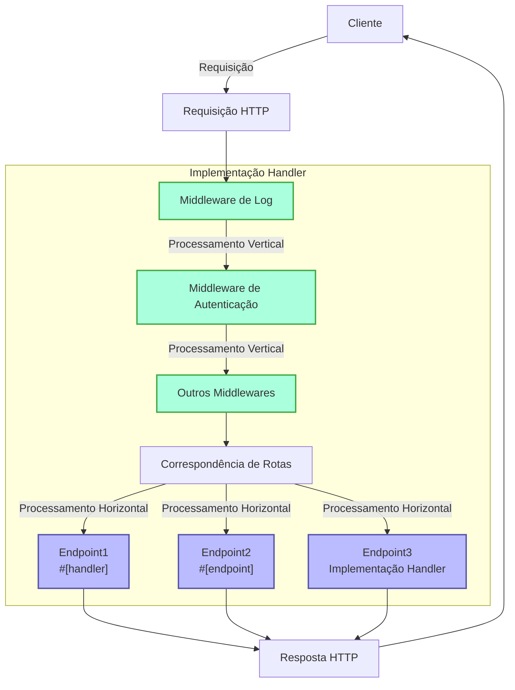
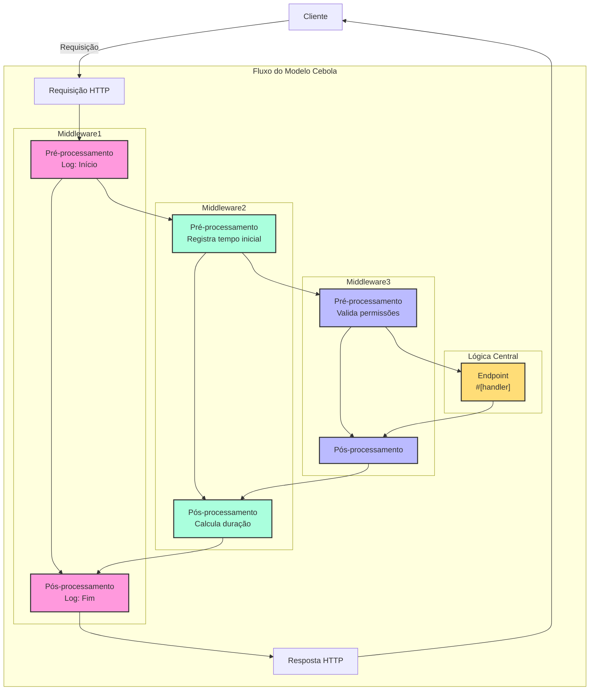

# Handler

## Visão Geral Rápida

Handler é um conceito central do framework Salvo, que pode ser entendido como uma unidade de processamento de requisições, com dois principais usos:

1. **Como Endpoint**: Objetos que implementam `Handler` podem ser colocados no sistema de roteamento como pontos finais de processamento. Ao usar a macro `#[handler]`, funções podem ser usadas diretamente como endpoints; já com a macro `#[endpoint]`, além de servir como endpoint, também geram automaticamente documentação OpenAPI (detalhada em documentação posterior).

2. **Como Middleware**: O mesmo `Handler` pode atuar como middleware, processando requisições antes ou depois de chegarem ao endpoint final.

O fluxo de processamento do Salvo funciona como um "pipeline": requisições passam primeiro por uma série de middlewares (processamento vertical) antes de alcançar o endpoint correspondente (processamento horizontal). Tanto middlewares quanto endpoints são implementações de `Handler`, garantindo consistência e flexibilidade ao sistema.

### Diagrama de Fluxo do Handler no Salvo



### Middleware e o Modelo Cebola

A essência do modelo cebola está no posicionamento de `ctrl.call_next()`, que permite o processamento bidirecional (requisição e resposta), fazendo com que cada middleware participe de todo o ciclo.

### Estrutura Completa de Exemplo de Middleware

```rust
async fn example_middleware(req: &mut Request, resp: &mut Response, ctrl: &mut FlowCtrl) {
    // Pré-processamento (fase de requisição)
    // Lógica executada ao receber a requisição

    // Chama o próximo handler na cadeia
    ctrl.call_next(req, resp).await;

    // Pós-processamento (fase de resposta)
    // Lógica executada após o processamento
}
```



## O que é um Handler

Handler é o objeto responsável por processar requisições. É um Trait que contém um método assíncrono `handle`:

```rust
#[async_trait]
pub trait Handler: Send + Sync + 'static {
    async fn handle(&self, req: &mut Request, depot: &mut Depot, res: &mut Response);
}
```

O método `handle` recebe quatro parâmetros: `&mut Request, &mut Depot, &mut Response, &mut FlowCtrl`. Depot é um armazenamento temporário para dados da requisição.

Dependendo do uso, pode servir como middleware (hoop), processando requisições antes ou depois do Handler principal (ex: autenticação, compressão).

Middlewares são adicionados via função `hoop` do `Router` e afetam o `Router` atual e seus descendentes.

Handlers também podem ser usados como endpoints finais (goal).

## Handler como Middleware (hoop)

Como middleware, pode ser adicionado a três tipos de objetos:

- `Service`: Todas as requisições passam por seus middlewares.
- `Router`: Somente requisições com rota correspondente.
- `Catcher`: Acionado quando ocorrem erros não tratados.
- `Handler`: Permite adicionar middlewares para lógica pré/pós-processamento.

## Uso da Macro `#[handler]`

`#[handler]` simplifica código e aumenta flexibilidade:

```rust
#[handler]
async fn hello() -> &'static str {
    "hello world!"
}
```

Equivale a:

```rust
struct hello;

#[async_trait]
impl Handler for hello {
    async fn handle(&self, _req: &mut Request, _depot: &mut Depot, res: &mut Response, _ctrl: &mut FlowCtrl) {
        res.render(Text::Plain("hello world!"));
    }
}
```

Vantagens:
- Elimina `#[async_trait]`.
- Parâmetros opcionais podem ser omitidos ou reordenados.
- Tipos que implementam `Writer`/`Scribe` podem ser retornados diretamente.

Também pode ser usada em `impl` para structs:

```rust
struct Hello;

#[handler]
impl Hello {
    async fn handle(&self, res: &mut Response) {
        res.render(Text::Plain("hello world!"));
    }
}
```

## Tratamento de Erros

Handlers podem retornar `Result`, desde que `Ok` e `Err` implementem `Writer`. Com o recurso `anyhow` ativado, `anyhow::Error` implementa `Writer` e mapeia para `InternalServerError`.

```rust
#[cfg(feature = "anyhow")]
#[async_trait]
impl Writer for ::anyhow::Error {
    async fn write(mut self, _req: &mut Request, _depot: &mut Depot, res: &mut Response) {
        res.render(StatusError::internal_server_error());
    }
}
```

Para erros personalizados:

```rust
use salvo::anyhow;
use salvo::prelude::*;

struct CustomError;
#[async_trait]
impl Writer for CustomError {
    async fn write(mut self, _req: &mut Request, _depot: &mut Depot, res: &mut Response) {
        res.status_code(StatusCode::INTERNAL_SERVER_ERROR);
        res.render("custom error");
    }
}

#[handler]
async fn handle_anyhow() -> Result<(), anyhow::Error> {
    Err(anyhow::anyhow!("anyhow error"))
}
#[handler]
async fn handle_custom() -> Result<(), CustomError> {
    Err(CustomError)
}
```

## Implementação Direta do Trait Handler

```rust
use salvo_core::prelude::*;
use crate::salvo_core::http::Body;

pub struct MaxSizeHandler(u64);
#[async_trait]
impl Handler for MaxSizeHandler {
    async fn handle(&self, req: &mut Request, depot: &mut Depot, res: &mut Response, ctrl: &mut FlowCtrl) {
        if let Some(upper) = req.body().and_then(|body| body.size_hint().upper()) {
            if upper > self.0 {
                res.render(StatusError::payload_too_large());
                ctrl.skip_rest();
            } else {
                ctrl.call_next(req, depot, res).await;
            }
        }
    }
}
```
{/* 本行由工具自动生成,原文哈希值:6e138bcee73660fa82c5418d286d59cc */}