# Fluxo de Processamento

O `Service` primeiro converte a requisição em uma `Response` do Salvo, e então entra na fase de correspondência de rotas.

## Fase de Correspondência de Rotas

A correspondência de rotas segue a ordem de adição, executando os filtros de fora para dentro e de cima para baixo. Se qualquer filtro falhar, a correspondência é considerada falha.

Durante o processo de correspondência, as informações do caminho da requisição são consumidas à medida que os filtros de caminho correspondem com sucesso. Quando todo o caminho é consumido e nenhum filtro na cadeia falha, e o último `Router` na cadeia possui um `Handler` `goal`, a correspondência é bem-sucedida e a fase termina. Todos os `Handlers` das cadeias correspondentes são coletados para a fase de execução.

Se o caminho não for totalmente consumido, a cadeia de filtros não apresentar erros, mas não houver mais sub-rotas para continuar a correspondência, a correspondência da cadeia atual é considerada falha e passa para a próxima rota.

Se todas as rotas forem verificadas sem sucesso, o processo entra na fase de captura de erros.

## Fase de Execução do Handler

Os `Handlers` coletados na fase de correspondência são executados em ordem. Durante a execução, os middlewares anteriores podem chamar `ctrl::call_next()` para permitir que os middlewares subsequentes sejam executados primeiro, antes de executar sua própria lógica. Se ocorrer um erro de código de status ou um redirecionamento durante a execução, os `Handlers` subsequentes não serão executados. Se o código de status for um erro e o `Body` da `Response` não estiver definido ou for `ResBody::Error`, o processo entra na fase de captura de erros; caso contrário, essa fase é ignorada.

## Fase de Captura de Erros

O `Catcher` é um tipo usado para tratar erros e também pode adicionar middlewares (hoops). Os erros passam por todos os `Handlers` dentro do `Catcher`. Se um `Handler` já tiver tratado o erro e não desejar que os `Handlers` subsequentes continuem, ele pode pular os restantes com `ctrl.skip_rest()`, encerrando imediatamente a fase de captura.

O `Catcher` deve incluir obrigatoriamente um `Handler` padrão para tratamento de erros. O padrão é o `DefaultGoal`, mas você pode personalizar completamente seu próprio `Handler` como implementação padrão. Ele exibe mensagens de erro no formato solicitado pelo cabeçalho `content-type`, suportando `json`, `xml`, `text` e `html`. O `DefaultGoal` também oferece configurações de exibição, como links relacionados ao Salvo no formato HTML, que podem ser personalizados usando `DefaultGoal::footer` ou `DefaultGoal::with_footer` para definir um rodapé personalizado.

O `Service` converte a `Response` do Salvo em um tipo `Response` do Hyper, que é finalmente retornado ao cliente, como um navegador.

## Ciclo de Vida da Requisição no Salvo
Esta é uma representação visual e explicação do ciclo de vida do processamento de requisições HTTP no framework web Salvo.

```mermaid
flowchart TD
    subgraph MainGraph[Ciclo de Vida da Requisição no Salvo]
        Start[Requisição do Cliente] --> Convert[Service converte a requisição HTTP em Response do Salvo]
        
        %% Fase de Correspondência de Rotas
        subgraph RoutingPhase[1. Fase de Correspondência de Rotas]
            Convert --> Routing[Correspondência de rotas por ordem de adição, de fora para dentro, de cima para baixo]
            Routing --> FilterCheck{Todos os filtros passaram?}
            FilterCheck -->|Não| NextRoute[Tentar próxima rota]
            FilterCheck -->|Sim| PathConsume[Consumir parte correspondente do caminho]
            PathConsume --> PathCheck{O caminho foi totalmente consumido e há um Handler goal?}
            PathCheck -->|Não| SubRouteCheck{Há sub-rotas para continuar?}
            SubRouteCheck -->|Sim| Routing
            SubRouteCheck -->|Não| NextRoute
            NextRoute --> RouteLeft{Há mais rotas?}
            RouteLeft -->|Sim| Routing
            RouteLeft -->|Não| NoMatchRoute[Falha na correspondência de rotas]
            PathCheck -->|Sim| MatchSuccess[Correspondência de rotas bem-sucedida]
            MatchSuccess --> CollectHandlers[Coletar todos os Handlers das cadeias correspondentes]
        end
        
        %% Fase de Execução do Handler
        subgraph HandlerPhase[2. Fase de Execução do Handler]
            CollectHandlers --> ExecHandlers[Executar Handlers em ordem]
            ExecHandlers --> ErrorCheck{Ocorreu erro ou redirecionamento?}
            ErrorCheck -->|Não| FinishHandlers[Todos os Handlers executados]
            ErrorCheck -->|Sim| StatusCheck{O código de status é erro e o Body não está definido ou é Error?}
            StatusCheck -->|Sim| EnterCatcher[Entrar na fase de captura de erros]
            StatusCheck -->|Não| SkipCatcher[Ignorar fase de captura de erros]
        end
        
        %% Fase de Captura de Erros
        subgraph CatcherPhase[3. Fase de Captura de Erros]
            EnterCatcher --> CatcherHandlers[Executar Handlers do Catcher em ordem]
            NoMatchRoute --> CatcherHandlers
            CatcherHandlers --> DefaultHandler[DefaultGoal ou tratamento de erros personalizado]
        end
        
        %% Resposta Final
        FinishHandlers --> FinalConvert[Service converte a Response do Salvo em Response do Hyper]
        SkipCatcher --> FinalConvert
        DefaultHandler --> FinalConvert
        
        FinalConvert --> End[Retornar resposta ao cliente]
    end
    
    %% Estilos
    class RoutingPhase,HandlerPhase,CatcherPhase phase;
    class MainGraph mainGraph;
    classDef mainGraph fill:#f5f5f5,stroke:#333,stroke-width:1px;
    classDef phase fill:#e6f3ff,stroke:#333,stroke-width:2px;
```

{/* 本行由工具自动生成,原文哈希值:2934d9d3636688c10dfde8c3c36424c3 */}