# Fluxo de Processamento

O `Service` primeiro converte a requisição em uma `Response` do Salvo, e então entra na fase de correspondência de rotas.

## Fase de Correspondência de Rotas

A correspondência de rotas segue a ordem de adição, executando os filtros sequencialmente de fora para dentro e de cima para baixo. Se qualquer filtro falhar na execução, é considerado uma falha de correspondência.

Durante o processo de correspondência, as informações do caminho da requisição são consumidas à medida que os filtros de caminho correspondem com sucesso. Quando todo o caminho é consumido e nenhum filtro na cadeia de correspondência falha, e o último `Router` na cadeia atual possui um `Handler` `goal`, então a correspondência é bem-sucedida e a fase de correspondência termina. Todos os `Handlers` das cadeias correspondentes são coletados para a fase de execução.

Se o caminho não for totalmente consumido, nenhum erro ocorrer na cadeia, mas não houver mais sub-rotas para continuar a correspondência, considera-se que a correspondência da cadeia atual falhou e passa-se para a próxima rota.

Se todas as rotas forem testadas sem sucesso, o processo entra na fase de captura de erros.

## Fase de Execução do Handler

Os `Handlers` coletados na fase de correspondência são executados sequencialmente. Durante a execução, os middlewares anteriores podem chamar `ctrl::call_next()` para permitir que os middlewares subsequentes sejam executados primeiro, antes de executar sua própria lógica. Se ocorrer um erro de código de status ou um redirecionamento durante a execução, os `Handlers` subsequentes não serão executados. Nesse caso, se o código de status for um erro e o `Body` da `Response` não estiver definido ou for `ResBody::Error`, o processo entra na fase de captura de erros; caso contrário, a fase de captura é ignorada.

## Fase de Captura de Erros

O `Catcher` é um tipo usado para tratar erros e também pode adicionar middlewares (hoops). Os erros passam sequencialmente por todos os `Handlers` dentro do `Catcher`. Se um `Handler` já tiver tratado o erro e não desejar que os `Handlers` subsequentes continuem a execução, ele pode pular os `Handlers` restantes usando `ctrl.skip_rest()`, encerrando diretamente a fase de captura.

O `Catcher` deve conter, por padrão, um `Handler` para tratamento de erros padrão. O padrão é o `DefaultGoal`, mas você também pode personalizar completamente seu próprio `Handler` como implementação padrão para tratamento de erros. Ele exibe mensagens de erro no formato correspondente ao `content-type` exigido pelo cabeçalho da requisição, suportando quatro formatos de exibição: `json`, `xml`, `text` e `html`. O `DefaultGoal` também oferece algumas configurações de exibição, como a exibição de links relacionados ao Salvo no formato HTML por padrão. Você pode chamar `DefaultGoal::footer` ou `DefaultGoal::with_footer` para definir um rodapé personalizado conforme desejado.

O `Service` converte a `Response` do Salvo no tipo `Response` do Hyper, que é finalmente retornada ao cliente, como um navegador.

## Ciclo de Vida da Requisição no Salvo
Esta é uma representação visual e explicação do ciclo de vida do processamento de requisições HTTP no framework web Salvo.

```mermaid
flowchart TD
    subgraph MainGraph[Ciclo de Vida da Requisição no Framework Salvo]
        Start[Requisição do Cliente] --> Convert[Service converte a requisição HTTP em Response do Salvo]
        
        %% Fase de correspondência de rotas
        subgraph RoutingPhase[1. Fase de Correspondência de Rotas]
            Convert --> Routing[Correspondência de rotas na ordem de adição, de fora para dentro, de cima para baixo]
            Routing --> FilterCheck{Todos os filtros passaram?}
            FilterCheck -->|Não| NextRoute[Tentar próxima rota]
            FilterCheck -->|Sim| PathConsume[Consumir parte correspondente do caminho]
            PathConsume --> PathCheck{O caminho foi totalmente consumido e há um goal Handler?}
            PathCheck -->|Não| SubRouteCheck{Há sub-rotas para continuar a correspondência?}
            SubRouteCheck -->|Sim| Routing
            SubRouteCheck -->|Não| NextRoute
            NextRoute --> RouteLeft{Ainda há outras rotas?}
            RouteLeft -->|Sim| Routing
            RouteLeft -->|Não| NoMatchRoute[Falha na correspondência de rotas]
            PathCheck -->|Sim| MatchSuccess[Correspondência de rotas bem-sucedida]
            MatchSuccess --> CollectHandlers[Coletar todos os Handlers da cadeia correspondente]
        end
        
        %% Fase de execução do Handler
        subgraph HandlerPhase[2. Fase de Execução do Handler]
            CollectHandlers --> ExecHandlers[Executar Handlers em ordem]
            ExecHandlers --> ErrorCheck{Ocorreu erro ou redirecionamento durante a execução?}
            ErrorCheck -->|Não| FinishHandlers[Todos os Handlers executados]
            ErrorCheck -->|Sim| StatusCheck{O código de status é erro e o Body não está definido ou é Error?}
            StatusCheck -->|Sim| EnterCatcher[Entrar na fase de captura de erros]
            StatusCheck -->|Não| SkipCatcher[Ignorar fase de captura de erros]
        end
        
        %% Fase de captura de erros
        subgraph CatcherPhase[3. Fase de Captura de Erros]
            EnterCatcher --> CatcherHandlers[Executar Handlers do Catcher sequencialmente]
            NoMatchRoute --> CatcherHandlers
            CatcherHandlers --> DefaultHandler[DefaultGoal ou tratamento de erros personalizado]
        end
        
        %% Resposta final
        FinishHandlers --> FinalConvert[Service converte a Response do Salvo em Response do Hyper]
        SkipCatcher --> FinalConvert
        DefaultHandler --> FinalConvert
        
        FinalConvert --> End[Retornar resposta ao cliente]
    end
    
    %% Estilos
    class RoutingPhase,HandlerPhase,CatcherPhase phase;
    class MainGraph mainGraph;
    classDef mainGraph fill:#f5f5f5,stroke:#333,stroke-width:1px;
    classDef phase fill:#e6f3ff,stroke:#333,stroke-width:2px;
```

{/* Auto generated, origin file hash:2934d9d3636688c10dfde8c3c36424c3 */}