# Fluxo de Processamento

O `Service` primeiro converte a requisição em `Response` do Salvo e, em seguida, entra na fase de correspondência de rotas.

## Fase de Correspondência de Rotas

A correspondência de rotas executa os filtros na ordem em que foram adicionados, procedendo de fora para dentro e de cima para baixo. Se qualquer filtro falhar, a correspondência é considerada malsucedida.

Durante o processo de correspondência, as informações do caminho da requisição são consumidas progressivamente. Uma vez que um filtro de caminho corresponde com sucesso, ele consome a parte correspondente do caminho. Quando todos os segmentos do caminho são consumidos, nenhum filtro falha ao longo da cadeia de correspondência e o último `Router` na cadeia atual possui um `Handler` de `goal`, a correspondência é bem-sucedida e a fase de correspondência termina. Todos os `Handler`s coletados da cadeia de correspondência prosseguem para a fase de execução.

Se o caminho não for totalmente consumido, nenhum erro ocorrer ao longo da cadeia, mas não houver mais rotas filhas para continuar a correspondência, a cadeia atual é considerada uma falha de correspondência e o processo passa para a próxima rota para correspondência.

Se todas as rotas forem correspondidas sem sucesso, o processo entra na fase de captura de erros.

## Fase de Execução do Handler

Os `Handler`s coletados durante a fase de correspondência são executados sequencialmente. Durante a execução, o middleware anterior pode chamar `ctrl::call_next()` para permitir que o middleware subsequente execute primeiro antes de executar sua própria lógica. Se ocorrer um código de status de erro ou um redirecionamento durante a execução, os `Handler`s subsequentes não serão executados. Se o código de status indicar um erro e o `Body` da `Response` não estiver definido ou for `ResBody::Error`, o processo entra na fase de captura de erros; caso contrário, ele pula a fase de captura.

## Fase de Captura de Erros

`Catcher` é um tipo usado para lidar com erros e também pode incluir middleware (hoops). Os erros passam por todos os `Handler`s dentro do `Catcher` sequencialmente. Se um `Handler` já tiver tratado o erro e não quiser que os `Handler`s subsequentes continuem, ele pode pular o restante usando `ctrl.skip_rest()`, terminando diretamente a fase de captura.

`Catcher` deve incluir pelo menos um `Handler` como o manipulador de erros padrão. O padrão é `DefaultGoal`, mas você pode personalizar totalmente seu próprio `Handler` como a implementação padrão de tratamento de erros. Ele exibe informações de erro no formato solicitado pelo cabeçalho `content-type`, suportando os formatos `json`, `xml`, `text` e `html`. `DefaultGoal` também fornece configurações de exibição; por exemplo, por padrão, ele exibe links relacionados ao Salvo ao mostrar o formato HTML. Você pode chamar `DefaultGoal::footer` ou `DefaultGoal::with_footer` para definir um rodapé personalizado conforme desejado.

O `Service` converte a `Response` do Salvo no tipo `Response` do Hyper, que é finalmente retornado aos clientes, como navegadores.

## Ciclo de Vida da Requisição no Salvo
Esta é uma representação visual e explicação do ciclo de vida da requisição HTTP no framework web Salvo.

```mermaid
flowchart TD
    subgraph MainGraph[Ciclo de Vida da Requisição no Framework Salvo]
        Start[Requisição do Cliente] --> Convert[Service converte requisição HTTP para Salvo Response]
        
        %% Fase de Correspondência de Rotas
        subgraph RoutingPhase[1. Fase de Correspondência de Rotas]
            Convert --> Routing[Corresponder rotas na ordem adicionada, de fora para dentro, de cima para baixo]
            Routing --> FilterCheck{Todos os filtros passam?}
            FilterCheck -->|Não| NextRoute[Tentar próxima rota]
            FilterCheck -->|Sim| PathConsume[Consumir segmento de caminho correspondido]
            PathConsume --> PathCheck{O caminho está totalmente consumido com um Handler goal?}
            PathCheck -->|Não| SubRouteCheck{Há sub-rotas para continuar a correspondência?}
            SubRouteCheck -->|Sim| Routing
            SubRouteCheck -->|Não| NextRoute
            NextRoute --> RouteLeft{Há outras rotas?}
            RouteLeft -->|Sim| Routing
            RouteLeft -->|Não| NoMatchRoute[Falha na correspondência de rotas]
            PathCheck -->|Sim| MatchSuccess[Correspondência de rotas bem-sucedida]
            MatchSuccess --> CollectHandlers[Coletar todos os Handlers da cadeia de correspondência]
        end
        
        %% Fase de Execução do Handler
        subgraph HandlerPhase[2. Fase de Execução do Handler]
            CollectHandlers --> ExecHandlers[Executar Handlers sequencialmente]
            ExecHandlers --> ErrorCheck{Erro ou redirecionamento durante a execução?}
            ErrorCheck -->|Não| FinishHandlers[Todos os Handlers executados]
            ErrorCheck -->|Sim| StatusCheck{O código de status é um erro e o Body não está definido ou é Error?}
            StatusCheck -->|Sim| EnterCatcher[Entrar na fase de captura de erros]
            StatusCheck -->|Não| SkipCatcher[Pular fase de captura de erros]
        end
        
        %% Fase de Captura de Erros
        subgraph CatcherPhase[3. Fase de Captura de Erros]
            EnterCatcher --> CatcherHandlers[Executar Handlers do Catcher sequencialmente]
            NoMatchRoute --> CatcherHandlers
            CatcherHandlers --> DefaultHandler[DefaultGoal ou tratamento de erro personalizado]
        end
        
        %% Resposta Final
        FinishHandlers --> FinalConvert[Service converte Salvo Response para Hyper Response]
        SkipCatcher --> FinalConvert
        DefaultHandler --> FinalConvert
        
        FinalConvert --> End[Retornar resposta ao cliente]
    end
    
    %% Estilização
    class RoutingPhase,HandlerPhase,CatcherPhase phase;
    class MainGraph mainGraph;
    classDef mainGraph fill:#f5f5f5,stroke:#333,stroke-width:1px;
    classDef phase fill:#e6f3ff,stroke:#333,stroke-width:2px;
```

{/* Auto generated, origin file hash:76cc6c9018ddf6bdbf1b59044abae994 */}