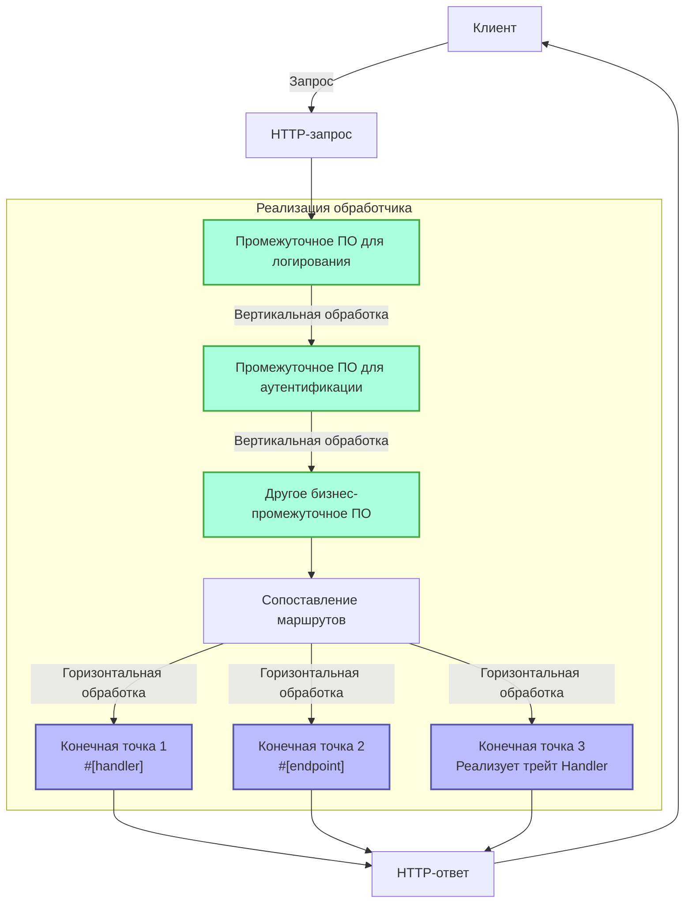
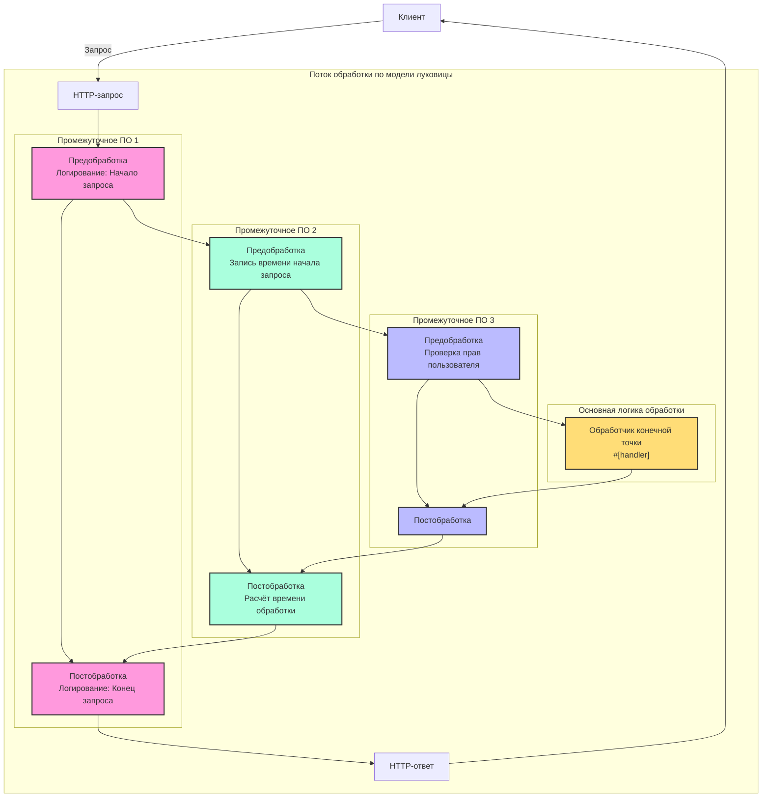

# Обработчик

## Краткий обзор

Обработчик (Handler) — это ключевая концепция в фреймворке Salvo, которую можно просто понимать как единицу обработки запросов. Он служит двум основным целям:

1. **Как конечная точка (Endpoint)**: Объект, реализующий `Handler`, может быть помещён в систему маршрутизации в качестве конечной точки для обработки запросов. При использовании макроса `#[handler]` функция может напрямую использоваться как конечная точка; а использование макроса `#[endpoint]` не только позволяет ей служить конечной точкой, но и автоматически генерирует документацию OpenAPI (это будет подробно описано в последующей документации).

2. **Как промежуточное ПО (Middleware)**: Тот же `Handler` также может использоваться в качестве промежуточного ПО для обработки запросов до или после их достижения конечной точки.

Поток обработки запросов в Salvo можно рассматривать как "конвейер": запрос сначала проходит через серию промежуточных обработчиков (вертикальная обработка), а затем достигает соответствующей конечной точки (горизонтальная обработка). И промежуточные обработчики, и конечные точки являются реализациями `Handler`, что обеспечивает согласованность и гибкость всей системы.

### Схема потока обработчика в Salvo



### Промежуточное ПО и модель луковицы (Onion Model)

Суть модели луковицы заключается в том, что размещая `ctrl.call_next()` до и после определённой логики, реализуется двунаправленный поток обработки запросов и ответов, позволяя каждому промежуточному обработчику участвовать в полном цикле "запрос-ответ".

### Пример структуры полного промежуточного обработчика

```rust
async fn example_middleware(req: &mut Request, depot: &mut Depot, resp: &mut Response, ctrl: &mut FlowCtrl) {
    // Предварительная обработка (фаза запроса)
    // Разместите здесь логику, выполняемую при входе запроса.

    // Вызов следующего обработчика в цепочке.
    ctrl.call_next(req, depot, resp).await;

    // Постобработка (фаза ответа)
    // Разместите здесь логику, выполняемую после обработки запроса.
}
```



## Что такое обработчик

Обработчик (Handler) — это конкретный объект, отвечающий за обработку объектов запроса (Request). Сам `Handler` является трейтом, содержащим асинхронный метод `handle`:

```rust
#[async_trait]
pub trait Handler: Send + Sync + 'static {
    async fn handle(&self, req: &mut Request, depot: &mut Depot, res: &mut Response);
}
```

Сигнатура функции `handle` по умолчанию включает четыре параметра в порядке: `&mut Request, &mut Depot, &mut Response, &mut FlowCtrl`. `Depot` — это временное хранилище, которое может содержать данные, связанные с текущим запросом.

В зависимости от способа использования, он может служить промежуточным ПО (hoop), которое может выполнять обработку до или после того, как запрос достигнет основного `Handler`, обрабатывающего запрос, например: проверка входа, сжатие данных и т.д.

Промежуточное ПО добавляется через функцию `hoop` у `Router`. Добавленное промежуточное ПО влияет на текущий `Router` и все его дочерние `Router`.

`Handler` также может использоваться как `Handler`, который участвует в сопоставлении маршрутов и в конечном итоге выполняется, что называется `goal` (целью).

## `Handler` как промежуточное ПО (hoop)

Когда `Handler` выступает в роли промежуточного ПО, он может быть добавлен к следующим трём типам объектов, поддерживающих промежуточное ПО:

- `Service`: Любой запрос будет проходить через промежуточное ПО в `Service`.
- `Router`: Только при успешном сопоставлении маршрута запрос пройдёт через промежуточное ПО, определённое в `Service`, и всё промежуточное ПО, собранное вдоль пути сопоставления.
- `Catcher`: При возникновении ошибки и если пользовательская информация об ошибке не была записана, запрос пройдёт через промежуточное ПО в `Catcher`.
- `Handler`: Сам `Handler` поддерживает добавление обёрток промежуточного ПО для выполнения некоторой пред- или постлогики.

## Использование макроса `#[handler]`

Макрос `#[handler]` может значительно упростить написание кода и повысить его гибкость.

Его можно применить к функции, чтобы заставить её реализовать `Handler`:

```rust
#[handler]
async fn hello() -> &'static str {
    "hello world!"
}
```

Это эквивалентно:

```rust
struct hello;

#[async_trait]
impl Handler for hello {
    async fn handle(&self, _req: &mut Request, _depot: &mut Depot, res: &mut Response, _ctrl: &mut FlowCtrl) {
        res.render(Text::Plain("hello world!"));
    }
}
```

Как видите, с `#[handler]` код становится намного проще:

- Не нужно вручную добавлять `#[async_trait]`.
- Ненужные параметры в функции опускаются, а требуемые параметры могут быть расположены в любом порядке.
- Для объектов, реализующих абстракции `Writer` или `Scribe`, они могут быть напрямую возвращены как возвращаемое значение функции. Здесь `&'static str` реализует `Scribe`, поэтому может быть возвращён напрямую.

`#[handler]` можно применять не только к функциям, но и к блоку `impl` для `struct`, чтобы заставить эту структуру реализовать `Handler`. В этом случае функция `handle` внутри блока `impl` распознаётся как конкретная реализация метода `handle` в `Handler`:

```rust
struct Hello;

#[handler]
impl Hello {
    async fn handle(&self, res: &mut Response) {
        res.render(Text::Plain("hello world!"));
    }
}
```

## Обработка ошибок

В Salvo `Handler` может возвращать `Result` при условии, что оба типа `Ok` и `Err` внутри `Result` реализуют трейт `Writer`.
Учитывая широкое использование `anyhow`, когда функция `anyhow` включена, `anyhow::Error` будет реализовывать трейт `Writer`. `anyhow::Error` будет отображаться как `InternalServerError`.

```rust
#[cfg(feature = "anyhow")]
#[async_trait]
impl Writer for ::anyhow::Error {
    async fn write(mut self, _req: &mut Request, _depot: &mut Depot, res: &mut Response) {
        res.render(StatusError::internal_server_error());
    }
}
```

Для пользовательских типов ошибок вы можете выводить различные страницы ошибок по мере необходимости.

```rust
use salvo::anyhow;
use salvo::prelude::*;

struct CustomError;
#[async_trait]
impl Writer for CustomError {
    async fn write(mut self, _req: &mut Request, _depot: &mut Depot, res: &mut Response) {
        res.status_code(StatusCode::INTERNAL_SERVER_ERROR);
        res.render("custom error");
    }
}

#[handler]
async fn handle_anyhow() -> Result<(), anyhow::Error> {
    Err(anyhow::anyhow!("anyhow error"))
}
#[handler]
async fn handle_custom() -> Result<(), CustomError> {
    Err(CustomError)
}

#[tokio::main]
async fn main() {
    let router = Router::new()
        .push(Router::new().path("anyhow").get(handle_anyhow))
        .push(Router::new().path("custom").get(handle_custom));
    let acceptor = TcpListener::new("127.0.0.1:5800").bind().await;
    Server::new(acceptor).serve(router).await;
}
```

## Прямая реализация трейта Handler

```rust
use salvo_core::prelude::*;
use crate::salvo_core::http::Body;

pub struct MaxSizeHandler(u64);
#[async_trait]
impl Handler for MaxSizeHandler {
    async fn handle(&self, req: &mut Request, depot: &mut Depot, res: &mut Response, ctrl: &mut FlowCtrl) {
        if let Some(upper) = req.body().and_then(|body| body.size_hint().upper()) {
            if upper > self.0 {
                res.render(StatusError::payload_too_large());
                ctrl.skip_rest();
            } else {
                ctrl.call_next(req, depot, res).await;
            }
        }
    }
}
```
{/* Auto generated, origin file hash:d20a5e643c01f98f895dfcba095711b2 */}