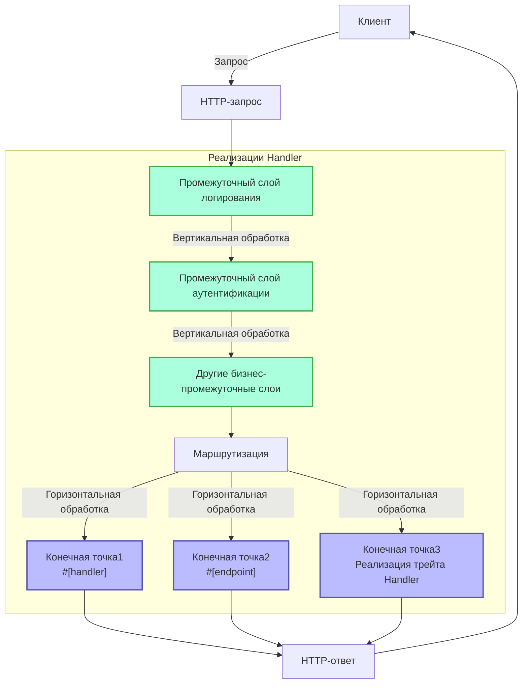
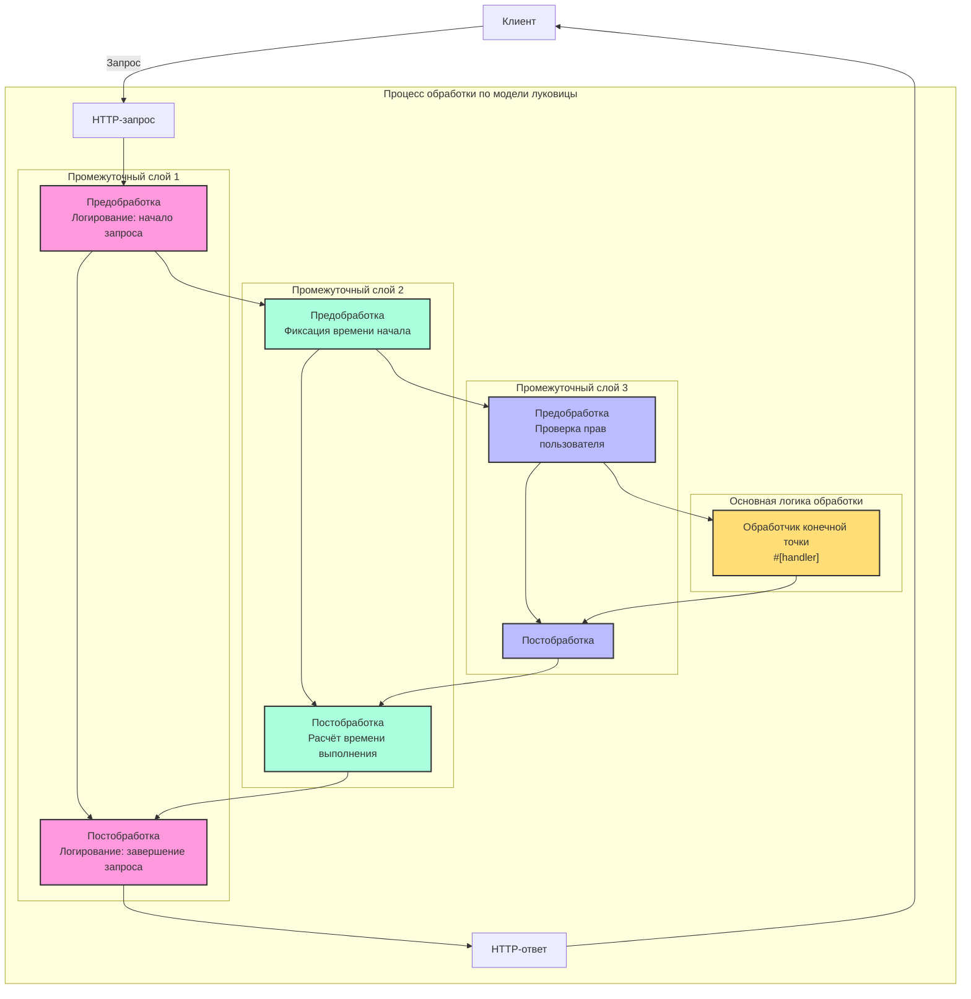

# Обработчик (Handler)

## Краткий обзор

Handler — это ключевое понятие фреймворка Salvo, которое можно рассматривать как единицу обработки запросов. Он имеет два основных назначения:

1. **Как конечная точка (Endpoint)**: Объекты, реализующие `Handler`, могут быть размещены в системе маршрутизации в качестве конечных обработчиков запросов. При использовании макроса `#[handler]` функция может напрямую выступать в роли конечной точки. Макрос `#[endpoint]` не только позволяет создавать конечные точки, но и автоматически генерирует документацию OpenAPI (эта возможность будет подробно рассмотрена в последующих материалах).

2. **Как промежуточное ПО (Middleware)**: Тот же `Handler` может использоваться в качестве промежуточного слоя для обработки запроса до или после его достижения конечной точки.

Процесс обработки запросов в Salvo можно представить как "конвейер": запрос сначала проходит через серию промежуточных слоёв (вертикальная обработка), затем достигает соответствующей конечной точки (горизонтальная обработка). И промежуточные слои, и конечные точки являются реализациями `Handler`, что обеспечивает согласованность и гибкость всей системы.

### Схема обработки Handler в Salvo



### Промежуточные слои и модель луковицы

Суть модели луковицы заключается в том, что позиционирование `ctrl.call_next()` до и после основного кода позволяет реализовать двунаправленный процесс обработки запросов и ответов, давая каждому промежуточному слою возможность участвовать в полном цикле "запрос-ответ".

### Полная структура примера промежуточного слоя

```rust
async fn example_middleware(req: &mut Request, resp: &mut Response, ctrl: &mut FlowCtrl) {
    // Предварительная обработка (фаза запроса)
    // Здесь размещается логика, выполняемая при получении запроса

    // Вызов следующего обработчика в цепочке
    ctrl.call_next(req, resp).await;

    // Постобработка (фаза ответа)
    // Здесь размещается логика, выполняемая после обработки запроса
}
```



## Что такое Handler

Handler — это объект, отвечающий за обработку Request-запросов. Сам Handler является трейтом, содержащим асинхронный метод `handle`:

```rust
#[async_trait]
pub trait Handler: Send + Sync + 'static {
    async fn handle(&self, req: &mut Request, depot: &mut Depot, res: &mut Response);
}
```

Функция обработки `handle` по умолчанию принимает четыре параметра: `&mut Request, &mut Depot. &mut Response, &mut FlowCtrl`. Depot — это временное хранилище, которое может содержать данные, связанные с текущим запросом.

В зависимости от способа использования, Handler может выступать в качестве промежуточного слоя (hoop), выполняя обработку до или после основного обработчика запросов `Handler`. Например: проверка авторизации, сжатие данных и т.д.

Промежуточные слои добавляются через функцию `hoop` маршрутизатора `Router`. Добавленные промежуточные слои влияют на текущий `Router` и все его дочерние `Router`.

`Handler` также может использоваться как конечный обработчик `Handler`, участвующий в сопоставлении маршрутов и выполняющийся в конце, называемый `goal`.

## `Handler` как промежуточный слой (hoop)

Когда `Handler` используется как промежуточный слой, он может быть добавлен к следующим трём типам объектов, поддерживающих промежуточные слои:

- `Service`: все запросы проходят через промежуточные слои `Service`.

- `Router`: только при успешном сопоставлении маршрута запрос последовательно проходит через промежуточные слои, определённые в `Service`, и все промежуточные слои, собранные по соответствующему пути.

- `Catcher`: при возникновении ошибки и отсутствии пользовательской информации об ошибке запрос проходит через промежуточные слои `Catcher`.

- `Handler`: сам `Handler` поддерживает добавление промежуточных слоёв-обёрток для выполнения предварительной или последующей логики.

## Использование макроса `#[handler]`

`#[handler]` может значительно упростить написание кода и повысить его гибкость.

Он может быть применён к функции, заставляя её реализовать `Handler`:

```rust
#[handler]
async fn hello() -> &'static str {
    "hello world!"
}
```

Это эквивалентно:

```rust
struct hello;

#[async_trait]
impl Handler for hello {
    async fn handle(&self, _req: &mut Request, _depot: &mut Depot, res: &mut Response, _ctrl: &mut FlowCtrl) {
        res.render(Text::Plain("hello world!"));
    }
}
```

Как видно, при использовании `#[handler]` код становится намного проще:

- Нет необходимости вручную добавлять `#[async_trait]`.
- Неиспользуемые параметры функции могут быть опущены, а необходимые параметры могут располагаться в любом порядке.
- Объекты, реализующие абстракции `Writer` или `Scribe`, могут напрямую возвращаться из функции. В данном случае `&'static str` реализует `Scribe`, поэтому может быть возвращён напрямую.

`#[handler]` может применяться не только к функциям, но и к блоку `impl` для `struct`, заставляя `struct` реализовать `Handler`. При этом функция `handle` в блоке `impl` будет распознана как конкретная реализация `handle` из `Handler`:

```rust
struct Hello;

#[handler]
impl Hello {
    async fn handle(&self, res: &mut Response) {
        res.render(Text::Plain("hello world!"));
    }
}
```

## Обработка ошибок

`Handler` в Salvo может возвращать `Result`, при условии что типы `Ok` и `Err` в `Result` реализуют трейт `Writer`.
Учитывая широкое использование anyhow, при включении функции `anyhow`, `anyhow::Error` будет реализовывать трейт `Writer`. `anyhow::Error` будет преобразован в `InternalServerError`.

```rust
#[cfg(feature = "anyhow")]
#[async_trait]
impl Writer for ::anyhow::Error {
    async fn write(mut self, _req: &mut Request, _depot: &mut Depot, res: &mut Response) {
        res.render(StatusError::internal_server_error());
    }
}
```

Для пользовательских типов ошибок вы можете выводить различные страницы ошибок по необходимости.

```rust
use salvo::anyhow;
use salvo::prelude::*;

struct CustomError;
#[async_trait]
impl Writer for CustomError {
    async fn write(mut self, _req: &mut Request, _depot: &mut Depot, res: &mut Response) {
        res.status_code(StatusCode::INTERNAL_SERVER_ERROR);
        res.render("custom error");
    }
}

#[handler]
async fn handle_anyhow() -> Result<(), anyhow::Error> {
    Err(anyhow::anyhow!("anyhow error"))
}
#[handler]
async fn handle_custom() -> Result<(), CustomError> {
    Err(CustomError)
}

#[tokio::main]
async fn main() {
    let router = Router::new()
        .push(Router::new().path("anyhow").get(handle_anyhow))
        .push(Router::new().path("custom").get(handle_custom));
    let acceptor = TcpListener::new("127.0.0.1:5800").bind().await;
    Server::new(acceptor).serve(router).await;
}
```

## Прямая реализация трейта Handler

```rust
use salvo_core::prelude::*;
use crate::salvo_core::http::Body;

pub struct MaxSizeHandler(u64);
#[async_trait]
impl Handler for MaxSizeHandler {
    async fn handle(&self, req: &mut Request, depot: &mut Depot, res: &mut Response, ctrl: &mut FlowCtrl) {
        if let Some(upper) = req.body().and_then(|body| body.size_hint().upper()) {
            if upper > self.0 {
                res.render(StatusError::payload_too_large());
                ctrl.skip_rest();
            } else {
                ctrl.call_next(req, depot, res).await;
            }
        }
    }
}
```
{/* 本行由工具自动生成,原文哈希值:6e138bcee73660fa82c5418d286d59cc */}