# Процесс обработки

`Service` сначала преобразует запрос в `Response` Salvo, затем переходит в фазу сопоставления маршрутов.

## Фаза сопоставления маршрутов

Сопоставление маршрутов запускает фильтры в порядке их добавления, продвигаясь от внешних к внутренним и сверху вниз. Если какой-либо фильтр не проходит, сопоставление считается неудачным.

В процессе сопоставления информация о пути запроса постепенно расходуется. Как только фильтр пути успешно сопоставляется, он потребляет соответствующую часть пути. Когда все сегменты пути израсходованы, ни один фильтр в цепочке сопоставления не завершился неудачей, и последний `Router` в текущей цепочке имеет целевой `Handler`, сопоставление считается успешным, и фаза сопоставления завершается. Все `Handler`, собранные из цепочки сопоставления, переходят в фазу выполнения.

Если путь не полностью израсходован, в цепочке не возникло ошибок, но нет дочерних маршрутов для продолжения сопоставления, текущая цепочка считается неудачной, и процесс переходит к следующему маршруту для сопоставления.

Если все маршруты сопоставлены без успеха, процесс переходит в фазу обработки ошибок.

## Фаза выполнения обработчиков

`Handler`, собранные на этапе сопоставления, выполняются последовательно. Во время выполнения предыдущее промежуточное ПО может вызвать `ctrl::call_next()`, чтобы позволить последующему промежуточному ПО выполниться сначала, прежде чем запустить свою собственную логику. Если во время выполнения возникает код состояния ошибки или перенаправление, последующие `Handler` не будут выполнены. Если код состояния указывает на ошибку и `Body` `Response` не установлен или является `ResBody::Error`, процесс переходит в фазу обработки ошибок; в противном случае он пропускает фазу обработки ошибок.

## Фаза обработки ошибок

`Catcher` — это тип, используемый для обработки ошибок, который также может включать промежуточное ПО (hoops). Ошибки проходят через все `Handler` внутри `Catcher` последовательно. Если `Handler` уже обработал ошибку и не хочет, чтобы последующие `Handler` продолжали, он может пропустить остальные с помощью `ctrl.skip_rest()`, напрямую завершая фазу обработки ошибок.

`Catcher` должен включать по крайней мере один `Handler` в качестве обработчика ошибок по умолчанию. По умолчанию это `DefaultGoal`, но вы можете полностью настроить свой собственный `Handler` в качестве реализации обработки ошибок по умолчанию. Он отображает информацию об ошибке в формате, запрошенном заголовком `content-type`, поддерживая форматы `json`, `xml`, `text` и `html`. `DefaultGoal` также предоставляет настройки отображения; например, по умолчанию он отображает ссылки, связанные с Salvo, при показе формата HTML. Вы можете вызвать `DefaultGoal::footer` или `DefaultGoal::with_footer`, чтобы установить пользовательский нижний колонтитул по желанию.

`Service` преобразует `Response` Salvo в тип `Response` Hyper, который в конечном итоге возвращается клиентам, таким как браузеры.

## Жизненный цикл запроса Salvo
Это визуальное представление и объяснение жизненного цикла HTTP-запроса в веб-фреймворке Salvo.

```mermaid
flowchart TD
    subgraph MainGraph[Жизненный цикл запроса Salvo Framework]
        Start[Запрос клиента] --> Convert[Service преобразует HTTP-запрос в Salvo Response]
        
        %% Фаза сопоставления маршрутов
        subgraph RoutingPhase[1. Фаза сопоставления маршрутов]
            Convert --> Routing[Сопоставление маршрутов в порядке добавления, от внешних к внутренним, сверху вниз]
            Routing --> FilterCheck{Проходят ли все фильтры?}
            FilterCheck -->|Нет| NextRoute[Попробовать следующий маршрут]
            FilterCheck -->|Да| PathConsume[Потребление сопоставленного сегмента пути]
            PathConsume --> PathCheck{Полностью ли потреблен путь с целевым Handler?}
            PathCheck -->|Нет| SubRouteCheck{Есть ли подмаршруты для продолжения сопоставления?}
            SubRouteCheck -->|Да| Routing
            SubRouteCheck -->|Нет| NextRoute
            NextRoute --> RouteLeft{Есть ли другие маршруты?}
            RouteLeft -->|Да| Routing
            RouteLeft -->|Нет| NoMatchRoute[Сопоставление маршрутов не удалось]
            PathCheck -->|Да| MatchSuccess[Сопоставление маршрутов успешно]
            MatchSuccess --> CollectHandlers[Сбор всех Handlers из цепочки сопоставления]
        end
        
        %% Фаза выполнения обработчиков
        subgraph HandlerPhase[2. Фаза выполнения обработчиков]
            CollectHandlers --> ExecHandlers[Последовательное выполнение Handlers]
            ExecHandlers --> ErrorCheck{Ошибка или перенаправление во время выполнения?}
            ErrorCheck -->|Нет| FinishHandlers[Все Handlers выполнены]
            ErrorCheck -->|Да| StatusCheck{Является ли код состояния ошибкой и Body не установлен или Error?}
            StatusCheck -->|Да| EnterCatcher[Переход в фазу обработки ошибок]
            StatusCheck -->|Нет| SkipCatcher[Пропуск фазы обработки ошибок]
        end
        
        %% Фаза обработки ошибок
        subgraph CatcherPhase[3. Фаза обработки ошибок]
            EnterCatcher --> CatcherHandlers[Последовательное выполнение Handlers Catcher]
            NoMatchRoute --> CatcherHandlers
            CatcherHandlers --> DefaultHandler[DefaultGoal или пользовательская обработка ошибок]
        end
        
        %% Финальный ответ
        FinishHandlers --> FinalConvert[Service преобразует Salvo Response в Hyper Response]
        SkipCatcher --> FinalConvert
        DefaultHandler --> FinalConvert
        
        FinalConvert --> End[Возврат ответа клиенту]
    end
    
    %% Стилизация
    class RoutingPhase,HandlerPhase,CatcherPhase phase;
    class MainGraph mainGraph;
    classDef mainGraph fill:#f5f5f5,stroke:#333,stroke-width:1px;
    classDef phase fill:#e6f3ff,stroke:#333,stroke-width:2px;
```

{/* Auto generated, origin file hash:76cc6c9018ddf6bdbf1b59044abae994 */}