# Процесс обработки

`Service` сначала преобразует запрос в `Response` salvo, затем начинается этап сопоставления маршрутов.

## Этап сопоставления маршрутов

Сопоставление маршрутов выполняется в порядке их добавления, последовательно снаружи внутрь и сверху вниз. Если любой фильтр завершается неудачей, считается, что сопоставление не удалось.

В процессе сопоставления учитывается информация о пути запроса. По мере выполнения сопоставления, как только фильтр пути успешно сопоставляется, он "поглощает" соответствующую часть пути. Когда весь путь поглощен и ни один фильтр в цепочке не завершился ошибкой, а последний `Router` в цепочке имеет целевой `Handler`, сопоставление считается успешным. На этом этапе собираются все `Handler` из успешно сопоставленных цепочек для перехода к этапу выполнения.

Если путь не полностью поглощен, в цепочке нет ошибок, но нет и дочерних маршрутов для продолжения сопоставления, текущая цепочка считается неудачной, и начинается сопоставление следующего маршрута.

Если все маршруты пройдены без успешного сопоставления, процесс переходит к этапу обработки ошибок.

## Этап выполнения Handler

`Handler` из списка, собранного на этапе сопоставления, выполняются последовательно. В процессе выполнения промежуточное ПО может вызвать `ctrl::call_next()`, чтобы сначала выполнить последующие обработчики, а затем свою логику. Если во время выполнения возникает ошибка статуса или перенаправление, последующие `Handler` не выполняются. Если код состояния указывает на ошибку, а `Body` в `Response` не установлен или имеет тип `ResBody::Error`, процесс переходит к этапу обработки ошибок. В противном случае этот этап пропускается.

## Этап обработки ошибок

`Catcher` — это тип для обработки ошибок, который также может включать промежуточное ПО (hoops). Ошибки последовательно проходят через все `Handler` внутри `Catcher`. Если какой-либо `Handler` обработал ошибку и не хочет, чтобы последующие обработчики продолжали выполнение, можно использовать `ctrl.skip_rest()` для пропуска оставшихся `Handler` и завершения этапа обработки ошибок.

`Catcher` по умолчанию должен содержать хотя бы один `Handler` для обработки ошибок. Стандартным является `DefaultGoal`, но вы можете полностью настроить свой собственный `Handler` в качестве реализации по умолчанию для обработки ошибок. В зависимости от заголовка `content-type` запроса будет отображаться информация об ошибке в соответствующем формате: поддерживаются `json`, `xml`, `text` и `html`. `DefaultGoal` также предоставляет настройки отображения, например, при выводе в формате HTML по умолчанию отображаются ссылки, связанные с salvo. Вы можете вызвать `DefaultGoal::footer` или `DefaultGoal::with_footer`, чтобы установить собственный пользовательский футер.

`Service` преобразует `Response` salvo в `Response` hyper, который в конечном итоге возвращается клиенту, например браузеру.

## Жизненный цикл запроса в Salvo
Это визуальное представление и описание жизненного цикла обработки HTTP-запроса в веб-фреймворке Salvo.

```mermaid
flowchart TD
    subgraph MainGraph[Жизненный цикл запроса в Salvo]
        Start[Запрос клиента] --> Convert[Service преобразует HTTP-запрос в Response salvo]
        
        %% Этап сопоставления маршрутов
        subgraph RoutingPhase[1. Этап сопоставления маршрутов]
            Convert --> Routing[Сопоставление маршрутов в порядке добавления, снаружи внутрь, сверху вниз]
            Routing --> FilterCheck{Все фильтры пройдены?}
            FilterCheck -->|Нет| NextRoute[Попытка следующего маршрута]
            FilterCheck -->|Да| PathConsume[Поглощение части пути]
            PathConsume --> PathCheck{Весь путь поглощен и есть goal Handler?}
            PathCheck -->|Нет| SubRouteCheck{Есть дочерние маршруты для продолжения?}
            SubRouteCheck -->|Да| Routing
            SubRouteCheck -->|Нет| NextRoute
            NextRoute --> RouteLeft{Остались ли другие маршруты?}
            RouteLeft -->|Да| Routing
            RouteLeft -->|Нет| NoMatchRoute[Сопоставление маршрутов не удалось]
            PathCheck -->|Да| MatchSuccess[Сопоставление маршрутов успешно]
            MatchSuccess --> CollectHandlers[Сбор всех Handler из цепочки]
        end
        
        %% Этап выполнения Handler
        subgraph HandlerPhase[2. Этап выполнения Handler]
            CollectHandlers --> ExecHandlers[Последовательное выполнение Handler]
            ExecHandlers --> ErrorCheck{Возникла ошибка или перенаправление?}
            ErrorCheck -->|Нет| FinishHandlers[Все Handler выполнены]
            ErrorCheck -->|Да| StatusCheck{Код состояния указывает на ошибку и Body не установлен или Error?}
            StatusCheck -->|Да| EnterCatcher[Переход к этапу обработки ошибок]
            StatusCheck -->|Нет| SkipCatcher[Пропуск этапа обработки ошибок]
        end
        
        %% Этап обработки ошибок
        subgraph CatcherPhase[3. Этап обработки ошибок]
            EnterCatcher --> CatcherHandlers[Последовательное выполнение Handler Catcher]
            NoMatchRoute --> CatcherHandlers
            CatcherHandlers --> DefaultHandler[DefaultGoal или пользовательская обработка ошибок]
        end
        
        %% Финальный ответ
        FinishHandlers --> FinalConvert[Service преобразует Response salvo в Response hyper]
        SkipCatcher --> FinalConvert
        DefaultHandler --> FinalConvert
        
        FinalConvert --> End[Возврат ответа клиенту]
    end
    
    %% Стили
    class RoutingPhase,HandlerPhase,CatcherPhase phase;
    class MainGraph mainGraph;
    classDef mainGraph fill:#f5f5f5,stroke:#333,stroke-width:1px;
    classDef phase fill:#e6f3ff,stroke:#333,stroke-width:2px;
```

{/* 本行由工具自动生成,原文哈希值:2934d9d3636688c10dfde8c3c36424c3 */}