# Процесс обработки

`Service` сначала преобразует запрос в `Response` Salvo, затем переходит к этапу сопоставления маршрутов.

## Этап сопоставления маршрутов

Сопоставление маршрутов выполняется в порядке их добавления, слева направо и сверху вниз, последовательно применяя фильтры. Если любой фильтер завершается неудачей, сопоставление считается неудачным.

В процессе сопоставления существует информация о пути запроса. По мере сопоставления, как только фильтер пути успешно сопоставляется, он потребляет соответствующий ему участок пути. Когда весь путь потреблён и на цепочке сопоставления нет неудачных фильтров, и последний `Router` в текущей цепочке имеет целевой `Handler`, сопоставление считается успешным, этап сопоставления завершается, и собираются все `Handler` с цепочек сопоставления для перехода к этапу выполнения.

Если путь не полностью потреблён, на цепочке нет ошибок фильтров, но больше нет дочерних маршрутов для продолжения сопоставления, то текущая цепочка считается неудачной, и происходит переход к следующему маршруту для сопоставления.

Если все маршруты были сопоставлены и ни один не был успешным, происходит переход к этапу перехвата ошибок.

## Этап выполнения Handler

В соответствии со списком `Handler`, собранным на этапе сопоставления, последовательно выполняются `Handler`. В процессе выполнения предыдущие промежуточные обработчики могут вызвать `ctrl::call_next()`, чтобы позволить последующим промежуточным обработчикам выполниться сначала, а затем выполнить свою собственную логику. Если в процессе выполнения возникает ошибка кода состояния или перенаправление, последующие `Handler` больше не выполняются. В этом случае, если код состояния указывает на ошибку и `Body` в `Response` не установлен или имеет тип `ResBody::Error`, происходит переход к этапу перехвата ошибок; в противном случае этап перехвата пропускается.

## Этап перехвата ошибок

`Catcher` — это тип, предназначенный для обработки ошибок, он также может добавлять промежуточные обработчики (hoops). Ошибки последовательно проходят через все `Handler` внутри `Catcher`. Если какой-либо `Handler` уже обработал ошибку и не хочет, чтобы последующие `Handler` продолжали выполнение, он может пропустить последующие `Handler` с помощью `ctrl.skip_rest()`, напрямую завершив этап перехвата.

`Catcher` по умолчанию должен содержать хотя бы один `Handler` для обработки ошибок по умолчанию. По умолчанию это `DefaultGoal`, но вы также можете полностью настроить свой собственный `Handler` в качестве реализации обработки ошибок по умолчанию. Он будет отображать информацию об ошибке в соответствующем формате в зависимости от `content-type`, указанного в заголовках запроса, поддерживая четыре формата отображения: `json`, `xml`, `text` и `html`. `DefaultGoal` также предоставляет некоторые настройки отображения, например, по умолчанию при отображении в формате html он показывает ссылки, связанные с Salvo. Вы можете вызвать `DefaultGoal::footer` или `DefaultGoal::with_footer`, чтобы установить свой собственный пользовательский нижний колонтитул.

`Service` преобразует `Response` Salvo в тип `Response` hyper, который в конечном итоге возвращается клиенту, такому как браузер.

## Жизненный цикл запроса в Salvo
Это визуальное представление и описание жизненного цикла обработки HTTP-запросов в веб-фреймворке Salvo.

```mermaid
flowchart TD
    subgraph MainGraph[Жизненный цикл запроса в Salvo]
        Start[Запрос клиента] --> Convert[Service преобразует HTTP-запрос в Response Salvo]
        
        %% Этап сопоставления маршрутов
        subgraph RoutingPhase[1. Этап сопоставления маршрутов]
            Convert --> Routing[Сопоставление маршрутов в порядке добавления, слева направо, сверху вниз]
            Routing --> FilterCheck{Все ли фильтры пройдены?}
            FilterCheck -->|Нет| NextRoute[Попытка следующего маршрута]
            FilterCheck -->|Да| PathConsume[Потребление сопоставленной части пути]
            PathConsume --> PathCheck{Весь ли путь потреблён и есть ли goal Handler?}
            PathCheck -->|Нет| SubRouteCheck{Есть ли дочерние маршруты для продолжения сопоставления?}
            SubRouteCheck -->|Да| Routing
            SubRouteCheck -->|Нет| NextRoute
            NextRoute --> RouteLeft{Остались ли другие маршруты?}
            RouteLeft -->|Да| Routing
            RouteLeft -->|Нет| NoMatchRoute[Сопоставление маршрутов не удалось]
            PathCheck -->|Да| MatchSuccess[Сопоставление маршрутов успешно]
            MatchSuccess --> CollectHandlers[Сбор всех Handler с цепочек сопоставления]
        end
        
        %% Этап выполнения Handler
        subgraph HandlerPhase[2. Этап выполнения Handler]
            CollectHandlers --> ExecHandlers[Последовательное выполнение Handler]
            ExecHandlers --> ErrorCheck{Возникла ли ошибка или перенаправление в процессе выполнения?}
            ErrorCheck -->|Нет| FinishHandlers[Все Handler выполнены]
            ErrorCheck -->|Да| StatusCheck{Код состояния указывает на ошибку и Body не установлен или имеет тип Error?}
            StatusCheck -->|Да| EnterCatcher[Переход к этапу перехвата ошибок]
            StatusCheck -->|Нет| SkipCatcher[Пропуск этапа перехвата ошибок]
        end
        
        %% Этап перехвата ошибок
        subgraph CatcherPhase[3. Этап перехвата ошибок]
            EnterCatcher --> CatcherHandlers[Последовательное выполнение Handler Catcher]
            NoMatchRoute --> CatcherHandlers
            CatcherHandlers --> DefaultHandler[DefaultGoal или пользовательская обработка ошибок]
        end
        
        %% Финальный ответ
        FinishHandlers --> FinalConvert[Service преобразует Response Salvo в Response hyper]
        SkipCatcher --> FinalConvert
        DefaultHandler --> FinalConvert
        
        FinalConvert --> End[Возврат ответа клиенту]
    end
    
    %% Стили
    class RoutingPhase,HandlerPhase,CatcherPhase phase;
    class MainGraph mainGraph;
    classDef mainGraph fill:#f5f5f5,stroke:#333,stroke-width:1px;
    classDef phase fill:#e6f3ff,stroke:#333,stroke-width:2px;
```

{/* Auto generated, origin file hash:2934d9d3636688c10dfde8c3c36424c3 */}