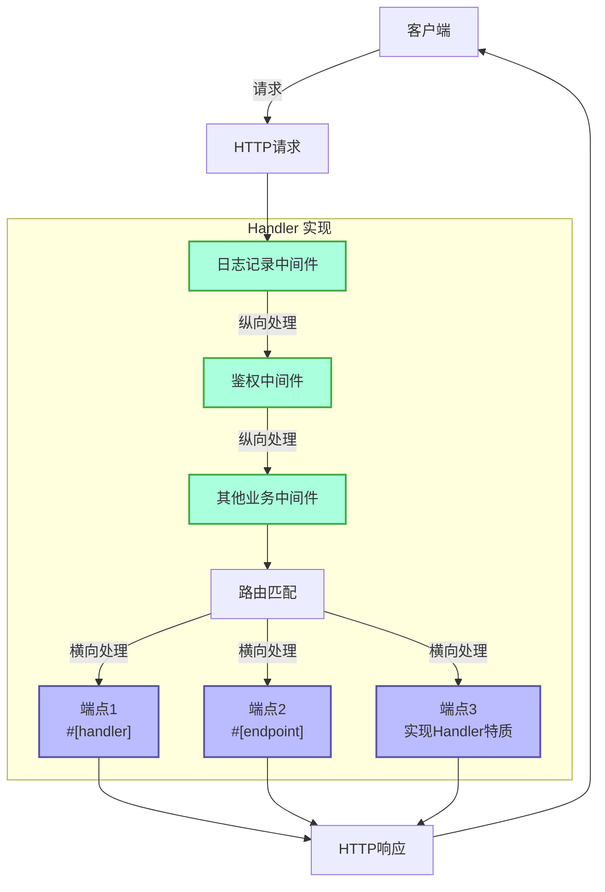
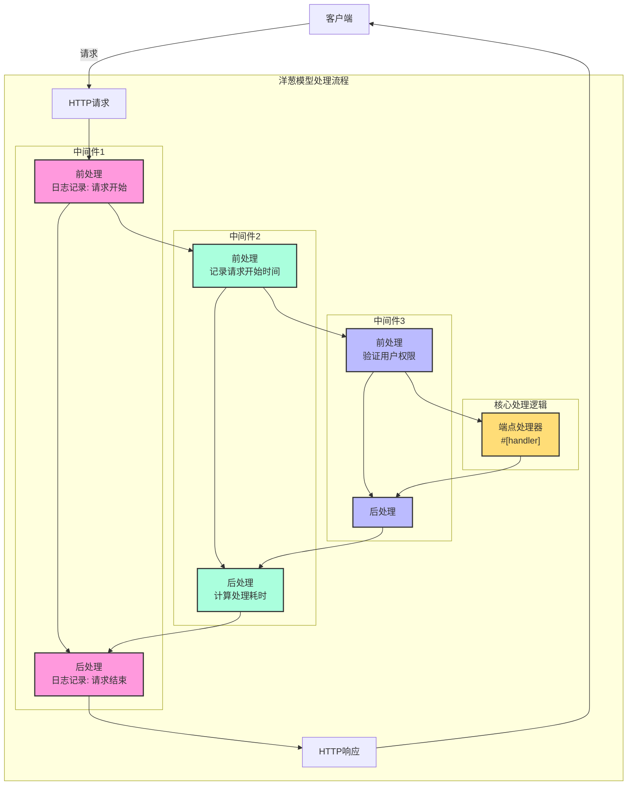

# Handler

## 快速概述

Handler 是 Salvo 框架的核心概念，可以简单理解为请求处理单元，它有两种主要用途：

1. **作为端点(Endpoint)**：实现了 `Handler` 的对象可以被放入路由系统中作为最终处理请求的端点。当使用 `#[handler]` 宏时，函数可以直接作为端点使用；而使用 `#[endpoint]` 宏时，不仅能作为端点，还可以自动生成 OpenAPI 文档（这部分将在后续文档中详细介绍）。

2. **作为中间件(Middleware)**：同样的 `Handler` 也可以作为中间件使用，用于在请求到达最终端点前或后进行处理。

Salvo 的请求处理流程可以视为一个"管道"：请求首先通过一系列中间件（纵向处理），然后到达匹配的端点（横向处理）。无论是中间件还是端点，它们都是 `Handler` 的实现，这使得整个系统保持了一致性和灵活性。

### Salvo 中的 Handler 流程图



### 中间件与 洋葱模型

洋葱模型的精髓就是通过ctrl.call_next()的前后位置，实现了请求和响应的双向处理流程，使每个中间件都能参与到完整的请求-响应周期中。
### 完整中间件示例结构

```rust
async fn example_middleware(req: &mut Request, resp: &mut Response, ctrl: &mut FlowCtrl) {
    // 前处理（请求阶段）
    // 在这里放置请求进入时需要执行的逻辑

    // 调用链中的下一个处理器
    ctrl.call_next(req, resp).await;

    // 后处理（响应阶段）
    // 在这里放置请求处理完成后需要执行的逻辑
}
```



## 什么是 Handler

Handler 是负责处理 Request 请求的具体对象. Handler 本身是一个 Trait, 内部包含一个 `handle` 的异步方法:

```rust
#[async_trait]
pub trait Handler: Send + Sync + 'static {
    async fn handle(&self, req: &mut Request, depot: &mut Depot, res: &mut Response);
}
```

处理函数 `handle` 默认签名包含四个参数, 依次是, `&mut Request, &mut Depot. &mut Response, &mut FlowCtrl`. Depot 是一个临时存储, 可以存储本次请求相关的数据.

根据使用方式不一样，它可以被用作中间件(hoop), 它们可以对请求到达正式处理请求的 `Handler` 之前或者之后作一些处理 比如：登录验证, 数据压缩等.

中间件是通过 `Router` 的 `hoop` 函数添加的. 被添加的中间件会影响当前的 `Router` 和它内部所有子孙 `Router`.

`Handler` 也可以被用作参与路由匹配并最终执行的 `Handler`, 被称为 `goal`.

## `Handler` 作为中间件(hoop)

当 `Handler` 作为中间件时，它可以被添加到以下三种支持中间件的对象上：

- `Service`, 任何请求都会通过 `Service` 中的中间件.

- `Router`, 只有路由匹配成功时，请求才依次通过 `Service` 中定义的的中间件和匹配路径上搜集到的所有中间.

- `Catcher`, 当错误发生时，且没有写入自定义的错误信息时，请求才会通过 `Catcher` 中的中间件.

- `Handler`, `Handler` 本身支持添加中间件包裹, 则行一些前置或者后置的逻辑.

## `#[handler]` 宏的使用

`#[handler]` 可以大量简化代码的书写, 并且提升代码的灵活度.

它可以加在一个函数上, 让它实现 `Handler`:

```rust
#[handler]
async fn hello() -> &'static str {
    "hello world!"
}
```

这等价于:

```rust
struct hello;

#[async_trait]
impl Handler for hello {
    async fn handle(&self, _req: &mut Request, _depot: &mut Depot, res: &mut Response, _ctrl: &mut FlowCtrl) {
        res.render(Text::Plain("hello world!"));
    }
}
```

可以看到, 在使用 `#[handler]` 的情况下, 代码变得简单很多:

- 不再需要手工添加 `#[async_trait]`.
- 函数中不需要的参数已经省略, 对于需要的参数也可以按任意顺序排布.
- 对于实现了 `Writer` 或者 `Scribe` 抽象的对象, 可以直接作为函数的返回值. 在这里 `&'static str` 实现了 `Scribe`, 于是可以直接作为函数返回值返回.

`#[handler]` 不仅可以加在函数上, 也可以加在 `struct` 的 `impl` 上，让 `struct` 实现 `Handler`, 这时 `impl` 代码块中的 `handle` 函数会被识别为 `Handler` 中的 `handle` 的具体实现:

```rust
struct Hello;

#[handler]
impl Hello {
    async fn handle(&self, res: &mut Response) {
        res.render(Text::Plain("hello world!"));
    }
}
```

## 处理错误

Salvo 中的 `Handler` 可以返回 `Result`, 只需要 `Result` 中的 `Ok` 和 `Err` 的类型都实现 `Writer` trait.
考虑到 anyhow 的使用比较广泛, 在开启 `anyhow` 功能后, `anyhow::Error` 会实现 `Writer` trait. `anyhow::Error` 会被映射为 `InternalServerError`.

```rust
#[cfg(feature = "anyhow")]
#[async_trait]
impl Writer for ::anyhow::Error {
    async fn write(mut self, _req: &mut Request, _depot: &mut Depot, res: &mut Response) {
        res.render(StatusError::internal_server_error());
    }
}
```

对于自定义错误类型, 你可以根据需要输出不同的错误页面.

```rust
use salvo::anyhow;
use salvo::prelude::*;

struct CustomError;
#[async_trait]
impl Writer for CustomError {
    async fn write(mut self, _req: &mut Request, _depot: &mut Depot, res: &mut Response) {
        res.status_code(StatusCode::INTERNAL_SERVER_ERROR);
        res.render("custom error");
    }
}

#[handler]
async fn handle_anyhow() -> Result<(), anyhow::Error> {
    Err(anyhow::anyhow!("anyhow error"))
}
#[handler]
async fn handle_custom() -> Result<(), CustomError> {
    Err(CustomError)
}

#[tokio::main]
async fn main() {
    let router = Router::new()
        .push(Router::new().path("anyhow").get(handle_anyhow))
        .push(Router::new().path("custom").get(handle_custom));
    let acceptor = TcpListener::new("127.0.0.1:5800").bind().await;
    Server::new(acceptor).serve(router).await;
}
```

## 直接实现 Handler Trait

```rust
use salvo_core::prelude::*;
use crate::salvo_core::http::Body;

pub struct MaxSizeHandler(u64);
#[async_trait]
impl Handler for MaxSizeHandler {
    async fn handle(&self, req: &mut Request, depot: &mut Depot, res: &mut Response, ctrl: &mut FlowCtrl) {
        if let Some(upper) = req.body().and_then(|body| body.size_hint().upper()) {
            if upper > self.0 {
                res.render(StatusError::payload_too_large());
                ctrl.skip_rest();
            } else {
                ctrl.call_next(req, depot, res).await;
            }
        }
    }
}
```
