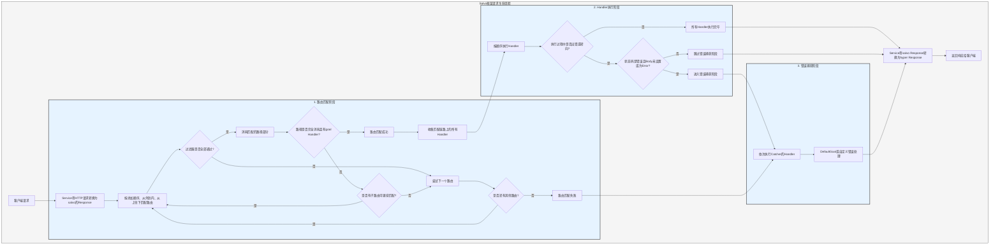

# 处理流程

`Service` 先将请求转换为 salvo 的 `Response`, 然后进入路由匹配阶段. 

## 路由匹配阶段

路由匹配安照添加的次序，依次按从外到内，从上往下的顺序运行过滤器，任何一个过滤器执行失败，就会被认为匹配失败.

匹配过程中，存在要给请求的路径信息，随着匹配的进行，路径过滤器一旦匹配成功，就会消耗掉它匹配到的路径，当所有的路径都消耗完毕且匹配的链路上没有过滤器匹配失败，当前链路上最后一个`Router` 存在 `goal` `Handler`, 那么匹配成功，匹配阶段结束，收集匹配所有匹配链路上的 `Handler` 进入执行阶段.

如果路径未消耗完毕，链路上过滤器没报错，但是也不再有子路由可以继续匹配，则认为当前链路匹配失败，进入下一个路由匹配.

所有的路由都匹配完毕，没有成功，则进入错误捕获阶段.

## Handler 执行阶段

根据匹配阶段收集到的 `Handler` 列表依次执行 `Handler`. 执行过程中前面的中间件可以调用 `ctrl::call_next()` 让后续的中间件先执行，然后再执行自己的逻辑. 如果执行过程中出现状态码错误或者是转向，那么后续的 `Handler` 将不再执行，此时如果状态码是错误，并且 `Response` 的 `Body` 未设置或者是 `ResBody::Error`，则进入错误捕获阶段,反之跳过捕获阶段.

## 错误捕获阶段

`Catcher` 是用于处理错误的类型，它也可以添加中间件(hoops), 错误会依次通过 `Catcher` 里面的所有 `Handler`. 如果某个 `Handler` 已经处理了错误，不想后续 `Handler` 继续执行，可以通过 `ctrl.skip_rest()` 跳过后续的 `Handler`, 直接结束捕获阶段.

`Catcher` 默认必须包含一个 `Handler` 用于作为默认错误处理. 默认的是 `DeaultGoal`, 你也可以完全自定义自己的 `Handler` 作为错误处理的默认实现. 它会根据请求头要求的 `content-type` 显示对应格式的错误信息，支持`json`, `xml`, `text`，`html` 四种显示格式. `DeaultGoal` 也提供了一些显示设置，比如，默认它在显示 html 格式时会显示 salvo 相关链接，就可以调用 `DefaultGoal::footer` 或者 `DefaultGoal::with_footer` 把也叫设置成你自己希望的自定义页脚,.

`Service` 会把 salvo 的 `Response` 转换为 hyper 的 `Response` 类型，最终返回给浏览器等客户端.

##  Salvo 请求生命周期
这是一个 Salvo Web 框架处理 HTTP 请求的生命周期的可视化表示和说明。

