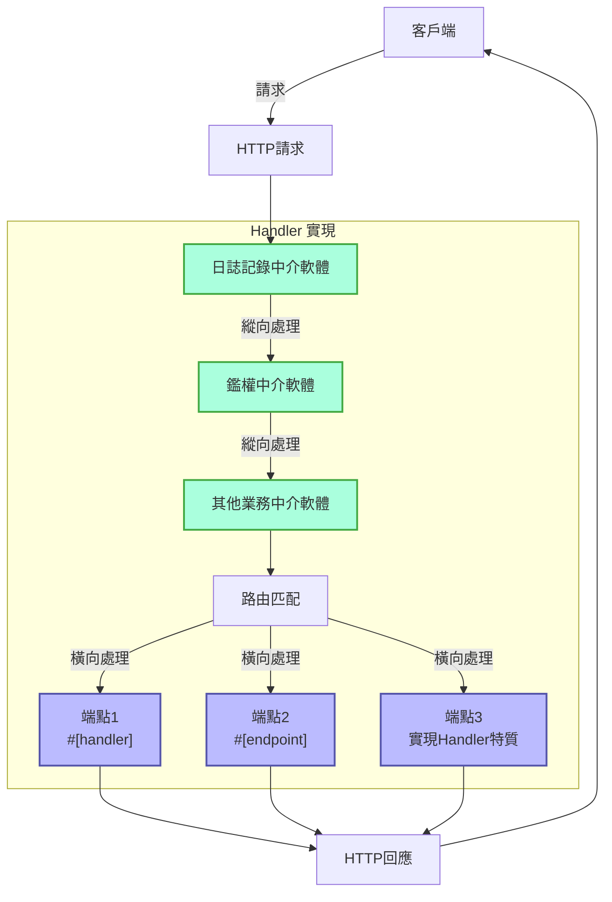
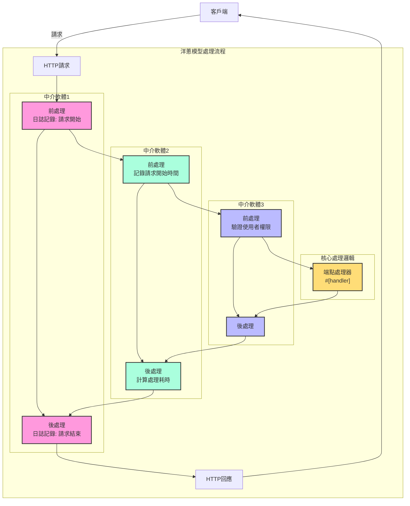

# 處理器

## 快速概述

處理器是 Salvo 框架的核心概念，可以簡單理解為請求處理單元，它有兩種主要用途：

1. **作為端點(Endpoint)**：實現了 `Handler` 的物件可以被放入路由系統中作為最終處理請求的端點。當使用 `#[handler]` 巨集時，函式可以直接作為端點使用；而使用 `#[endpoint]` 巨集時，不僅能作為端點，還可以自動生成 OpenAPI 文件（這部分將在後續文件中詳細介紹）。

2. **作為中介軟體(Middleware)**：同樣的 `Handler` 也可以作為中介軟體使用，用於在請求到達最終端點前或後進行處理。

Salvo 的請求處理流程可以視為一個「管道」：請求首先通過一系列中介軟體（縱向處理），然後到達匹配的端點（橫向處理）。無論是中介軟體還是端點，它們都是 `Handler` 的實現，這使得整個系統保持了一致性和靈活性。

### Salvo 中的 Handler 流程圖



### 中介軟體與 洋蔥模型

洋蔥模型的精髓就是通過ctrl.call_next()的前後位置，實現了請求和回應的雙向處理流程，使每個中介軟體都能參與到完整的請求-回應週期中。
### 完整中介軟體範例結構

```rust
async fn example_middleware(req: &mut Request, resp: &mut Response, ctrl: &mut FlowCtrl) {
    // 前處理（請求階段）
    // 在這裡放置請求進入時需要執行的邏輯

    // 呼叫鏈中的下一個處理器
    ctrl.call_next(req, resp).await;

    // 後處理（回應階段）
    // 在這裡放置請求處理完成後需要執行的邏輯
}
```



## 什麼是 Handler

Handler 是負責處理 Request 請求的具體物件。Handler 本身是一個 Trait，內部包含一個 `handle` 的非同步方法：

```rust
#[async_trait]
pub trait Handler: Send + Sync + 'static {
    async fn handle(&self, req: &mut Request, depot: &mut Depot, res: &mut Response);
}
```

處理函式 `handle` 預設簽名包含四個參數，依次是 `&mut Request, &mut Depot. &mut Response, &mut FlowCtrl`。Depot 是一個臨時儲存，可以儲存本次請求相關的資料。

根據使用方式不一樣，它可以被用作中介軟體(hoop)，它們可以對請求到達正式處理請求的 `Handler` 之前或者之後作一些處理，比如：登入驗證、資料壓縮等。

中介軟體是通過 `Router` 的 `hoop` 函式新增的。被新增的中介軟體會影響當前的 `Router` 和它內部所有子孫 `Router`。

`Handler` 也可以被用作參與路由匹配並最終執行的 `Handler`，被稱為 `goal`。

## `Handler` 作為中介軟體(hoop)

當 `Handler` 作為中介軟體時，它可以被新增到以下三種支援中介軟體的物件上：

- `Service`，任何請求都會通過 `Service` 中的中介軟體。

- `Router`，只有路由匹配成功時，請求才依次通過 `Service` 中定義的的中介軟體和匹配路徑上蒐集到的所有中介。

- `Catcher`，當錯誤發生時，且沒有寫入自訂的錯誤資訊時，請求才會通過 `Catcher` 中的中介軟體。

- `Handler`，`Handler` 本身支援新增中介軟體包裹，則行一些前置或者後置的邏輯。

## `#[handler]` 巨集的使用

`#[handler]` 可以大量簡化程式碼的書寫，並且提升程式碼的靈活度。

它可以加在一個函式上，讓它實現 `Handler`：

```rust
#[handler]
async fn hello() -> &'static str {
    "hello world!"
}
```

這等價於：

```rust
struct hello;

#[async_trait]
impl Handler for hello {
    async fn handle(&self, _req: &mut Request, _depot: &mut Depot, res: &mut Response, _ctrl: &mut FlowCtrl) {
        res.render(Text::Plain("hello world!"));
    }
}
```

可以看到，在使用 `#[handler]` 的情況下，程式碼變得簡單很多：

- 不再需要手工新增 `#[async_trait]`。
- 函式中不需要的參數已經省略，對於需要的參數也可以按任意順序排布。
- 對於實現了 `Writer` 或者 `Scribe` 抽象的物件，可以直接作為函式的返回值。在這裡 `&'static str` 實現了 `Scribe`，於是可以直接作為函式返回值返回。

`#[handler]` 不僅可以加在函式上，也可以加在 `struct` 的 `impl` 上，讓 `struct` 實現 `Handler`，這時 `impl` 程式碼塊中的 `handle` 函式會被識別為 `Handler` 中的 `handle` 的具體實現：

```rust
struct Hello;

#[handler]
impl Hello {
    async fn handle(&self, res: &mut Response) {
        res.render(Text::Plain("hello world!"));
    }
}
```

## 處理錯誤

Salvo 中的 `Handler` 可以返回 `Result`，只需要 `Result` 中的 `Ok` 和 `Err` 的型別都實現 `Writer` trait。
考慮到 anyhow 的使用比較廣泛，在開啟 `anyhow` 功能後，`anyhow::Error` 會實現 `Writer` trait。`anyhow::Error` 會被映射為 `InternalServerError`。

```rust
#[cfg(feature = "anyhow")]
#[async_trait]
impl Writer for ::anyhow::Error {
    async fn write(mut self, _req: &mut Request, _depot: &mut Depot, res: &mut Response) {
        res.render(StatusError::internal_server_error());
    }
}
```

對於自訂錯誤型別，你可以根據需要輸出不同的錯誤頁面。

```rust
use salvo::anyhow;
use salvo::prelude::*;

struct CustomError;
#[async_trait]
impl Writer for CustomError {
    async fn write(mut self, _req: &mut Request, _depot: &mut Depot, res: &mut Response) {
        res.status_code(StatusCode::INTERNAL_SERVER_ERROR);
        res.render("custom error");
    }
}

#[handler]
async fn handle_anyhow() -> Result<(), anyhow::Error> {
    Err(anyhow::anyhow!("anyhow error"))
}
#[handler]
async fn handle_custom() -> Result<(), CustomError> {
    Err(CustomError)
}

#[tokio::main]
async fn main() {
    let router = Router::new()
        .push(Router::new().path("anyhow").get(handle_anyhow))
        .push(Router::new().path("custom").get(handle_custom));
    let acceptor = TcpListener::new("127.0.0.1:5800").bind().await;
    Server::new(acceptor).serve(router).await;
}
```

## 直接實現 Handler Trait

```rust
use salvo_core::prelude::*;
use crate::salvo_core::http::Body;

pub struct MaxSizeHandler(u64);
#[async_trait]
impl Handler for MaxSizeHandler {
    async fn handle(&self, req: &mut Request, depot: &mut Depot, res: &mut Response, ctrl: &mut FlowCtrl) {
        if let Some(upper) = req.body().and_then(|body| body.size_hint().upper()) {
            if upper > self.0 {
                res.render(StatusError::payload_too_large());
                ctrl.skip_rest();
            } else {
                ctrl.call_next(req, depot, res).await;
            }
        }
    }
}
```
{/* 本行由工具自动生成,原文哈希值:6e138bcee73660fa82c5418d286d59cc */}