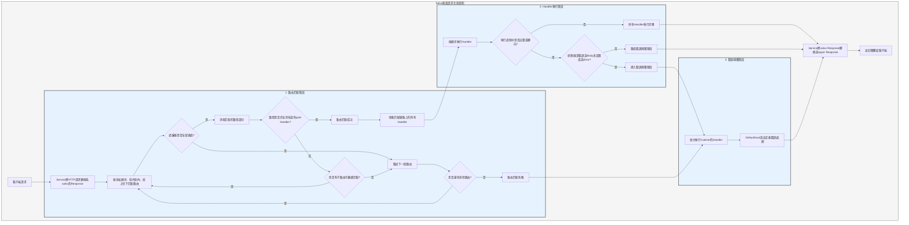

# 處理流程

`Service` 先將請求轉換為 salvo 的 `Response`，然後進入路由匹配階段。

## 路由匹配階段

路由匹配按照添加的順序，依次按從外到內、從上往下的順序運行過濾器，任何一個過濾器執行失敗，就會被認為匹配失敗。

匹配過程中，存在要給請求的路徑資訊，隨著匹配的進行，路徑過濾器一旦匹配成功，就會消耗掉它匹配到的路徑。當所有的路徑都消耗完畢且匹配的鏈路上沒有過濾器匹配失敗，當前鏈路上最後一個`Router` 存在 `goal` `Handler`，那麼匹配成功，匹配階段結束，收集匹配所有匹配鏈路上的 `Handler` 進入執行階段。

如果路徑未消耗完畢，鏈路上過濾器沒報錯，但是也不再有子路由可以繼續匹配，則認為當前鏈路匹配失敗，進入下一個路由匹配。

所有的路由都匹配完畢，沒有成功，則進入錯誤捕獲階段。

## Handler 執行階段

根據匹配階段收集到的 `Handler` 列表依次執行 `Handler`。執行過程中前面的中介軟體可以調用 `ctrl::call_next()` 讓後續的中介軟體先執行，然後再執行自己的邏輯。如果執行過程中出現狀態碼錯誤或者是轉向，那麼後續的 `Handler` 將不再執行，此時如果狀態碼是錯誤，並且 `Response` 的 `Body` 未設置或者是 `ResBody::Error`，則進入錯誤捕獲階段，反之跳過捕獲階段。

## 錯誤捕獲階段

`Catcher` 是用於處理錯誤的類型，它也可以添加中介軟體(hoops)，錯誤會依次通過 `Catcher` 裡面的所有 `Handler`。如果某個 `Handler` 已經處理了錯誤，不想後續 `Handler` 繼續執行，可以通過 `ctrl.skip_rest()` 跳過後續的 `Handler`，直接結束捕獲階段。

`Catcher` 預設必須包含一個 `Handler` 用於作為預設錯誤處理。預設的是 `DeaultGoal`，你也可以完全自定義自己的 `Handler` 作為錯誤處理的預設實現。它會根據請求頭要求的 `content-type` 顯示對應格式的錯誤資訊，支援`json`、`xml`、`text`、`html` 四種顯示格式。 `DeaultGoal` 也提供了一些顯示設定，比如，預設它在顯示 html 格式時會顯示 salvo 相關連結，就可以調用 `DefaultGoal::footer` 或者 `DefaultGoal::with_footer` 把也叫設定成你自己希望的自定義頁腳。

`Service` 會把 salvo 的 `Response` 轉換為 hyper 的 `Response` 類型，最終返回給瀏覽器等客戶端。

## Salvo 請求生命週期
這是一個 Salvo Web 框架處理 HTTP 請求的生命週期的可視化表示和說明。

{/* 本行由工具自动生成,原文哈希值:2934d9d3636688c10dfde8c3c36424c3 */}